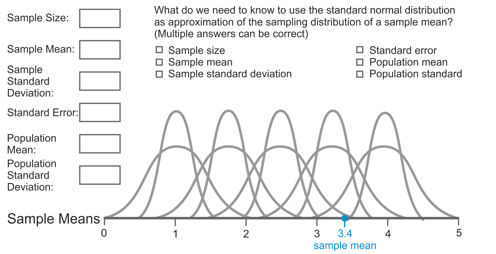

# Estimating a Parameter: Which Population Values Are Plausible? {#param-estim}
> Key concepts: point estimate, interval estimate, confidence (level), precision, standard error, critical value, degrees of freedom, confidence interval, uncertainty.

### Summary {-}

In this chapter, we set out to make educated guesses of a population value (parameter, often called "the true value") based on our sample. This type of guessing is called _estimation_. Our first guess will be a single value for the population value. We merely guess that the population value is equal to the value of the sample statistic. This guess is the most precise guess that we can make, but it is most likely to be wrong. 

Our second guess uses the sampling distribution to make a statement about the approximate population value. More precisely, we calculate an interval for which we are confident that it includes the population value. The wider the interval, the more confident we are that it contains the true population value but, at the same time, the less precise our guess.

### Test your intuition and understanding {-}

```{r estimation, fig.cap="Point and interval estimates, confidence intervals.", echo=FALSE, out.width="420px", screenshot.opts = list(delay = 5), dev="png"}
# Combination of apps interval-level, interval-size, and crit-values: A normal curve (M = 2.8, SE = 0.1 (SD population = 0.5 and sample size = 25)) as sampling distribution with two vertical lines marking interval limits (initially set at 2.5%/95%/2.5%) ; percentages indicating the area under the curve within and outside the limits ; double arrow from mean to interval limits indicating the interval estimate ; double x-axis: the first in grams and the second in standard errors, both axes labelled ; 2 sliders: confidence level and sample size ; any slider change will change the position of the interval limits (to represent the selected confidence level) ; changing confidence level also changes the percentages ; changing sample size also changes the scale of the x-axis in standard errors ; the value of the standard error is shown to highlight its relation with sample size.
knitr::include_app("http://82.196.4.233:3838/apps/estimation/", height="460px")
```

Figure \@ref(fig:estimation) shows the sampling distribution of average candy weight in a sample bag, which is a normal distribution. 

1. What is most likely estimate for average candy weight in the population?
```{r, eval=FALSE}
* The average of a distribution of sample means is the expected value or
expectation of the population mean (because a sample mean is an unbiased
estimate of a population mean).
* The mean of average candy weight over all samples is 2.8 gram in this
example. This is our best guess (point estimate) for average candy weight in
the population.
* The density (not the probability!) of the sampling distribution is at its
maximum at 2.8 gram.
```

2. The percentage in between the two vertical lines can be interpreted as a probability. A probability of what? 
```{r, eval=FALSE}
* The probability to draw a sample (bag) with a sample mean (average candy
weight) between the value of the left (lower) limit and the right (upper)
limit.
```

3. The double arrow represents an interval of sample means, in this example, average candy weight. What happens if you change the confidence level? Explain why this makes sense.
```{r, eval=FALSE}
* Raising the confidence level increases the width of the interval because it
increases the area under the curve between the interval limits.
* This makes sense because the confidence level is the probability of drawing
a sample with a mean (sample statistic value) within the interval.
* If we want to have a higher probability, we must be more inclusive, that is,
we must allow for a greater range of sample means.
```

4. What happens to the graph if you change sample size?
```{r, eval=FALSE}
* A larger sample size makes the sampling distribution more peaked, so the
interval containing the middle 95% of all samples becomes narrower.
* We have to expect less variation in sample means, so we have a more precise
estimate of the sample mean that we are very likely (95% probability) to draw.
```

5. What happens to the standard error if you change sample size? How are sample size and standard error linked? What characteristic of the sampling distribution is expressed by the standard error?
```{r, eval=FALSE}
* Increasing sample size decreases the standard error, so the two are
negatively correlated. A larger sample size creates a more peaked
distribution, which indicates lower variation (scores are closer to the mean).
The standard error expresses the variation in the sampling distribution.
* Actually, the standard error is the standard deviation of the sampling
distribution. This makes sense: A larger sample contains more information, so
its mean should (on average) be closer to the true population mean (hence to
the mean of the sampling distribution).
```

6. The values of the interval limits---average candy weights in this example---on the scale in standard errors are called critical values. What happens to the critical values if you change sample size?
```{r, eval=FALSE}
* Nothing changes. Critical values are fixed values in terms of standard 
errors if the confidence level and the degrees of freedom do not change. 
* If this was a t distribution, the critical values would slightly decrease 
with larger sample size but this change is too small to be of practical 
relevance, so it is ignored in this booklet.
```

7. What happens to the critical values if you change the confidence level?
```{r, eval=FALSE}
* Higher confidence levels yield more extreme critical values because 
the interval must cover a larger prportion of all possible samples.
```

8. If 2.8 is average candy weight in the sample but not necessarily true average candy weight in the population, the interval marked by the arrows is called a _confidence interval_. In this example, a confidence interval for what? And what is the point estimate?
```{r, eval=FALSE}
* A confidence interval always belongs to a population statistic (parameter).
In this example, we use the sample mean to estimate the populaiton mean, so
the confidence interval refers to average candy weight in the population. The
point estimate, which gives a single number instead of an interval, would be
2.8 grams here.
```

On first reading, you may not know all answers. That is OK. Just try again after you have studied this chapter.

## Point Estimate

```{r point-estimates", fig.cap="A sample from a population with unknown proportion of yelow candies.", eval=FALSE, echo=FALSE}
# A button allows to draw a sample of size 20 from a population with five colours and random proportion of yellow candies within the range .10 .40 ; the sample is shown as a dotplot (stacks of coloured dots) with the proportion of yellow as a number ; result: true population proportion, sample proportion, and student's proportion with current winner (closest to true population proportion) and a bar chart showing cumulative number of wins for sample proportion versus student's choice.

Figure \@ref(fig:point-estimates) generates random samples from a population of candies for which we do not know the proportion of yellow candies. It uses the sample proportion as estimate of the population proportion. Note that each sample is drawn from a different population. 

1. Can you do better than the sample proportion? Draw a sample and guess the population proportion. See which estimate is better. Repeat this until you are convinced that you can or cannot do better than the sample proportion.  
```

If we have to name one value for the population value, our best guess is the value of the sample statistic. For example, if 18% of the candies in our sample bag are yellow, our best guess of the proportion of yellow candies in the population of all candies from which this bag was filled, is .18. What other number can we give if we only have our sample? This type of guess is called a _point estimate_ and we use it a lot.  

The sample statistic is the best estimate of the population value only if the sample statistic is an unbiased estimator of the population value. As we have learned in Section \@ref(unbiased-est), the true population value is equal to the mean of the sampling distribution for an unbiased estimator. The mean of the sampling distribution is the expected value for the sample. 

In other words, an unbiased estimator neither systematically overestimates the population value, nor does it systematically underestimate the population value. With an unbiased estimator, then, there is no reason to prefer a value higher or lower than the sample value as our estimate of the population value.

Even though the value of the statistic in the sample is our best guess, it is very unlikely that our sample statistic is exactly equal to the population value (parameter). The recurrent theme in our discussion of random samples is that a random sample differs from the population because of chance during the sampling process. The precise population value is highly unlikely to actually appear in our sample. 

The sample statistic value is our best point estimate but it is nearly certain to be wrong. It may be slightly or strongly off the mark but it will hardly ever be spot on. For this reason, it is better to estimate a range within which the population value falls. Let us turn to this in the next section.  

## Interval Estimate for the Sample Statistic  

The sampling distribution of a continuous sample statistic tells us the probability of finding a range of scores for the sample statistic in a random sample. For example, the average weight of candies in a sample bag is a continuous random variable. The sampling distribution tells us the probability of drawing a sample with average candy weight between 2.0 and 3.6 gram. We can use this range as our _interval estimate_. 

Remember that the average or expected value of a sampling distribution is equal to the population value if the estimator is unbiased. For example, the mean weight of yellow candies averaged over a large number of samples is equal to the mean weight of yellow candies in the population. For an interval estimate, we now select the sample statistic values that are closest to the average of the sampling distribution. 

Between which boundaries are the sample statistic values situated that are closest to the population value? Of course, we have to specify what we mean by "closest". Which part of all samples do we want to include? A popular proportion is 95%, so we want to know the boundary values that include 95% of all samples that are closest to the population value. For example, between which boundaries is the average candy weight situated for 95% of all samples that are closest to the average candy weight in the population?

```{r ci-borders, fig.cap="Within which interval do we find the sample results that are closest to the population value?", echo=FALSE, out.width="420px", screenshot.opts = list(delay = 5), dev="png"}
# Graph a normal distribution with mean 2.8 and standard deviation equal to a random number between 0.05 and 0.2 ; x-axis with scale and labelled "Average candy weight"; add two vertical lines, one to the extreme left, one to the extreme right with their values on the x-axis displayed and the percentage of observations (area) between the two lines displayed (initially near 50%) ; slider moves right line and left line (in opposite directions) and adjusts percentage of area between lines ; note that the lines cannot be moved across the centre of the distribution
knitr::include_app("http://82.196.4.233:3838/apps/ci-borders/", height="290px")
```

Figure \@ref(fig:ci-borders) shows the sampling distribution of average sample candy weight.

1. What is the average candy weight in the population of candies?  
```{r eval=FALSE}
* A sample mean is an unbiased estimator of the population mean. As a
consequence, the mean of the sampling distribution is equal to the population.
* The(normal)  sampling distribution is symmetrical, so the mean of the
sampling distribution is in its middle, exactly under the top of the sampling
distribution. Here, the value is 2.8 (gram). This is average candy weight in
the population.
```

2. Move the slider until you have found the interval containing 95% of all samples that are closest to the (true) population value. What are the upper and lower limits of the interval that contains these samples?
```{r eval=FALSE}
* The exact value of the upper (right) limit changes from application to
application. It usually is somewehere between 3 and 5. 
* To obtain the exact lower (left) limit, calculate the difference between the
upper limit and the mean of the distribution (2.8). Then subtract this
difference from the distribution mean (2.8) to get the lower left) limit of
the interval.
* Tip: If the cursor is on the slider handle, you can change the slider value
in minimal steps with the left and right arrow keys on your keyboard.
```

Say, for instance, that 95% of all possible samples in the middle of the sampling distribution have an average candy weight ranging from 1.6 to 4.0 gram. The proportion .95 can be interpreted as a probability. Our sampling distribution tells us that we have 95% probability that the average weight of yellow candies lies between 1.6 and 4.0 gram in a random sample that we draw from this population. 

We now have boundary values, that is, a range of sample statistic values, and a probability of drawing a sample with a statistic falling within this range. The probability shows our _confidence_ in the estimate. It is called the _confidence level_ of an interval estimate. 

## Precision, Standard Error, and Sample Size

The width of the estimated interval represents the _precision_ of our estimate. The wider the interval, the less precise our estimate. With a less precise interval estimate, we we will have to reckon with a wider variety of outcomes in our sample. 

```{r interval-level, fig.cap="How does the confidence level affect the precision of an interval estimate?", echo=FALSE, out.width="420px", screenshot.opts = list(delay = 5), dev="png"}
# (as in ci-borders) Graph a normal distribution with mean 2.8 and standard deviation equal to a random number between 0.05 and 0.2 ; x-axis with scale and labelled "Average candy weight" ; vertical lines for boundaries  interval estimate ; show a double-pointed arrow on top of or above/under the x-axis representing the confidence interval for the initial confidence level (95%) and sample size (30); add a slider to adjust the confidence level (50%-100%?) ; update the vertical lines (boundaries ) and the arrow representing the precision of the confidence interval if the slider position changes.
knitr::include_app("http://82.196.4.233:3838/apps/interval-level/", height="310px")
```

1. How, do you think, does the precision (width) of the interval estimate (represented by the double-sided arrow) change if you change the confidence level?
    First write down what you expect, and why you expect that. Then check what happens if you change the confidence level slider in Figure \@ref(fig:interval-level).

```{r eval=FALSE}
* The more population values we exclude, the larger the probability that the
true population value is NOT in our estimated interval. In other words, our
confidence is smaller if we increase the precision of our estimate or, in other
words, if we reduce the width of the estimated interval.
```

2. What happens if we want to be 100% certain that our interval contains the true population value?

```{r eval=FALSE}
* If we want to be 100% sure, we cannot rule out any possible average weight
as the true population value. As a consequence, the interval becomes
infinitely wide. Of course, such an interval is completely useless because it
tells us that any value is possible.
```

If we want to predict something, however, we value precision. We rather conclude that the average weight of candies in the next sample we draw lies between 2.0 and 3.6 gram than between 1.6 and 4.0 gram. If we would be satisfied with a very imprecise estimate, we need not do any research at all. With relatively little knowledge about the candies that we are investigating, we could straightaway predict that the average candy weight is between zero and ten gram. The goal of our research is to find a more precise estimation.

There are several ways to increase the precision of our interval estimate, that is, to obtain a narrower interval for our estimate. The easiest and least useful way is to decrease the probability that our estimate is correct. If we lower the probability that we are right, we can discard a large number of other possible sample statistic outcomes and focus on a narrower range of sample outcomes around the true population value.

This method is not useful because we sacrifice our confidence that the range includes the outcome in the sample that we are going to draw. What is the use of a more precise estimate if we are less certain that it predicts correctly? Therefore, we usually do not change the confidence level and leave it at 95% or thereabouts (90%, 99%). We think it important to be quite sure that our prediction will be right.

### Sample size {#sample-size}

```{r interval-size, fig.cap="How does sample size affect the precision of an interval estimate?", echo=FALSE, out.width="420px", screenshot.opts = list(delay = 5), dev="png"}
# same as interval-level but the slider adjusts sample size (N between 5 and 100, steps of 5) ; update the line/arrow representing the precision of the confidence interval if the slider position changes ; also update the normal curve and ensure that the scale of the x-axis remains the same, so it is clear that the sampling distribution becomes more peaked for larger samples. 
knitr::include_app("http://82.196.4.233:3838/apps/interval-size/", height="310px")
```

Figure \@ref(fig:interval-size) shows a sampling distribution of average candy weight in candy sample bags. The horizontal arrow indicates the precision of the interval estimate.

1. How does the precision of the interval estimate change if you change the size of the sample? First write down what you expect, and why you expect that. Then, check what happens if you change the sample size slider.
```{r eval=FALSE}
* Larger samples offer more information, so they allow a more precise estimate
of a population value, such as average candy weight. The precision of the
interval will increase, so the interval will become narrower, the arror will
become shorter.
* The computational reason: A larger sample yields a smaller standard error
(se). See the next section.
```

2. How does the shape of the sampling distribution change if you change sample size? Explain what this means for the values of the sample statistic.
```{r eval=FALSE}
* The sampling distribution because more peaked/less flat because more sample
means are found near the (true) population mean.
```

A less practical but very useful method of narrowing the interval estimate is increasing sample size. As you may have noticed while playing with Figure \@ref(fig:interval-size), a larger sample yields a narrower, that is, more precise interval. You may have expected intuitively that larger samples give more precise estimates because they offer more information. This intuition is correct.  

In a larger sample, an observation above the mean is more likely to be compensated by an observation below the mean. Just because there are more observations, it is less likely that we sample relatively high scores but no or considerably fewer scores that are relatively low. 

In other words, the larger the sample, the more the distribution of scores for a variable in the sample will resemble the distribution of scores for this variable in the population. As a consequence, a sample statistic value will be closer to the population value for this statistic.  

Larger samples resemble the population more closely, and therefore large samples drawn from the same population are also closer to one another. The result is that the sample statistic values in the sampling distribution are less varied and more similar. They are more concentrated around the true population value, which is the average of the sampling distribution. The sampling distribution is more peaked, so the middle 95% of all sample statistic values are closer to the centre.  

### Standard error {#standard-error}
The concentration of sample statistic values, such as average candy weight in a sample bag, is expressed by the standard deviation of the sampling distribution. Hitherto, we have only paid attention to the centre of the sampling distribution, its mean, because it is the expected value in a sample and it is equal to the population value if the estimator is unbiased. 

Now, we start looking at the standard deviation of the sampling distribution as well, because it tells us how precise our interval estimate is going to be. The sampling distribution's standard deviation is so important that it has received a special name: the _standard error_.  

```{r se-point-est, fig.cap="The standard error: How wrong are point estimates?", echo=FALSE, out.width="420px", screenshot.opts = list(delay = 5), dev="png"}
# Two goals. First, remind student of the fact that a standard deviation represents deviations from the mean. Second, show that the standard error equals the standard deviation of the sampling distribution in that it is the standard deviation calculated for many samples.
# Use a normally distributed population with M = 2.8 and SD = 2 (candy weight) ; one button creates a random sample (N = 10?) displaying it as a dotplot with vertical lines for both the sample average and population average ; mark the difference between the two averages as a (fat red?) horizontal arrow pointing from population to sample mean ; add the sample average to a histogram (with a normal curve representing the true sampling distribution as background) also displaying the population mean as a vertical line ; show the standard deviation of the means over all preceding samples as a (double)left- and right-pointing) arrow (at such a height that it touches the normal curve when it reaches the value of the standard error) ; add a second button to add another 10 (or 100?) samples that are not shown as a dot plot but theirs means are added to the histogram and the arrow representing the standard deviation is updated
knitr::include_app("http://82.196.4.233:3838/apps/se-point-est/", height="500px")
```

1. Draw a single sample by pressing the button _Take single sample_ in Figure \@ref(fig:se-point-est). Explain why we can interpret the red arrow in the sample plot as error.

```{r eval=FALSE}
* We use the sample mean (represented by the dotted line in the top graph) as
point estimate for the population mean (represented by the solid line). The
distance between the two shows how wrong our point estimate is. For this
reason, the red arrow in the top chart can be regarded as the size of the error.
```

2. Use the button __Take single sample__ several times. What is the meaning of the double-sided red arrow that appears in the sampling distribution? 

```{r eval=FALSE}
* The double-sided red arrow expresses the standard deviation of the sample
means that we have added to the sampling distribution (according to the
legend). So it is the standard deviation in the empirical sampling
distribution that we create by repeated sampling.
* It gives an impression of how different the means of different random
samples can be. Because those sample means are used as point estimates, the
red arrow expresses the (average) size of the errors that we make if we
generalize the sample mean to the population mean.
```

3. Use the button __Take 100 samples__ once or repeatedly. What happens to the length of the double-sided red arrow in the sampling distribution? 

```{r eval=FALSE}
* The red arrow fits the distance between the dotted lines in the bottom plot.
The dotted lines mark one standard error above or below the mean of the true
sampling distribution (light green). The arrowheads of the red arrows mark one
standard deviation above and below the average of the sample means that we
have drawn.
* The standard error of a sampling distribution, then, is equal to the
standard deviation of the sampling distribution.
```

The word _error_ reminds us that the standard error tells us the size of the error that we are likely to make (on average under many repetitions) if we use the value of the sample statistic as a point estimate for the population value. 

Let us assume, for instance, that the standard error of the average weight of candies in a sample bag is 0.6. Loosely stated, this means that the average difference between true average candy weight and average candy weight in a sample is 0.6 if we draw a very large number of samples from the same population. 

By the way, the standard deviation does not give us the ordinary average difference but it gives us the square root of the average of squared differences. But this detail is irrelevant to how we interpret the standard error.  

The smaller the standard error, the more the sample statistic values resemble the true population value, and the more precise our interval estimate with a given confidence level, for instance, 95%. Because we like more precise interval estimates, we prefer small standard errors over high standard errors. 

In theory, it is easy to obtain smaller standard errors: just increase sample size. See Figure \@ref(fig:interval-size): larger samples yield more peaked sampling distributions. In a peaked distribution, values are closer to the mean. In our example, average candy weight in sample bags are closer to the average candy weight in the population. Imagine a horizontal arrow showing the width of the distribution: It becomes smaller for a more peaked distribution, so the standard error is lower.

In practice, however, it is both time-consuming and expensive to draw a very large sample. Usually, we want to settle on the optimal size of the sample, namely a sample that is large enough to have interval estimates at the confidence level and precision that we need but as small as possible to save on time and expenses. We return to this matter in Chapter \@ref(power).  

## Critical Values {#crit-values}

```{r crit-values, fig.cap="How do critical values relate to the standard error in a normal distribution?", echo=FALSE, out.width="420px", screenshot.opts = list(delay = 5), dev="png"}
# same as interval-size but the slider adjusts the standard error (start value = 0.1, so one standard error aligns with 0.1 gram above or below average; slider range 0.05 and 0.15?) ; the vertical lines are fixed at 2.5% and 97.5% of the cumulative area under the normal curve ; first x-axis has fixed scale in grams (population mean is 2.8) ; add a second x-axis representing z scores with values -1.96, -1.0, 0, 1.0, 1.96 ; if the standard error is adjusted, the normal curve changes as well as the scale of the second x-axis and the two vertical lines at -1.96 and 1.96. 
knitr::include_app("http://82.196.4.233:3838/apps/crit-values/", height="360px")
```

Figure \@ref(fig:crit-values) shows the sampling distribution of average candy weight per sample bag. It contains two horizontal axes, one with average candy weight in grams (bottom) and one with average candy weight in standard errors, also called _z_ scores (top).

1. How do the two horizontal axes tell you the size of the standard error in grams?
```{r eval=FALSE}
* The axis at the bottom gives average candy weight in grams and the axis at
the top shows average candy weight in standard errors from the population
mean.
* One standard error equals the distance or difference between z score zero
(0) and z score one (1). If we follow the lines down from these standard error
scores, we obtain the mean average candy weight (2.8 gram) and the average
weight one standard error above the mean (3.6 gram).
* The difference is 0.8 gram, so one standard error represents 0.8 grams (in
average candy weight per sample bag).
```

2. How do you expect the location of the vertical lines on the two horizontal axes to change if you change the size of the standard error? Check your expectation by using the slider. 
```{r eval=FALSE}
* If we increase the standard error, one standard error coincides with more
grams, so the sampling distribution grows wider; it becomes less peaked. After
all, the variation in sample outcomes (average candy weight) will increase.
* The dotted lines representing plus or minus 1.00 and 1.96 will move away
from the centre but the centre will be fixed at the true average candy weight
in the population, in this example 2.8 gram.
```

In Figure \@ref(fig:crit-values), we approximate the sampling distribution with a theoretical probability distribution, namely the normal distribution. The theoretical probability distribution links probabilities (areas under the curve) to sample statistic outcome values (scores on the horizontal axis). For example, we have 2.5% probability to draw a sample bag with average candy weight below 1.2 gram or 2.5% probability to draw a sample bag with average candy weight over 4.4 gram.  

### Standardization and _z_ scores  
The average candy weights that are associated with 2.5% and 97.5% probabilities in Figure \@ref(fig:crit-values) depend on the sample that we have drawn. As you will have noticed while playing with Figure \@ref(fig:interval-size), changing the size of the sample also changes the avergae candy weights that mark the 2.5% and 97.5% probabilities.

We can simplify the situation if we _standardize_ the sampling distribution: Subtract the average of the sampling distribution from each sample mean in this distribution, and divide the result by the standard error. Thus, we transform the sampling distribution into a distribution of standardized scores. The mean of the new standardized variable is always zero.  

If we use the normal distribution for standardized scores, which is called the _standard-normal distribution_ or _z distribution_, there is a single _z_ value that marks the boundary between the top 2.5% and the bottom 97.5% of any sample. This _z_ value is 1.96. If we combine this value with -1.96, separating the bottom 2.5% of all samples from the rest, we obtain an interval [-1.96, 1.96] containing 95% of all samples that are closest to the mean of the sampling distribution. This is part of the _empirical rule_ for the normal distribution.

In a standard-normal or _z_ distribution, 1.96 is called a _critical value_. Together wih its negative (-1.96), it separates the 95% sample statistic outcomes that are closest to the parameter, hence that are most likely to appear, from the 5% that are furthest away and least likely to appear. There are also critical _z_ values for other probabilities, for instance, 1.64 for the middle 90% of all samples and 2.58 for the middle 99%. 

### Interval estimates from critical values and standard errors {#int-est-sample-mean} 
Critical values in a theoretical probability distribution tell us the boundaries, or range, of the interval estimate expressed in standard errors. In a normal distribution, 95% of all sample means are situated no more than 1.96 standard errors from the population mean. 

If the standard error is 0.5 and the population mean is 2.8 gram, we have 95% probability that the mean candy weight in a sample that we draw from this population lies between 1.82 gram (this is 1.96 times 0.5 subtracted from 2.8) and 3.78 gram. 

Critical values make it easy to calculate an interval estimate if we know the standard error. Just take the population value and add the critical value times the standard error to obtain the upper limit of the interval estimate. Subtract the critical value times the standard error from the population value to obtain the lower limit. 

Normal distributions make life easier for us, because there is a fixed critical value for each probability, such as 1.96 for 95% probability, which is well-worth memorizing.

### Degrees of freedom (_df_)  
For other theoretical probability distributions, the situation is slightly more complicated because we have different critical values for the same confidence level. Small samples usually require higher critical values than large samples. More generally, critical values depend on the _degrees of freedom_ in the sample.

We need not be concerned with the exact meaning of degrees of freedom, or how the degrees of freedom are calculated for a sample, if we want to use a theoretical probability distribution. Our statistical software takes care of this for us. We must, however, report the degrees of freedom in accordance with the APA6 standard.

## Confidence Interval for a Parameter

Working through the preceding sections, it may have occurred to you that it is all very well to be able to estimate the value of a statistic in a new sample with a particular precision and probability, but that this is not what we are primarily interested in. Instead, we want to estimate the value of the statistic in the population.

For example, we don't care much about the average weight of candies in our sample bag or in the next sample bag that we may buy. We want to say something about the average weight of candies in the population. How can we do this?

In addition, you may have realized that, if we know the sampling distribution,  we also know the precise population value, for instance, average candy weight. After all, the average of the sampling distribution is equal to the population mean for an unbiased estimator. In the preceding paragraphs, we acted as if we knew the sampling distribution. If we know the sampling distribution, and it then follows that we also know the population value, why would we even care about estimating an interval?

Our problem is this: We want to estimate a population value using probabilities. For probabilities we need the sampling distribution but for the sampling distribution, we must know the population. A vicious circle.

In the exact approach to the sampling distribution of the proportion of yellow candies in a sample bag, for instance, we must know the proportion of yellow candies in the population. If we know the population proportion, we can exactly calculate the probability of getting a sample bag with a particular proportion of yellow candies. But we don't know the population proportion of yellow candies; we want to estimate it.  

```{r normal-param, eval=FALSE, echo=FALSE, fig.cap="Which population statistics do we need to know if we want to use the standard normal distribution as sampling distribution?"}
# show an X axis labeled 'sample mean' with a scale from 0 to 5 gram ; add sample mean as labelled dot at 3.4 ; add a normal curve with population mean 2.8, a standard error 0.1 (equivalent to sample standard deviation of 1.0 and a sample size of 25) ; show checkboxes for sample size, sample mean, sample standard deviation, standard error, population mean, and population standard error with their (fixed) values ; select all checkboxes ; if the user deselects a checkbox, either nothing happens or a series of 5 normal curves is shown for different values of the statistic associated with the checkbox.
# - sample size: only needed if standard error is deselected
# - sample mean: not necessary
# - sample standard deviation: if population standard deviation or standard error is selected, the sample standard deviations is not needed ; if both standard deviations and the standard error are not selected, show normal curves with different standard deviations
# - standard error: not needed if sample size and sample or population standard deviation are selected ; otherwise, show normal curves with different standard deviations
# - population mean: if deselected, show normal curves for different values
# - population standard deviation: see sample standard deviation



Figure \@ref(fig:normal-param) shows a standard normal distribution that we could use to approximate the sampling distribution of average candy weight in a sample (bag) of candies. This theoretical distribution can be used only if some of the statistics (see the check boxes) are known. Uncheck a box if you think this statistic is _not_ needed to use the standard normal distribution. If you are right, nothing happens. If you are wrong, you will see a series of normal curves for different values of the statistic. Then, check the statistic again and try another statistic.

1. Which mean is required for using the standard normal distribution? Which characteristic of the distribution is fixed by this statistic?

2. Do you have to know the standard deviation of the sample as well as that  of the population?

3. Which values do you have to know _only if_ you don't know the standard error? In other words, which statistics affect the standard error (you have learned about before)? Deselect the standard error and experiment with the other options.
```

A theoretical probability distribution can only be used as an approximation of a sampling distribution if we know some characteristics of the population. We know that the sampling distribution of sample means always has the bell shape of a normal (_z_) distribution or _t_ distribution. However, knowing the shape is not sufficient for using the theoretical distribution as an approximation of the sampling distribution.

We must also know the population mean because it specifies where the centre of the sampling distribution is located. So, we must know the population mean to use a theoretical probability distribution to estimate the population mean. This sounds like a problem that only Baron von M&uuml;nchhausen can solve. How can we drag ourselves by the hair out of this swamp?  

By the way, we also need the standard error to know how peaked or flat the bell shape is. The standard error can usually be estimated from the data in our sample. But let us not worry about how the standard error is being estimated and focus on estimating the population mean now.  

### Imaginary population values  {#imag-pop-values}
```{r pop-means-ci, fig.cap="For which population means is our sample mean plausible?", echo=FALSE, out.width="420px", screenshot.opts = list(delay = 5), dev="png"}
# draw two horizontal lines, the top line labeled 'population' and the bottom line labeled 'sample', both lines with a numerical scale (0-5) ; generate a sample mean and standard error within a particular range, say 1-4 for the sample mean and the standard error in a range convenient to have interval estimates within the 0-5 or -1-6 range ; mark the sample mean on the lower line and show the value of the standard error somewhere in the app ; if the user clicks on the upper line, the corresponding number is shown as an (imaginary) population mean ; the 95% probability interval estimate for the sample mean is shown as a horizontal line segment on top/near the lower line (plus a light triangle starting at the population value) ; if the line segment overlaps with the sample mean, the selected population value is marked by a green dot and the line segment is green, they are red dots otherwise ; also show the z value of the sample mean for the chosen population mean ; at next click, remove old interval estimate (line segment plus triangle) but keep the prevously selected population mean ; a 'Reset' button generates new values to restart the interaction (repeat the assignment with different values for the sample mean and standard error to emphasize that the z values remain the same)
knitr::include_app("http://82.196.4.233:3838/apps/pop-means-ci/", height="210px")
```

Figure \@ref(fig:pop-means-ci) shows average candy weight in a random sample (lower scale). Click somewhere under the top axis to select a possible value for the population mean. The app will then display the interval of most plausible sample means (green if it contains the actual sample means, red otherwise) and the actual sample mean's _z_ value if this would have been the true population value.

1. Click repeatedly on Figure \@ref(fig:pop-means-ci) to find the highest and lowest value of the population mean for which the sample mean is in the interval of sample means that have 95% probability to occur. 
```{r eval=FALSE}
* The closer the sample mean is to the population mean, the higher the
probability to draw a sample with more or less this mean. Population means
close to the sample mean will turn up as green dots and their intervals will
include the sample mean.
* The more we move away from the sample mean, the less likely to draw a sample
with a mean that differs at least this much with the population mean. At some
point, the population mean is too far away from the sample mean, so the actual
sample mean is no longer in the range of the 95% most likely sample means to
be drawn from a population with the selected population mean.
```

2. How does the _z_ value of the sample mean help you to minimize the number of clicks you need?
```{r eval=FALSE}
* In a normal distribution, z standardizes scores and 95% of all observations
differ no more than 1.96 z scores from the mean. The lowest and highest
population means for which the current sample mean is among the 95% most
plausible samples, then, are reached if the z value of the sample mean is
(almost) 1.96 or -1.96.
* So the z value tells us how close we are to the limit.
```

3. How does the depicted interval estimate help you to minimize the number of clicks you need?
```{r eval=FALSE}
* The interval estimate shows the width of the interval between the lowest and
highest population average for which the current sample mean is among the 95%
most plausible samples.
* If the current sample mean is at the left limit of the interval, we reach
the highest population mean for which the sample mean is in the interval.
Increase the population mean and the interval will no longer include the
current sample mean. In a similar way, the lowest population mean for which
the interval includes the sample mean is found if the sample mean is on the
right limit of the interval.
```

4. What is the most efficient strategy (minimum number of clicks) to determine the lower and upper limits of the population means for which the sample mean is among the 95% most likely samples? Explain why this is the most efficient strategy.
```{r eval=FALSE}
* Using the answer to Question 3, we may use the following steps to find the
lower and upper limits.
a. Click in the middle of the sample mean. This selects the population mean
that is equal to the sample mean.
b. Click on the left edge of the interval. This should be (very near to) the
lowest population mean, the interval of which still includes the sample mean.
c. Repeat Step a to display again the interval for the population mean that is
equal to the sample mean.
d. Click the right end of this interval to find the highest population mean
such that the current sample mean is still among the 95% most plausible
samples.
* You may not hit the nail spot-on with every click but the procedure itself
is efficient. You can only do better by gambling the values of the two limits
directly and being very very lucky.
* The important lesson here: Instead of constructing the interval around the
population mean, we can construct it around the sample mean to obtain the
range of population means that are plausible given this sample. We flip the
procedure!
```

How do we solve the M&uuml;nchhausen problem that we must know the population mean to estimate the population mean? The solution is that we select a lot of imaginary population means. For each imaginary population mean, we calculate the interval within which the sample mean is expected to fall if this imaginary mean would be the true population mean. We use a fixed confidence level, usually a probability of 95 per cent. 

As a next step, we check if the mean of the sample that we have actually drawn falls within this interval. If it does, we conclude that this (imaginary) population mean is not at odds with the sample that we have drawn. In contrast, if our sample mean falls outside the interval, we conclude that this population mean is not plausible because our sample is too unlikely to be drawn from a population with this mean. 

In this way, we can find all population means that are _consistent_ with our sample. If the true population mean is any of these imaginary means, we are sufficiently likely (95% probability) to draw a sample with our actual sample mean.  

While playing with Figure \@ref(fig:pop-means-ci), you may have noticed the _z_ values of the sample mean for the lowest and highest population means for which the sample mean is still within the interval. When you hit the lower bound of the population means, the sample mean has a _z_ value of about 1.96 while it has a _z_ value of about -1.96 for the highest population mean in the range.

It is not a coincidence that we find the critical values of the standard-normal distribution when we reach the minimum and maximum population means that are plausible. We are using the standard-normal distribution to approximate the sampling distribution of the sample mean. The critical _z_ value 1.96 marks the upper limit of the interval containing 95% of all samples with means closest to the population mean and -1.96 marks the lower limit. A distance of 1.96 standard errors, then, is the maximum distance between a population mean and a sample mean that belongs to the 95% sample means closest to the population mean.

As a consequence, we could simply have calculated the range of plausible population values by adding and subtracting 1.96 standard errors from the sample mean. This can be illustrated with an example: If the average candy weight in our sample is 2.8 gram and the standard error is 0.5, the lower and upper boundary for plausible population means are 1.82 gram (this is 2.8 minus 1.96 times 0.5) and 3.78 gram (2.8 plus 1.96 times 0.5). 

Haven't we seen this calculation before? Yes we did, in Section \@ref(int-est-sample-mean), where we estimated the interval for sample means. We now simply reverse the calculation, using the sample mean to estimate an interval of plausible population means instead of the other way around.

----
<div style="column-count: 2; -moz-column-count: 2">
Jerzy Neyman introduced the concept of a confidence interval in 1937:

"In what follows, we shall consider in full detail the problem of estimation by interval. We shall show that it can be solved entirely on the ground of the theory of probability as adopted in this paper, without appealing to any new principles or measures of uncertainty in our judgements". [@RefWorks:3929: 347] 


</div>
---- 

### Confidence interval {#conf-interval}
The upper and lower bounds for the population mean or, more generally, the parameter that we want to estimate, yield an interval for the parameter. We use this as the interval estimate of the parameter. 

This interval is linked to a probability, for instance, 95%. However, it is very important that we understand that this is NOT the probability that the parameter has a particular value, or that it falls within the interval. The parameter is _not_ a random variable because it is not affected by the random sample that we draw. In our example, it will be clear that the sample that we draw does not and cannot change the average weight of all candies. 

The parameter has one value, which is either within or outside the interval that we have constructed. We just don't know. But we do know that our sample is more likely for population values within the interval.  

We use the term _confidence_ instead of probability when we use this interval to estimate a parameter. We say that we are 95% confident that the parameter falls within the interval. The interval is called a _confidence interval_ and we usually add the confidence level, for instance, the 95% confidence interval (abbreviated: 95%CI) of the average weight of candies in the population ranges from 2.4 to 3.2 gram. An average candy weight between 2.4 and 3.2 gram is plausible given the sample that we have drawn. In our reports, we say that: 

> We are 95% confident that the average candy weight in the population is between 2.4 and 3.2 gram.  

```{r 95ci-simul, fig.cap="How often does a confidence interval include the true population value?", echo=FALSE, out.width="420px", screenshot.opts = list(delay = 5), dev="png"}
# Generate 100 samples of size 50 (or larger to obtain about 95% coverage) from
# a population with average (candy weight) 2.8 and a standard deviation of 0.5 ;
# display each 95% confidence interval (with the sample mean) as a line segment
# in a graph, which displays the population mean as a line perpendicular to the
# confidence interval line segments ; mark the confidence intervals (and their
# means) as red if they do not contain/cover the parameter ; initially show one
# confidence interval ; a button allows to create an additional confidence
# interval ; at the fifth use of this button, add another 95 confidence
# intervals to attain 100 confidence intervals. Adjust
# https://github.com/ensley/Confidence-Interval-Shiny or
# https://github.com/CamilleFairbourn/ConfidenceApp or
# https://github.com/zkeller89/shiny_conf_int_proportions
knitr::include_app("http://82.196.4.233:3838/apps/95ci-simul/", height="450px")
```

Figure \@ref(fig:95ci-simul) shows a 95% confidence interval for average candy weight in the population based on a sample of candies. The vertical line indicates the true average candy weight in the population.

1. Does the (first) confidence interval include the true average candy weight in the population?

```{r eval=FALSE}
* The first confidence interval may (blue) and may not (red) include the true
population mean (2.8).
* The sample mean can be close enough to the true population mean for the
confidence interval to include the true population mean. But it can also be too
far from the true population mean.
* A confidence interval, however, is much more likely to include the true
population mean than not.
```

2. What does the dot in the middle of the confidence interval represent?

```{r eval=FALSE}
* The centre of a confidence interval represents the point estimate, that is,
if the standard error is used to calculate the confidence interval. In this
case, the upper and lower boundaries of a confidence interval are situated one
standard error times the critical value below or above the point estimate.
* In the current example, the population mean is estimated, so the point
estimate is the sample mean. A sample mean is an unbiased estimator of the
population mean.
```

3. If you would draw a hundred random samples from the same population and calculate the 95% confidence interval for the mean of each sample, how many confidence intervals do you expect to contain the true population mean? Press the __New Sample__ button until there are one hundred confidence intervals. Does your expectation come true? If not, why not?

```{r eval=FALSE}
* The confidence level is the probability that our confidence interval includes
the true population value. If the confidence level is 95%, the probability that
a confidence interval includes the true population value is .95, so we expect
that 95 out of 100 confidence intervals include the population mean.
* With probabilities, the expected value is only certain to be found in an
infinitively large number of draws (samples). One hundred samples are quite few
in the light of infinity, so the number of samples including the true
population value may well be smaller or larger than 95.
* This is easier to see if we focus on the number of red confidence intervals
that do not include the true population value. This number is usually
(slightly) larger or smaller than five.
```

The more precise meaning of a confidence interval is rather complicated. If we draw a very large number of samples from the same population, 95% of the sample means would differ less from the population mean than the critical value times the standard error. This is just the definition of critical value. 

Because the critical value times the standard error also defines the width of the confidence interval, we can reverse the statement. The population mean would be within the 95% confidence interval of 95% of all sample means. In other words, if we construct the 95% confidence interval for each sample mean, 95% of all samples will have confidence intervals that contain the true population mean. 

Our confidence interval is a random variable because it depends on the sample that we draw. After all, we construct the interval around the sample statistic outcome, for instance, average candy weight in our sample (the point estimate), which may change from sample to sample. So we may say that the confidence level is the _probability that our confidence interval includes the true population value_. But we avoid this interpretation because it is easily misread as the probability that the true population value is in the interval. The latter reading is wrong from the perspective that the population value is not a random variable, so it does not have a probability.

Unfortunately, we have no clue whether or not our single sample belongs to the 95 per cent of 'lucky' samples with confidence intervals containing the true population value. We can only hope and be confident that this is the case.  

### Confidence intervals with bootstrapping {#bootstrap-confidenceinterval}

If we approximate the sampling distribution with a theoretical probability distribution such as the normal (_z_) or _t_ distribution, critical values and the standard error are used to calculate the confidence interval (see Section \@ref(imag-pop-values)). 

There are theoretical probability distributions that do not work with a standard error,  such as the _F_ distribution or chi-squared distribution. If we use those distributions to approximate the sampling distribution of a continuous sample statistic, for instance, the quotient of two variances, we must use bootstrapping to obtain a confidence interval.

```{r bootstrap-ci, eval=FALSE, echo=FALSE, fig.cap="How do we construct confidence intervals with bootstrapping?"}
# Adapt app bootstrapping: Show Initial Sample and Sampling Distribution, buttons Bootstrap 1000 samples and Draw new initial sample. Increase vertical size of sampling distribution but reduce range from 0 to 0.5. 
# Add vertical lines for 95% confidence interval limits calculated from percentiles in the bootstrapped sampling distribution and limits calculated from the standard error (= standard deviation of the bootstrapped sampling distribution) times the critical value 1.96 (using a normal approximation). 
# Finally, display the average of the bootstrapped sampling distribution as well as the true population proportion (0.2).

# In questions, point out the symmetry of the normal approximation to the confidence interval versus the asymmetry of the percentile-based confidence interval.
```

As you probably remember from Section \@ref(boot-approx), we simulate an entire sampling distribution if we bootstrap a statistic, for instance the median candy weight in a sample bag. This simulated sampling distribution can be used to estimate the standard error, which is by definition the standard deviation of the sampling distribution. This standard error can then be combined with critical values to calculate the confidence interval.

As an alternative, we can just take the values separating the bottom 2.5% and the top 2.5% of all samples in the bootstrapped sampling distribution as the lower and upper limits of the 95% confidence interval. This is known as the percentile approach.

It is also possible to construct the entire sampling distribution in exact approaches to the sampling distribution. Both the standard error and percentiles can be used to create confidence intervals. This can be very demanding in terms of computer time, so exact approaches to the sampling distribution usually only report p values, not confidence intervals.

## Confidence Intervals in SPSS {#SPSS-CI}

### Instruction

```{r SPSSconflevel, echo=FALSE, out.width="640px", fig.cap="(ref:conflevelSPSS)", dev="png", screenshot.opts = list(delay = 5)}
knitr::include_url("https://www.youtube.com/embed/7e1gCCKYcW4", height = "360px")
# SPSS usually displays the 95% confidence interval automatically if you use the standard-normal (_z_) or _t_ distribution.
# * t tests on one or two means: 95% CI displayed. Adjust confidence level under options.
# * post-hoc tests with 1WAY-ANOVA: 95% CI by default, adjust significance level (under Post-Hoc) to change confidence level (1 - significance level)
# * post-hoc tests with 2WAY-ANOVA: 95% CI by default, adjust significance level (under Options) to change confidence level (1 - significance level)
# * t test on regression coefficient: ask for CI under Statistics, level can be adjusted there.
# Bootstrapping: always a confidence interval
# * example: media with Frequencies
# * correlation: only with bootstrapping
# No confidence intervals:
# * non-parametric tests (just categorical variables - irrelevant)
```

### Exercises

1. <a href="http://82.196.4.233:3838/data/candies.sav" target="_blank"> Download the data set "candies.sav"</a> and use SPSS to calculate the 95% and 99% confidence intervals of average candy weight. 

    Hint: Use the _Analyze > Compare Means > One-Sample T Test_ command and leave the test value at zero. 

    Interpret the results and explain why the 99% confidence interval is wider than the 95% confidence interval.  

```{r eval=FALSE}
SPSS syntax:

* Check data.
FREQUENCIES VARIABLES=weight
  /FORMAT=NOTABLE
  /HISTOGRAM NORMAL
  /ORDER=ANALYSIS.
* 95% CI.
T-TEST
  /TESTVAL=0
  /MISSING=ANALYSIS
  /VARIABLES=weight
  /CRITERIA=CI(.95).
* 99% CI.
T-TEST
  /TESTVAL=0
  /MISSING=ANALYSIS
  /VARIABLES=weight
  /CRITERIA=CI(.99).

Check data:

There are no impossible values on variable weight.

Check assumptions:

Sample size (N = 50) is well over 30, so we need not care about
the normal distribution of candy weight in the population.

Interpret the results:

Average weight of candies in the population is between 2.77 and 
2.90 gram with 95% confidence and between 2.75 and 2.92 gram
with 99% confidence.
If we want to be more confident, we must allow for a broader
range of values, so the confidence interval is wider.
```

2. Let SPSS calculate the 95% confidence interval for median candy weight. Interpret the result. The data are in "candies.sav". 

    Remember the SPSS exercises in Chapter \@ref(probmodels).

```{r eval=FALSE}
SPSS syntax:

* Check data.
FREQUENCIES VARIABLES=weight
  /ORDER=ANALYSIS.
* Bootstrap on median candy weight.
BOOTSTRAP
  /SAMPLING METHOD=SIMPLE
  /VARIABLES INPUT=weight 
  /CRITERIA CILEVEL=95 CITYPE=BCA  NSAMPLES=5000
  /MISSING USERMISSING=EXCLUDE.
FREQUENCIES VARIABLES=weight
  /FORMAT=NOTABLE
  /STATISTICS=MEDIAN
  /ORDER=ANALYSIS.

Check data:
  
There are no impossible values on the weight variable.

Check assumptions:
  
The measurement level of variable weight is OK.
    
Interpret the results: 

Median candy weight in the sample is 2.89 gram. With 
95% confidence, we expect median candy weight to be 
between 2.77 and 2.92 grams in the population of all candies.
```

3. Use SPSS to determine the 95% confidence interval for a paired-samples t test on candy colour fading under sunlight (variables colour_pre and colour_post in "candies.sav"). In your interpretation of the confidence interval, clarify the meaning of the statistic for which the confidence interval was calculated.

    The paired-samples t test is available in SPSS under _Analyze > Compare Means_.

```{r eval=FALSE}
SPSS syntax:

* Check data.
FREQUENCIES VARIABLES=colour_pre colour_post
  /FORMAT=NOTABLE
  /HISTOGRAM NORMAL
  /ORDER=ANALYSIS.
* Paired-samples t test.
T-TEST PAIRS=colour_pre WITH colour_post (PAIRED)
  /CRITERIA=CI(.9500)
  /MISSING=ANALYSIS.

Check data:

There are no impossible values on variable weight.

Check assumptions:

Sample size (N = 50) is well over 30, so we need not care about
the normal distribution of candy weight in the population.

Interpret the results:

Candy colourfulness fades under sunlight by 1.88 (or between 
1.6 to 2.2) points in the data. This change is statistically 
significant, t (49) = 12.86, p < 001, 95%CI[1.59; 2.17].
```

4. Use SPSS to determine if candy colourfulness after exposure to sunlight (colour_post) depends on candy weight and candy sweetness. Interpret the 95% confidence intervals for both effects. 

    Hint: Use regression analysis, which is available under _Analyze > Regression > Linear_ in SPSS.

```{r eval=FALSE}
SPSS syntax:

* Check data: Assumption checks in Chapter 8.
* CHeck for impossible values.
FREQUENCIES VARIABLES=weight sweetness colour_post
  /ORDER=ANALYSIS.
* Regression of colour_post on weight and sweetness. 
REGRESSION
  /MISSING LISTWISE
  /STATISTICS COEFF OUTS CI(95) R ANOVA
  /CRITERIA=PIN(.05) POUT(.10)
  /NOORIGIN 
  /DEPENDENT colour_post
  /METHOD=ENTER weight sweetness.

Check data: 

There are no impossible values on the variables.

Check assumptions:

Assumptions are presented later (Chapter 8).

Interpret the results:

We are 95 per cent confident that average candy
colourfulness decreases by 0.23 to 0.52 for
each additional unit of sweetness in the
population.
We are not confident about the direction of the
effect of candy weight on colourfulness. This
effect can be negative (up to a .65 decrease for
each additional candy weight gram) or positive
(up to a 2.05 increase for each additional candy
weight gram).
```

## Take-Home Points  

* If a sample statistic is an unbiased estimator, we can use it as a point estimate for the value of the statistic in the population.  

* A point estimate may come close to the population value but it is most certainly not correct.  

* A 95% confidence interval is an interval estimate of the population value: We are 95% confident that the population value lies within this interval. Note that confidence is not a probability!  

* A larger sample or a lower confidence level yields a narrower, that is, a more precise confidence interval. The sample statistic is more likely to be closer to the population value. We have less uncertainty in our results.

* A larger sample yields a smaller standard error, which yields a more precise confidence interval because the limits of a confidence interval fall one standard error times the critical value below and above the value of the sample statistic.
