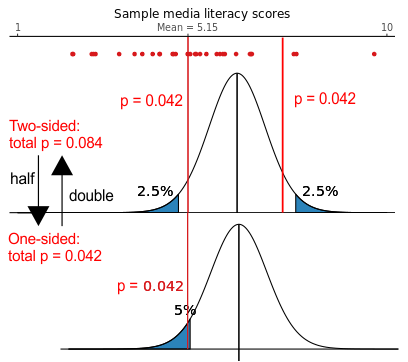
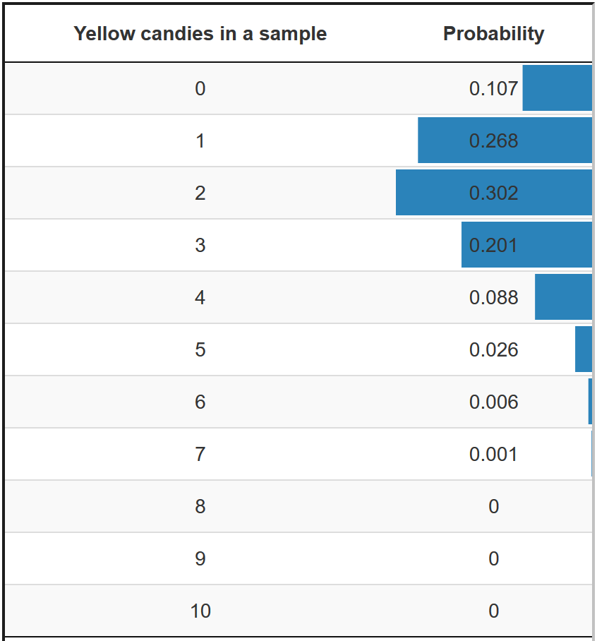

# Testing a Null Hypothesis: Am I Right or Am I Wrong? {#hypothesis}
> Key concepts: research hypothesis, statistical null and alternative hypothesis, nil hypothesis, test statistic, p value, significance level (Type I error rate), Type I error, inflated Type I error, capitalization on chance, one-sided and two-sided tests and tests to which this distinction does not apply, rejection region.  

### Summary {-}

```{block2, type='rmdimportant'}
Is my sample probable if the null hypothesis is true?
```

In the preceding chapter, we have learned that a confidence interval contains the population values that are plausible, given the sample that we have drawn. In the current chapter, we narrow this down to the question whether the expectation of the researcher about the population is plausible. 

The expectation is usually called a (research) hypothesis and it must be translated into statistical hypotheses about a population value (parameter): a null hypothesis and an alternative hypothesis. 

We test a null hypothesis in the following way. We construct a sampling distribution in one of the ways we have learned in Chapter \@ref(probmodels) using the value specified in the null hypothesis as the hypothetical population value. In other words, we act as if the null hypothesis is true. 

Then, we calculate the probability of drawing a sample such as the one we have drawn or a sample that differs even more from the hypothesized population value. If this probability (p value) is very low, say, below 5%, we reject the null hypothesis because our sample would be too unlikely if the null hypothesis is true. In this case, the test is statistically significant. The probability threshold that we use is called the significance level of the test.

## A Binary Decision {#binarydecision}

The overall goal of statistical inference is to increase our knowledge about a population, when we only have a random sample from that population. In Chapter \@ref(param-estim), we estimated population values that are plausible considering the sample that we have drawn. For instance, we looked for all plausible average weights of candies in the population using information about the weight of candies in our sample bag. This is what we do when we estimate a population value.  

Estimation is one of two types of statistical inference, the other being null hypothesis testing. When we estimate a population value, we do not use our previous knowledge about the world of candies or whatever other subject we are investigating. We can be completely ignorant about the phenomenon that we are investigating. This approach is not entirely in line with the conceptualization of scientific progress as an _empirical cycle_, in which scientists develop theories about the empirical world, test these theories against data collected from this world, and improve their theories if they are contradicted by the data [@deGrootMethodologyFoundationsInference1969].  

Hypothesis testing, however, is more in line with this conceptualization of scientific progress. It requires the researcher to formulate an expectation about the population, usually called a _hypothesis_. If the hypothesis is based on theory and previous research, the scientist uses previous knowledge. As a next step, the researcher tests the hypothesis against data collected for this purpose. If the data contradict the hypothesis, the hypothesis is rejected and the researcher has to improve the theory. If the data does not contradict the hypothesis, it is not rejected and, for the time being, the researcher does not have to change the theory.  

Hypothesis testing, then, amounts to choosing one of two options: reject or not reject the hypothesis. This is a binary decision between believing that the population is as it is described in the null hypothesis, or believing that it is not. This is quite a different approach than estimating a confidence interval as a range of plausible population values. Nevertheless, hypothesis testing and confidence intervals are tightly related as we will see later on in this chapter (Section \@ref(null-ci0)).

## Statistical Tests

A statistical test determines whether a statement about a population is plausible given a sample that is drawn from this population. In essence, a statistical test answers the question: Is the sample that we have drawn sufficiently plausible if the statement about the population would be true?

We need several ingredients to apply a statistical test:

1. A statement about a population.

2. A sample from the population supplying information about the statement.

3. A criterion to decide when the statement is sufficiently plausible.

4. A probability for the statement showing how plausible the statement is.

This section discusses these four ingredients of a statistical test. The statement about a population is the null hypothesis of the test (Section \@ref(nullhypothesis)). The sample must contain the variable or variables addressed in the null hypothesis, so we discuss the sample in the section on the null hypothesis. We select a significance level, usually five per cent, as criterion to decide whether the null hypothesis is sufficiently plausible or not. In the latter case, we reject the null hypothesis. The values for which we reject the null hypothesis constitute the rejection region of the test (Section \@ref(sig-typeI)). Finally, we let the computer calculate a probability (p value) for drawing a sample that differs at least as much from the null hypothesis as the sample that we have drawn. If this probability is smaller than the selected significance level, the sample is in the rejection region, so we must reject the null hypothesis (Section \@ref(pvalue)). This concludes the statistical test.

### The null hypothesis and the sample {#nullhypothesis}

The statement that a research wants to test is called a _research hypothesis_. It is a statement about the empirical world that can be tested against data. Communication scientists, for instance, may hypothesize that:  

* a television station reaches half of all households in a country,

* media literacy is below a particular standard (for instance, 5.5 on a 10-point scale) among children, 

* opinions about immigrants are not equally polarized among young and old voters,  

* the celebrity endorsing a fundraising campaign makes a difference to adult's willingness to donate,  

* more exposure to brand advertisements increases brand awareness of consumers,

* and so on.  

These are statements about populations: all households in a country, children, voters, adults, and consumers. As these examples illustrate, research hypotheses seldom refer to statistics such as means, proportions, variances, or correlations. Still, we need a statistic to test a hypothesis. The researcher must translate the research hypothesis into a new hypothesis that refers to a statistic in the population, for example, the population mean. The new hypothesis is called a _statistical hypothesis_.

<A name="question4.2.1"></A>
```{block2, type='rmdquestion'}
1. Which statistics are addressed in the examples of research hypotheses above? [](#answer4.2.1)
```

The most important statistical hypothesis is called the _null hypothesis_ (_H_~0~). _The null hypothesis specifies one value for a population statistic_. For example, it hypothesizes that average media literacy in the population of children equals 5.5 on a scale from one to ten. If 5.5 distinguishes between sufficient and insufficient media literacy on a ten-point scale, it is interesting to know whether average media literacy of children is just sufficient or not.

We can test this statement about the population with a random sample of children drawn from the population in which we measure their media literacy. Once we have the measurements, we can calculate average media literacy in the sample. We can compare the sample average to the hypothesized average media literacy in the population. If they are not too far apart, we conclude that the null hypothesis is plausible. If they are too far apart, we don't think the null hypothesis is plausible and we reject it.

### Significance level ($\alpha$), significance, rejection region, and Type I error  {#sig-typeI}

How far apart must the sample statistic value and the hypothesized population value be to conclude that the null hypothesis is not plausible? The null hypothesis is supposed to be implausible if the sample that we have drawn is among the samples that are very unlikely if the null hypothesis is true. A commonly accepted threshold value is that the sample is among the five per cent most unlikely samples. This threshold is called the _significance level_ of the test. It is often represented by the symbol $\alpha$. If our sample is among the five per cent most unlikely samples, we reject the null hypothesis and we say that the test is _statistically significant_.

We can construct a sampling distribution around the hypothesized population value. Remember (Section \@ref(expectedvalue)) that the population value is the expected value of the sampling distribution, that is, it's mean (if the estimator is unbiased). The sampling distribution, then, is centered around the population value specified in the null hypothesis. This sampling distribution tells us the probabilities of all possible sample outcomes _if the null hypothesis is true_. It allows us to identify the most unlikely samples, that is, the samples for which we reject the null hypothesis.

Note that we can construct a sampling distribution for the null hypothesis only if the hypothesis specifies one value for the population statistic. If we would have multiple population values in our null hypothesis, for example, average media literacy is 5.5, 5.0, or 4.5 in the population, we would have multiple sampling distributions: one for each value. This is why the null hypothesis must specify a single value.

Let us assume that average media literacy is 3.9 in our sample. According to our null hypothesis, the population average is 5.5. If average media literacy of children in the population would really be 5.5, is our sample with 3.9 as average media literacy among the five per cent most unlikely samples? We can use a hypothetical sampling distribution with 5.5 as mean value to answer this question.

```{r nullsampling, fig.cap="Sampling distribution of average media literacy according to the null hypothesis.", echo=FALSE, out.width="420px", screenshot.opts = list(delay = 5), dev="png"}
# Display a normal curve (M = 5.5) representing the sampling distribution of average media literacy. Colour 2.5% of the area situated in each tail, add 2.5% as text. Add a vertical line representing the sample mean, initially 3.9.
# Let the user manipulate the population mean according to the null hypothesis (range 1-10) and allow her to draw a new sample.
knitr::include_app("http://82.196.4.233:3838/apps/nullsampling/", height="400px")
```

<A name="question4.2.2"></A>
```{block2, type='rmdquestion'}
2. Figure \@ref(fig:nullsampling) shows the hypothesized population mean, the associated sampling distribution, and the sample scores (red dots) with their mean. Formulate the null hypothesis represented by this figure. [](#answer4.2.2)
```

<A name="question4.2.3"></A>
```{block2, type='rmdquestion'}
3. How can you create a sampling distribution for a null hypothesis that specifies 4.3 as selected value? [](#answer4.2.3)
```

<A name="question4.2.4"></A>
```{block2, type='rmdquestion'}
4. The significance level is five per cent here. Why is it marked by two blue tails? [](#answer4.2.4)
```

<A name="question4.2.5"></A>
```{block2, type='rmdquestion'}
5. How low or high must the sample mean be to have a statistically significant test result? [](#answer4.2.5)
```

<A name="question4.2.6"></A>
```{block2, type='rmdquestion'}
6. Is it always possible to formulate a null hypothesis such that the sample mean is statistically significant? Take some new samples and change the value of the null hypothesis to check your answer. [](#answer4.2.6)
```

<A name="question4.2.7"></A>
```{block2, type='rmdquestion'}
7. What is special about a significance level of five per cent? [](#answer4.2.7)
```

The values for the sample statistic for which the test is statistically significant constitute the _rejection region_ of the test. If the sample statistic is in the rejection region, we reject the null hypothesis. Note that the rejection region has two separate parts: a part in the left tail and a part in the right tail of the sampling distribution. Average media literacy can be too low to maintain the null hypothesis that it is 5.5 in the population, but it can also be too high. The threshold value of five per cent is divided into two halves of 2.5% per cent; one for each tail.

If the sample statistic is in the rejection region, we have to reject the null hypothesis. Those are the rules of the game. However, our conclusion that the null hypothesis is wrong can be a mistake because the null hypothesis may still be true. For example, average media literacy is really 5.5 in the population, but we were so unfortunate to draw a sample of children with very low media literacy scores. This error is called a _Type I error_: rejecting a hypothesis that is actually true.

We don’t know whether or when we make this error. We cannot entirely avoid this error because samples can be very different from the population from which they are drawn, as we learned in Chapter \@ref(samp-dist). Thankfully, however, we know the probability that we make this error. This probability is the significance level.  

You should understand the exact meaning of probabilities here. A significance level of .05 allows five per cent of all possible samples to be so different from the population that we reject the null hypothesis even if it is true. 

In other words, if we draw a lot of samples and decide on the null hypothesis for each sample, we would reject a true null hypothesis in five per cent of our decisions. So we have a five per cent chance of making a Type I error. We decide on that probability when we select the confidence level of the test. We think that .05 is an acceptable probability for making this type of error.

### p Value {#pvalue}

How do we know that the sample that we have drawn is among the five percent most unlikely samples if the null hypothesis is true? In other words, how do we know that our sample statistic outcome is in the rejection region?

```{r twosided, fig.cap="Sampling distribution of average media literacy according to the null hypothesis.", echo=FALSE, out.width="420px", screenshot.opts = list(delay = 5), dev="png"}
# Display a normal curve (M = 5.5) representing the sampling distribution of average media literacy. Colour 2.5% of the area situated in each tail, add 2.5% as text. Add a vertical line representing the sample mean, initially 3.9, as well as a dotted line mirrored across the hypothesized mean. Display the percentage of the area under the curve to the left or right (outside) of this line (one-sided p value). Also display the two-sided p value.
# Let the user manipulate the population mean according to the null hypothesis (range 1-10) and allow her to draw a new sample.
knitr::include_app("http://82.196.4.233:3838/apps/twosided/", height="400px")
```

<A name="question4.2.8"></A>
```{block2, type='rmdquestion'}
8. What does the number next to the solid red vertical line represent in Figure \@ref(fig:twosided)? [](#answer4.2.8)
```

<A name="question4.2.9"></A>
```{block2, type='rmdquestion'}
9. What is the relation between the number next to the solid red vertical line and the two-sided p value reported in the figure? Pay attention to the dashed red vertical line in your answer. [](#answer4.2.9)
```

<A name="question4.2.10"></A>
```{block2, type='rmdquestion'}
10. Is the test on average media literacy statistically significant in the initial situation of Figure \@ref(fig:twosided)? If so, at which significance level? Use the rejection region, the number to the vertical red line, and the two-sided p value to motivate your answer. [](#answer4.2.10)
```

<A name="question4.2.11"></A>
```{block2, type='rmdquestion'}
11. What happens to the two-sided p value if you change the hypothesized population mean? [](#answer4.2.11)
```

In the previous section, we learned that a test is statistically significant if the sample statistic is in the rejection region. Statistical software, however, usually does not report the rejection region for the sample statistic. Instead, it reports the _p value_ of the test, which is sometimes referred to as _significance_ or _Sig._ in SPSS. 

A p value is the probability that a sample is drawn with a value for the sample statistic that is at least as different from the hypothesized population value as the value in the observed sample. In other words, the p value tells us which proportion of all possible samples are less similar to the hypothesized population value than our observed sample if the null hypothesis is true. If this proportion is very small, say less than five percent, the sample that we have drawn is among the unlikely samples. 

And what do we do if our sample is among the unlikely ones? We reject the null hypothesis because the test is statistically significant. The decision rule is quite simple if we know the p value of a test: If the p value is below the significance level (usually .05), we reject the null hypothesis. Otherwise, we do not reject it.

```{block2, type='rmdimportant'}
If p is low, the null must go and the test is statistically significant.
```

This is the golden rule of null hypothesis testing (although some argue that the gold of this rule is fool's gold, see Chapter \@ref(crit-discus)).  

It is important to remember that a p value is a probability _under the assumption that the null hypothesis is true_. Therefore, it is a _conditional probability_. 

Compare it to the probability that we throw sixes with a dice. This probability is one out of six under the assumption that the dice is unbiased. Probabilities always rest on assumptions. If the assumptions are violated, we cannot calculate probabilities. 

If the dice is biased, we don't know the probability of throwing sixes. In the same way, we have no clue whatsoever of the probability of drawing a sample like the one we have if the null hypothesis is not true in the population. This is why specifying a null hypothesis is necessary for calculating p values.

### Answers {-}

<A name="answer4.2.1"></A>
```{block2, type='rmdanswer'}
Answer to Question 1. 

* A television station reaches half of all households in a country: This
hypothesis is about a proportion (share): half (50%) of all households.
* Media literacy is below 5.5 (on a 10-point scale) among children: This
hypothesis probably addresses a population mean, namely average media
literacy.
* Opinions about immigrants are not equally polarized among young and old
voters: It is not so easy to see, but this hypothesis is about variation in
scores, namely the variance in opinion scores among young voters and the
variation among old voters.
* The celebrity endorsing a fundraising campaign makes a difference to
willingness to donate: People exposed to different endorsers are expected to
have different (levels of) willingness to donate. We are probably going to
compare the mean or median willingness across groups of people.
* More exposure to brand advertisements increases brand awareness: This
probably refers to a correlation or regression between brand advertisements
and brand awareness. [](#question4.2.1)
```

<A name="answer4.2.2"></A>
```{block2, type='rmdanswer'}
Answer to Question 2. 

* The null hypothesis: In the population of children, average media literacy
is 5.5.
* Be sure to mention that the null hypothesis concerns a population.
* This example is about average media literacy, so the null hypothesis
statistic is the average.
* The average (middle) of the sampling distribution is 5.5. This must be the
hypothesized population value because (the sample mean is an unbiased estimator
of the population mean, so) the population value is the average of the sampling
distribution. [](#question4.2.2)
```

<A name="answer4.2.3"></A>
```{block2, type='rmdanswer'}
Answer to Question 3. 

Just change the hypothesized population mean with the slider. [](#question4.2.3)
```

<A name="answer4.2.4"></A>
```{block2, type='rmdanswer'}
Answer to Question 4. 

* The significance level is a proportion or probability, so it is expressed by
a surface under the (probability density) curve.
* The sample average can be too low, so half of the risk is situated in the
left tail, but it can also be too high, so the other half of the risk is
situated in the right tail. [](#question4.2.4)
```

<A name="answer4.2.5"></A>
```{block2, type='rmdanswer'}
Answer to Question 5. 

* In the initial example, with average population media literacy hypothesized
to be 5.5 and 3.9 as the sample mean, sample means below 4.07 or above 6.93
are in the blue tails. They are statistically significantly different from the
hypothesized population value. [](#question4.2.5)
```

<A name="answer4.2.6"></A>
```{block2, type='rmdanswer'}
Answer to Question 6. 

* If the null hypothesis changes, the hypothesized population average, hence
the centre of the sampling distribution moves left or right. And so do the
blue tails that indicate statistically significant results.
* Thus, it is always possible to find a hypothesized population value for
which the sample mean ends up in a blue tail, so it is statistically
significant. [](#question4.2.6)
```

<A name="answer4.2.7"></A>
```{block2, type='rmdanswer'}
Answer to Question 7. 

Nothing is special about a significance level of five per cent. We could have
used any other cutoff value. It is just a convention to use this level. [](#question4.2.7)
```

<A name="answer4.2.8"></A>
```{block2, type='rmdanswer'}
Answer to Question 8. 

* It represents the probability (p value) of drawing a sample with mean media
literacy below 3.9 if the null hypothesis is true that the population average
is 5.50.
* In a later section, we will see that this is a one-sided p value, more
precisely, a left-sided p value.
* Please, do not forget to mention that this is the probability only if the
null hypothesis is true. See Question 4. [](#question4.2.8)
```

<A name="answer4.2.9"></A>
```{block2, type='rmdanswer'}
Answer to Question 9. 

* The two-sided p value is twice the (one-sided) p value reported as number
next to the solid red line. Note that rounding errors occur.
* The two-sided p value tells us the probability of drawing a sample with
average media literacy at least as different from the hypothesized value as the
sample mean that we have found.
* The solid red line represents the sample mean that we have found. The
associated probability tells us the probability of drawing a sample with
average media literacy at least 5.5 - 3.9 = 1.6 LESS than the hypothesized
population value.
* The dashed red line is the boundary for samples with average media literacy
that are at least 1.6 HIGHER than the hypothesized population mean. These
samples are at least as far away from the hypothesis as the sample mean that we
have observed.
* The dashed red line cuts off the same size from the right tail as the solid
red line cuts off from the left tail (in the initial situation of the figure).
In other words, it represents the same probability.
* The two-sided p value sums the probabilities cut off from the left tail and
the right tail. As a result, it is twice the probability reported for the left
tail. [](#question4.2.9)
```

<A name="answer4.2.10"></A>
```{block2, type='rmdanswer'}
Answer to Question 10. 

* The statistical test is significant at the five per cent significance level.
* Rejection region: The sample mean is in the rejection region marked by the
blue tails, so the test is statistically significant. The total probability of
the two blue tails is five per cent, so this is the significance level.
* (left-sided) p Value: The probability to draw a sample with 3.9 average media
literacy (.015) is less than the probability associated with the rejection
region in the left tail (.025) if the null hypothesis is true. So the test is
statistically significant at the 2 * .025 = .05 level.
* Two-sided p value: The two-sided p value is below five percent if the null
hypothesis is true, so the test is statistically significant at the five
percent significance level. [](#question4.2.10)
```

<A name="answer4.2.11"></A>
```{block2, type='rmdanswer'}
Answer to Question 11. 

* The two-sided p value changes if we change the hypothesized population mean
with the slider. It becomes smaller if we move the hypothesized population
value away from the observed sample mean. It becomes larger if we move towards
the sample mean.
* This clearly illustrates that the p value of a test, the location of the
rejection regions, and, as a consequence, the statistical significance of the
test depends on the value of the population statistic that we specify in the
null hypothesis. [](#question4.2.11)
```

## Research hypothesis, alternative hypothesis, and nil hypothesis {#null-alt}

The null hypothesis is central to significance testing. If the test is statistically significant, that is, if the p value is below the significance level, we reject the null hypothesis.

Statistical hypotheses, however, come in pairs: a null hypothesis (_H_~0~) and an _alternative hypothesis_ (_H_~1~ or _H_~A~). _The alternative hypothesis covers all situations not covered by the null hypothesis_. The null hypothesis stating that average media literacy in a population of children is 5.5, is paired with the alternative hypothesis stating that the average is not 5.5. In this way, we cover all possible outcomes.

If we reject the null hypothesis, we say that our data lend support to the alternative hypothesis. We doubt that the null hypothesis is true. Of course, we know that we can be mistaken. There is five per cent chance that we reject a null hypothesis that is actually true (Type I error, Section \@ref(sig-typeI)). Rejecting the null hypothesis does not mean that this hypothesis is false or that the alternative hypothesis is true. Please, never forget this.

<A name="question4.3.1"></A>
```{block2, type='rmdquestion'}
1. Have another look at the research hypotheses. Which ones are null hypotheses, which ones are alternative hypotheses? Remember: A null hypothesis must specify a value for the population statistic that we are interested in.

    + a television station reaches half of all households in a country,

    + media literacy is below 5.5 (on a 10-point scale) among children,

    + opinions about immigrants are not equally polarized among young and old voters,  

    + the celebrity endorsing a fundraising campaign makes a difference to adult's willingness to donate,

    + more exposure to brand advertisements increases brand awareness of consumers. [](#answer4.3.1)
```

The alternative hypothesis is mainly of interest because it usually represents the research hypothesis (but not always as some statistics textbooks would have us believe). Most of the research hypotheses in social research are alternative hypotheses because our theories tell us to expect differences or changes but not the size of differences or changes.

Not knowing which precise difference or association to expect, we usually formulate the research hypothesis that there is a difference or association. Because a particular value for the difference or association cannot be specified, these research hypotheses are alternative hypotheses. The associated null hypothesis is that there is no difference or no association. It equates the population statistic to one value, namely zero. This type of null hypothesis is called a _nil hypothesis_ or just plainly _the nil_. 

When groups have the same average scores on a dependent variable, for example, willingness to donate to a charity, the differences between the group averages are hypothesized to be zero. If there is no correlation between exposure and brand awareness in the population, the correlation coefficient (Spearman's rho or Pearson's correlation coefficient) or regression coefficient ($b$ or $b^*$) is hypothesized to be zero. For all measures of association, zero means that there is no association.

If the research hypothesis is the alternative hypothesis, we have to formulate the null hypothesis ourselves. This is very important, because the null hypothesis is actually tested. If statistical software does not report the null hypothesis that is being tested, you may assume that it equates the parameter of interest to zero (see Section \@ref(nullSPSS) on null hypotheses in SPSS).

### Answers {-}

<A name="answer4.3.1"></A>
```{block2, type='rmdanswer'}
Answer to Question 1. 

* A television station reaches half of all households in a country: This
hypothesis is about a proportion (share) in the population of all households in
a country. It specifies one particular value, namely 'half', that is 50% or
0.50. This reseach hypothesis is a null hypothesis.
* Media literacy is below 5.5 (on a 10-point scale) among children: This
hypothesis addresses a population mean. It expects some value below 5.5. This
can be more than one value, so this is an alternative hypothesis.
* Opinions about immigrants are not equally polarized among young and old
voters: This hypothesis is about variation in scores, for example the variance
in opinion scores. There is a variance for young voters and a variance for old
voters in the population and they are expected not to be equal. The difference
in variances, which is the statistic that we are interested in here, is not
expected to be zero. It is expected to be anything but zero. This can be more
than one value, so this is an alternative hypothesis.
* The celebrity endorsing a fundraising campaign makes a difference to
willingness to donate: We are probably going to compare the mean willingness
across groups of people. The means are not expected to be the same, but the
exact difference is not specified. It can be any number other than zero.
Again, this is the alternative hypothesis.
* More exposure to brand advertisements increases brand awareness: We expect a
positive association, but the researcher does not specify a value for the
expected association, so this is an alternative hypothesis. [](#question4.3.1)
```

## One-Sided and Two-Sided Tests {#one-twosidedtests}

In the preceding section, you may have felt a bit awkward when you were determining whether a research hypothesis is a null hypothesis or an alternative hypothesis. The research hypothesis stating that average media literacy is below 5.5 in the population, for example, represents the alternative hypothesis because it does not fix the hypothesized population value to one number. The accompanying null hypothesis must cover all other options, so it must state that the population mean is 5.5 or higher. But this null hypothesis does not specify one value as it should, right?

This null hypothesis is slightly different from the ones we have encountered so far, which equated the population value to a single value. If the null hypothesis equates a parameter to a single value, the null hypothesis can be rejected if the sample statistic is either too high or too low. There are two ways of rejecting the null hypothesis, so this type of hypothesis and test are called _two-sided_ or _two-tailed_.

By contrast, the null hypothesis stating that the population mean is 5.5 or higher is a _one-sided_ or _one-tailed_ hypothesis. It can only be rejected if the sample statistic is at one side of the spectrum: only below (left-sided) or only above (right-sided) the hypothesized population value. In the media literacy example, the null hypothesis is only rejected if the sample mean is well below the hypothesized population value. A test of a one-sided null hypothesis is called a _one-sided test_. 

```{r nonsig-1sided, fig.cap="One-sided and two-sided tests of a null hypothesis.", echo=FALSE, out.width="420px", screenshot.opts = list(delay = 5), dev="png"}
# Display the sampling distribution of average media literacy as a normal curve with 5% two-sided significance areas dark blue and 5% one-sided significance areas light blue. Generate randomly one out of six possible values for the sample mean: (from left to right) in the 0-2.5% region, 2.5%-5%, 5%-50%, 50%-95%, 95%-97.5%, 97.5%-100%. Let the user select the answers (Yes/No) to three questions: Is this sample mean significant at a 5% significance level? "Left-sided test?", "Right-sided test?",  "Two-sided test?". Give feedback when the user presses the submit button. 
knitr::include_app("http://82.196.4.233:3838/apps/nonsig-1sided/", height="310px")
```

<A name="question4.4.1"></A>
```{block2, type='rmdquestion'}
1. The sampling distribution in Figure \@ref(fig:nonsig-1sided) contains dark-blue tails that represent 2.5 per cent of the sampling distribution and light-blue tails representing five per cent of the sampling distribution. Note that the light-blue (5%) tails include the dark-blue (2.5%) tails. Which coloured tails do we use for a two-sided test, a left-sided test, and a right-sided test at a five per cent significance level? [](#answer4.4.1)
```

<A name="question4.4.2"></A>
```{block2, type='rmdquestion'}
2. Practice recognizing significant test results in Figure \@ref(fig:nonsig-1sided). Draw some samples and decide if a two-sided, right-sided, or left-sided test is statistically significant at the 5% significance level. [](#answer4.4.2)
```

<A name="question4.4.3"></A>
```{block2, type='rmdquestion'}
3. In which situation is a one-sided test statistically significant whereas a two-sided test is not statistically significant at the five per cent significance level? [](#answer4.4.3)
```

<A name="question4.4.4"></A>
```{block2, type='rmdquestion'}
4. In which situation is a one-sided test not statistically significant whereas a two-sided test is statistically significant at the five per cent significance level? [](#answer4.4.4)
```

In a left-sided test of the media literacy hypothesis, the researcher is not interested in demonstrating that average media literacy among children can be larger than 5.5. She only wants to test if it is below 5.5, perhaps because an average score below 5.5 is alarming and requires an intervention, or because prior knowledge about the world has convinced her that average media literacy among children can only be lower than 5.5 on average in the population. 

If it is deemed important to note values well over 5.5 as well as values well below 5.5, the research and null hypotheses should be two-sided. Then, a sample average well above 5.5 would also have resulted in a rejection of the null hypothesis. In a left-sided test, however, a high sample outcome cannot reject the null hypothesis. 

### Boundary value as hypothesized population value

```{r sign-left, fig.cap="Sampling distribution of average media literacy.", echo=FALSE, out.width="420px", screenshot.opts = list(delay = 5), dev="png"}
# Display a normal curve (M = 5.5) representing the sampling distribution of average media literacy. Colour 5% of the area situated in the left tail, add 5% as text. Add a vertical line representing the sample mean, initially 3.9, and display the percentage of the area under the curve to the left of this line.
# Let the user manipulate the sample mean (range 1-10) and the population mean according to the null hypothesis (range 1-10).
knitr::include_app("http://82.196.4.233:3838/apps/sign-left/", height="400px")
```

<A name="question4.4.5"></A>
```{block2, type='rmdquestion'}
5. Figure \@ref(fig:sign-left) shows the sampling distribution and the rejection region for a left-sided test at five per cent significance level. If we reject the null hypothesis that average media literacy in the population is 5.5, do we also reject a null hypothesis that this average is larger than 5.5? Change the slider to demonstrate your answer. [](#answer4.4.5)
```

You may wonder how a one-sided null hypothesis equates the parameter of interest with one value as it should. The special value here is 5.5. If we can reject the null hypothesis stating that the population mean is 5.5 because our sample mean is sufficiently lower than 5.5, we can also reject any hypothesis involving population means higher than 5.5. 

In other words, if you want to know if the value is not 5.5 or more, it is enough to find that it is less than 5.5. If it's less than 5.5, then you know it's also less than any number above 5.5. Therefore, we use the boundary value of a one-sided null hypothesis as the value for a one-sided test.

### One-sided -- two-sided distinction is not always relevant

Note that the difference between one-sided and two-sided tests is only useful if we test a statistic against one particular value or if we test the difference between two groups. 

In the first situation, for example, if we test the null hypothesis that average media literacy is 5.5 in the population, we may only be interested in showing that the population value is lower than the hypothesized value. Another example is a test on a regression coefficient or correlation coefficient. According to the null hypothesis, the coefficient is zero in the population. If we only want to use a brand advertisement if exposure to the advertisement increases brand awareness among consumers, we apply a right-sided test to the coefficient for the effect of exposure on brand awareness because we are only interested in a positive effect (larger than the zero).

In the second situation, we compare the scores of two groups on a dependent variable. If we compare average media literacy after an intervention to media literacy before the intervention (paired-samples t test), we must demonstrate an increase in media literacy before we are going to use the intervention on a large scale. Again, a one-sided test can be applied.

In contrast, we cannot meaningfully formulate a one-sided null hypothesis if we are comparing three groups or more. Even if we expect that Group A can only score higher than Group B and Group C, what about the difference between Group B and Group C? If we can't have meaningful one-sided null hypotheses, we cannot meaningfully distinguish between one-sided and two-sided null hypotheses.  

### From one-sided to two-sided p values and back again

Statistical software like SPSS usually reports either one-sided or two-sided p values. What if a one-sided p value is reported but you need a two-sided p value or the other way around?

In Figure \@ref(fig:1-2sidedpvalues), the sample mean is 5.15 and we have .042 probability to find a sample mean of 5.15 or less if the null hypothesis is true. This probability is the surface under the curve to the left of the red line representing the sample mean. It is the one-sided p value that we obtain if we only take into account the possibility that the population mean can be smaller than the hypothesized value. We are only interested in the left tail of the sampling distribution.

```{r 1-2sidedpvalues, eval=TRUE, echo=FALSE, fig.cap="Halve a two-sided p value to obtain a one-sided p value, double a one-sided p value to obtain a two-sided p value."}

```

In a two-sided test, we have to reckon with two different types of outcomes. Our sample outcome can be smaller or larger than the hypothesized population value. As a consequence, the p value must cover samples at opposite sides of the sampling distribution. We should not only reckon with sample means that are less than 5.15 but also with sample means that are just as much larger than the hypothesized population value. So we have to take into account a probability of .042 for the right tail of the distribution as well in Figure \@ref(fig:1-2sidedpvalues). We can double the one-sided p value to obtain the two-sided p value.

In contrast, if our statistical software tells us the two-sided p value and we want to have the one-sided p value, we can simply halve the two-sided p value. The two-sided p value is divided equally between the left and right tails. If we are interested in just one tail, we can ignore the half of the p value that is situated in the other tail. Of course, this only makes sense if a one-sided test makes sense.

Be careful if you divide a two-sided p value to obtain a one-sided p value. If your left-sided test hypothesizes that average media literacy is below 5.5 but your sample mean is well above 5.5, the two-sided p value can be below .05. But your left-sided test can never be significant because a sample mean above 5.5 is fully in line with the null hypothesis. Check that the sample outcome is at the correct side of the hypothesized population value.

### Answers {-}

<A name="answer4.4.1"></A>
```{block2, type='rmdanswer'}
Answer to Question 1. 

* As we learned in a previous section, a two-sided test divides the total
significance level into two parts, one half for each tail of the sampling
distribution. The dark blue tails, each representing 2.5 per cent, then, are
used for a two-tailed test at five per cent significance level.
* A one-tailed test takes into account sample outcomes either below the
hypothesized value or above the hypothesized value. It assigns the full
significance level (5%) to one tail, so it uses the light blue tails (which
include the dark blue tails).
* A left-sided test only uses the light blue tail at the left, a right-sided
test only uses the tail at the right. [](#question4.4.1)
```

<A name="answer4.4.2"></A>
```{block2, type='rmdanswer'}
Answer to Question 2. 

* If the sample mean falls within a dark-blue tail, a two-sided test is
statistically significant.
* If the sample mean falls within the light (or dark-blue) tail at the
right, a right-sided test is statistically significant but a left-sided test
is not.
* If the sample mean falls within the light (or dark-blue) tail at the
left, a left-sided test is statistically significant but a right-sided test is
not. [](#question4.4.2)
```

<A name="answer4.4.3"></A>
```{block2, type='rmdanswer'}
Answer to Question 3. 

* If the sample mean is in the light-blue part of the tail at the right but not
in the dark-blue part, a right-sided test is statistically significant but a
two-sided test is not.
* If the sample mean is in the light-blue part of the tail at the left but not
in the dark-blue part, a left-sided test is statistically significant but a
two-sided test is not. [](#question4.4.3)
```

<A name="answer4.4.4"></A>
```{block2, type='rmdanswer'}
Answer to Question 4. 

* A one-sided test is more easily statistically significant because the 5%
part of the tail is wider than the 2.5% part of the tail. But a one-sided test
requires that the sample outcome is on the right side of the hypothesized
value. If it is on the wrong side, it can never be significant in a one-tailed
test. If the researcher wants to reject the null hypothesis only if the sample
outcome is too high, she will not reject it if the sample outcome is too low.
* If the sample mean is in the dark-blue tail at the right, a two-sided test
is statistically significant but a left-sided test is not. The right tail is
the wrong side for a left-sided hypothesis.
* If the sample mean is in the dark-blue tail at the left, a two-sided test is
statistically significant but a right-sided test is not. The left tail is the
wrong side for a right-sided hypothesis. [](#question4.4.4)
```

<A name="answer4.4.5"></A>
```{block2, type='rmdanswer'}
Answer to Question 5. 

* Yes. If a left-sided test is situated in the rejection region with the null
hypothesis that the population mean is 5.5, a left-sided test is also situated
in the rejection region for higher values of the hypothesized population mean.
* The sampling distribution shifts to the right if we use a higher value for
the hypothesized population mean. The observed sample mean remains in the left
blue tail, which extends infinitely to the left, even if we cannot see that
clearly in the figure. [](#question4.4.5)
```

## Testing a Null Hypothesis with a Theoretical Probability Distribution

The preceding sections taught us how to execute a significance test. Formulate a null hypothesis that equates a population characteristic (parameter) to a particular value, which is a boundary value in the case of a one-sided test. Then construct a sampling distribution with the hypothesized (boundary) value as centre and use it to calculate a p value. If the p value is below the significance level ($\alpha$), the test is statistically significant, so we reject the null hypothesis.

We have not discussed yet how we construct the sampling distribution. Chapter \@ref(probmodels) presented three ways: bootstrapping, an exact approach, and approximation of the sampling distribution with a theoretical probability distribution. The last option is the most popular, so let us discuss it first. Exact approaches and bootstrapping are discussed in the next section.

A theoretical probability distribution links sample outcomes such as a sample mean to probabilities by means of a _test statistic_. A test statistic is named after the theoretical probability distribution to which it belongs: _z_ for the standard-normal or _z_ distribution, _t_ for the _t_ distribution, _F_ for the _F_ distribution and, you guessed it, chi-squared for the chi-squared distribution.  

```{r crit-df, fig.cap="Sample size and critical values in a one-sample t test on the null hypothesis that the population average is 5.5.", echo=FALSE, screenshot.opts = list(delay = 5), dev="png", out.width="420px"}
# Compare app crit-values in Ch. 3.
# Draw a t distribution with mean 5.5, standard deviation 0.4, and degrees of freedom equal to selected sample size minus 1 ; x-axis with scale and labelled "Average media literacy" ; second x axis reflecting t values ; vertical lines with values for critical values (two-sided, 5% significance level) ; colour areas outside the critical values ; add a slider to adjust sample size (range [5, 50], initial setting 25) ; update the t distribution, the critical values (vertical lines), the areas outside the critical values, and the scale of the t axis if the slider position changes.
knitr::include_app("http://82.196.4.233:3838/apps/crit-df/", height="405px")
```

Figure \@ref(fig:crit-df) uses the t distribution to approximate the sampling distribution of average media literacy in a random sample of children. The null hypothesis states that average media literacy is 5.5 in the population of children.

<A name="question4.5.1"></A>
```{block2, type='rmdquestion'}
1. What is the meaning of the coloured tails? [](#answer4.5.1)
```

<A name="question4.5.2"></A>
```{block2, type='rmdquestion'}
2. What is the meaning of t~c~? [](#answer4.5.2)
```

<A name="question4.5.3"></A>
```{block2, type='rmdquestion'}
3. Why does the distribution become more pointed when sample size increases? [](#answer4.5.3)
```

<A name="question4.5.4"></A>
```{block2, type='rmdquestion'}
4. Is there a fixed relation between the t values (top axis) and the values for average sample media literacy (bottom axis)? Change the sample size to find the answer. [](#answer4.5.4)
```

<A name="question4.5.5"></A>
```{block2, type='rmdquestion'}
5.  What is the relation between sample size and critical t values? [](#answer4.5.5)
```

A test statistic is calculated from the sample statistic that we want to test, for instance, the sample proportion, mean, variance, or association, but it uses the null hypothesis as well. A test statistic more or less standardizes the difference between the sample statistic and the population value that we expect under the null hypothesis. 

The exact formula and calculation of a test statistic is not important to us. Just note that the test statistic is zero if the sample outcome is equal to the hypothesized population value. In Figure \@ref(fig:crit-df), for example, the t value of a sample with mean 5.5 is zero if the hypothesized population mean is 5.5. The larger the difference between the observed value (sample outcome) and the expected value (hypothesized population value), the more extreme the value of the test statistic, the less likely (lower p value) it is that we draw a sample with the observed outcome or an outcome even more different from the expected value, and, finally, the more likely we are to reject the null hypothesis.

We reject the null hypothesis if the test statistic is in the _rejection region_. The value of the test statistic where the rejection region starts, is called the _critical value_ of the test statistic. In Section \@ref(crit-values), we learned that 1.96 is the critical value of z for a two-sided test at five per cent significance level in a standard-normal distribution. In a z test, then, a sample z value above 1.96 or below -1.96 indicates a statistically significant test result.

Probability distributions other than the standard-normal distribution, however, do not have fixed critical values. Their critical values depend on the _degrees of freedom_ of the test, usually abbreviated to _df_. The degrees of freedom of a test may depend on sample size, the number of groups that we compare, or the number of rows and columns in a contingency table. We don't need to worry about this. 

The t distribution is an example of a probability distribution for which the critical values depend on the degrees of freedom of the test. In this case, the degrees of freedom are determined by sample size. Larger samples have more degrees of freedom and, as a consequence, they have slightly lower critical values. For samples that are not too small the critical values of t are near 2. You may have noticed this in Figure \@ref(fig:crit-df).

APA6 requires us to report the degrees of freedom. If SPSS reports the degrees of freedom, usually in a column with the header _df_, you should include the number between brackets after the name of the test statistic. If, for example, a t test has 18 degrees of freedom and the t value is 0.63, you report: _t_ (18) = 0.63. Note that the _F_ test statistic has two degrees of freedom, both of which should be reported (separated by a comma and a blank space), for example, _F_ (2, 87) = 3.13.

### Answers {-}

<A name="answer4.5.1"></A>
```{block2, type='rmdanswer'}
Answer to Question 1. 

* The coloured tails represent the probabilities of drawing a sample with a
(sample) mean that differs a lot from the (true or hypothesized) population
mean. The (true or hypothesized) population mean is represented by the centre
of the distribution.
* In this case, the probabilities of the two coloured tails sum to 5%, so the
tails represent the top five per cent of samples that are most different from
the hypothesized or true population mean. [](#question4.5.1)
```

<A name="answer4.5.2"></A>
```{block2, type='rmdanswer'}
Answer to Question 2. 

* t~c~ is the value of the test statistic t that separates the most unlikely
or most extreme samples from the most likely samples.
* It is called the critical value of the test statistic. [](#question4.5.2)
```

<A name="answer4.5.3"></A>
```{block2, type='rmdanswer'}
Answer to Question 3. 

* With a larger sample, we have more information, so we have more precise
results. More sample means are close to the true population mean.
* In technical terms, the variation of sample means decreases with larger
sample size; sample means are more alike. The standard deviation of the
sampling distribution measures the variation of sample means. It is the
standard error of the sampling distribution (see Section \@ref(standard-error)). A
distribution of larger samples has a smaller standard error. [](#question4.5.3)
```

<A name="answer4.5.4"></A>
```{block2, type='rmdanswer'}
Answer to Question 4. 

* No, there is not a fixed relation. A particular average media literacy
score, for example, 4.0 on the bottom scale, does not always correspond to the
same test statistic (t) value on the top scale. Just change sample size to see
this. [](#question4.5.4)
```

<A name="answer4.5.5"></A>
```{block2, type='rmdanswer'}
Answer to Question 5. 

* Smaller samples have slightly larger critical t values. [](#question4.5.5)
```

## Testing a Null Hypothesis with an Exact Approach or Bootstrapping

Exact approaches calculate probabilities for discrete outcomes. In the candy example, the number of yellow candies in a sample bag of ten candies is a discrete outcome. With the binomial formula, the exact probability of zero yellow candies can be calculated, the probability of one yellow candy, two yellow candies, and so on (see Figure \@ref(fig:exactapproachfigure2)). 

```{r exactapproachfigure2, eval=TRUE, echo=FALSE, out.width="300px", fig.cap="Probabilities of a sample with a particular number of yellow candies if 20 per cent of the candies are yellow in the population."}

```

Let us imagine that our sample bag contains six yellow candies and we hypothesize that twenty per cent of the candies are yellow in the population. The p value of our sample outcome (six yellow candies) sums the probabilities of drawing a sample bag with six, seven, eight, nine, or ten yellow candies from a population in which twenty per cent of the candies are yellow (our null hypothesis). The p value happens to be .006, even though Figure \@ref(fig:exactapproachfigure2) suggests .007 but that is a matter of rounding error. This is the right-sided p value if we assume that our hypothesis is true.

With the p value, we execute the significance test as usual. The p value is well below the significance level of .05, so we reject the null hypothesis that twenty per cent of all candies in the population are yellow.

The situation is slightly more complicated if we want to execute a significance test with a sampling distribution created with bootstrapping. To understand the testing procedure with bootstrapping, we first have to discuss the relation between null-hypothesis testing and confidence intervals.

### Relation between null-hypothesis tests and confidence intervals {#null-ci0}

The top of Figure \@ref(fig:null-ci) shows media literacy scores in a random sample of children and their average media literacy score (red). The hypothesized average media literacy in the population of children is shown on the bottom axis. The curve represents the sampling distribution if the null hypothesis is true.

```{r null-ci, fig.cap="How does null hypothesis significance relate to confidence intervals?", echo=FALSE, out.width="420px", screenshot.opts = list(delay = 5), dev="png"}
# Draw three horizontal lines, the top line labeled 'population', the middle one labeled 'sampling distribution', and the bottom line labeled 'sample'. All lines have a numerical scale (1-10). Add a normal curve to the sampling distribution axis with 2.5% of each tail area coloured and the mean indicated by a vertical line extending to the population axis and labeled there by 'Mean = <number>'. Generate a sample mean within the range [4.5, 6.5] and mark it with a number on the lower line and a vertical line from the sample to well above the sampling distribution line (so it cuts through the normal curve). Add a slider to adjust the hypothesized population mean (range [3, 7]). The slider adjusts the horizontal position of the normal curve and population mean.
knitr::include_app("http://82.196.4.233:3838/apps/null-ci/", height="410px")
```

<A name="question4.6.1"></A>
```{block2, type='rmdquestion'}
1. What are the lowest and highest hypothesized population means for which the null hypothesis is _not_ rejected? [](#answer4.6.1)
```

<A name="question4.6.2"></A>
```{block2, type='rmdquestion'}
2. The interval between the lowest and highest hypothesized population means of Question 1 is the 95% confidence interval (see Section \@ref(ci-parameter)). Is a null hypothesis statistically significant if the hypothesized population value is within the 95% confidence interval or outside of this interval? [](#answer4.6.2)
```
  
Do you remember how we constructed a confidence interval in Chapter \@ref(param-estim)? We looked for all population values for which the sample outcome is sufficiently plausible. Sufficiently plausible means that our observed sample outcome is among the sample outcomes that are closest to the population value. By convention, we use a confidence level of 95 per cent, which means that our observed sample is among the 95 per cent of all samples that have outcomes closest to the population value.

But wait a minute. If the sample outcome is among the 95 per cent of samples in the middle of the sampling distribution, it is not among the extreme five percent of all samples. This is simply another way of saying that the observed sample outcome is not statistically significant at the five per cent level. A 95% confidence interval contains all population values that we could hypothesize for which our sample outcome is not statistically significant.

```{block2, type='rmdimportant'}
A 95% confidence interval contains all null hypotheses that would not be rejected with the current sample at the 5% significance level, two-sided.
```

If we know the 95% confidence interval, we can immediately see if our null hypothesis must be rejected or not. If the population value in our null hypothesis lies within the 95% confidence interval, the null hypothesis is NOT rejected. The sample that we have drawn is sufficiently plausible if our null hypothesis is true. In contrast, we must reject the null hypothesis if the hypothesized population value is NOT in the 95% confidence interval. 

Let us assume, for example, that average media literacy in our sample is 3.0 and that the 95% confidence interval for average media literacy ranges from 1.0 to 5.0. A null hypothesis specifying 2.5 as population average must not be rejected at the five percent significance level because 2.5 is in between 1.0 and 5.0, that is, inside the 95% confidence interval. If our null hypothesis says that average media literacy in the population is 5.5, we must reject this null hypothesis because it is outside the 95% confidence interval. The null hypothesis that average media literacy in the population is 0.0 must be rejected for the same reason. 

Note that the hypothesized value can be too high or too low for the confidence interval, so a hypothesis test using a confidence interval is always two-sided.

### Testing a null hypothesis with bootstrapping  

Using the confidence interval is the easiest and sometimes the only way of testing a null hypothesis if we create the sampling distribution with bootstrapping. For instance, we may use the median as the preferred measure of central tendency rather than the mean if the distribution of scores is quite skewed and the sample is not very large. In this situation, a theoretical probability distribution for the sample median is not known, so we resort to bootstrapping.

```{r null-bootstrap, eval=FALSE, echo=FALSE}
# Create a (left) skewed sample of media literacy scores (N = 30, such that the sampling dsitribution is skewed?). Generate a sampling distribution of median media literacy scores and display it as a histogram (with narrow bins). Show to vertical lines for the lower and upper limit of the confidence interval and display the percentage of cases to left/middle/right of these lines. Add a range slider, so the user can set the lower and upper limits of the 95% confidence interval for the sample median.

1. Figure \@ref(fig:null-bootstrap) shows the bootstrapped sampling distribution of sample medians for media literacy of teenagers. Use the sliders to determine the 95% confidence interval of the sample median.

2. Test the null hypothesis that teenager media literacy in the population is 6.0.
```

Bootstrapping creates an empirical sampling distribution: a lot of samples with a median calculated for each sample. A confidence interval can be created from this sampling distribution (see Section \@ref(bootstrap-confidenceinterval)). If our null hypothesis about the population median is included in the 95% confidence interval, we do not reject the null hypothesis. Otherwise, we reject it.

### Answers {-}

<A name="answer4.6.1"></A>
```{block2, type='rmdanswer'}
Answer to Question 1. 

* Change the slider such that the boundary of the right tail coincides with
the red line of the sample mean. This hypothesized population value is the
lower bound of the 95% confidence interval. It is the lowest hypothesized
population value for which the observed sample mean is not statistically
significant.
* Make the boundary of the left tail meet the sample mean (red line): this
population value is the upper bound of the confidence interval. It is the
highest hypothesized population value for which the observed sample mean is
not statistically significant. [](#question4.6.1)
```

<A name="answer4.6.2"></A>
```{block2, type='rmdanswer'}
Answer to Question 2. 

* A confidence interval contains all (hypothetical) values of the population
value---here: the population mean---for which the observed sample is
plausible, for example, it is among the 95% of samples with values closest
to the population value.
* We reject a null hypothesis if the sample is NOT plausible when the null
hypothesis is true. So we reject null hypotheses if the hypothesized population
value is OUTSIDE the confidence interval. If it is INSIDE the confidence
interval, we do NOT reject the null hypothesis. [](#question4.6.2)
```
  
## Test Recipe and Rules for Reporting

Testing a null hypothesis consists of several steps, which are summarized below, much like a recipe in a cookbook.

1. Specify the statistical hypotheses.  

In the first step, translate the research hypothesis into a null and alternative hypothesis. This requires choosing the right statistic for testing the research hypothesis (Section \@ref(nullhypothesis)) and choosing between a one-sided or two-sided test if applicable (Section \@ref(one-twosidedtests)).  

2. Select the significance level of the test.  

Before we execute the test, we have to choose the maximum probability of rejecting the null hypothesis if it is actually true. This is the significance level of the test. We almost always select .05 (5%) as the significance level. If we have a very large sample, e.g., several thousands of cases, we may select a lower significance level, for instance, 0.01. See Chapter \@ref(power) for more details.  

3. Select how the sampling distribution is created.  

Are you going to use bootstrapping, an exact approach, or a theoretical probability distribution? Theoretical probability distributions are the most common choice. We have to know which theoretical probability distribution can be used for which test. If you are working with statistical software, you automatically select the correct probability distribution by selecting the correct test. For example, a test on the means of two independent samples in SPSS uses the t distribution.

4. Execute the test.  

Let your statistical software calculate the p value of the test and/or the value of the test statistic. It is important that this step comes after the first three steps. The first three steps should be made without knowledge of the results in the sample.  

5. Decide on the null hypothesis.  

Reject the null hypothesis if the p value is lower than the significance level.  

6. Report the test results.  

The ultimate goal of the test is to increase our knowledge. To this end, we have to communicate our results both to fellow scientists and to the general reader who is interested in the subject of our research.  

### Reporting to fellow scientists

Fellow scientists need to be able to see the exact statistical test results. According to [APA6](http://www.apastyle.org/), we should report the test statistic, the associated degrees of freedom (if any), the value of the test statistic, the p value of the test statistic, and the confidence interval (if any). APA6 requires a particular format for presenting statistical results and it demands that the results are included at the end of a sentence.  

The statistical results for a _t_ test on one mean, for example, would be:  

<center>_t_ (67) = 2.73, _p_ = .004, 95%CI[4.13, 4.87]</center>  

* The degrees of freedom are between parentheses directly after the name of the test statistic. Chi-squared tests add sample size to the degrees of freedom, for instance: chi-squared (12, _N_ = 89) = 23.14, _p_ = .027.

* The value of the test statistic is 2.73 in this example.

* The p value is .004. Note that we report all results with two decimal places except probabilities, which are reported with three decimals. We are usually interested in small probabilities---less than .05---so we need the third decimal here. If SPSS rounds the p value to .000, report: _p_ < .001. Add (one-sided) after the p value if the test is one-sided.

* The 95% confidence interval is 4.13 to 4.87, so with 95% confidence we state that the population mean is between 4.13 and 4.87. Add (bootstrapped) after the confidence interval if the confidence interval is bootstrapped.

Not all tests produce all results reported in the example above. For example, a _z_ test does not have degrees of freedom and _F_ or chi-squared tests do not have confidence intervals. Exact tests or bootstrap tests usually do not have a test statistic. Just report the items that your statistical software produces, and give them in the correct format.

### Reporting to the general reader

For fellow scientists and especially for the general reader, it is important to read an interpretation of the results that clarifies both the subject of the test and the test results. Make sure that you tell your reader who or what the test is about:  

* What is the population that you investigate?  

* What are the variables?  

* What are the values of the relevant sample statistics?  

* Which comparison(s) do you make?  

* Are the results statistically significant and, if so, what are the estimates for the population?  

* If the results are significant, how large are the differences or associations?  

A test on one proportion, for example, the proportion of all households reached by a television station, could be reported as follows:  

```{block2, type='rmdimportant'}
"The television station reaches significantly and substantially (_p_ = .61) more than half of all households in Greece, _z_ = 4.01, _p_ < .001."
```

The interpretation of this test tells us the population ("all households in Greece"), the variable ("reaching a household") and the sample statistic of interest (_p_ for proportion). It tells us that the result is statistically significant, which a fellow scientist can check with the reported p value. 

Note that the actual p value is well below .001. If we would round it to three decimals, it would become .000. This suggests that the probability is zero but there is always some probability of rejecting the null hypothesis if it is true. For this reason, APA6 wants us to report _p_ < .001 instead of _p_ = .000. 

Finally, the interpretation tells us that the difference from .5 is substantial. Sometimes, we can express the difference in a number, which is called the _effect size_, and give a more precise interpretation (see Chapter \@ref(power) for more information).  

If you have the value of the test statistic but not the p value, you may report the significance level of the test instead of the p value. In this case, you either report "_p_ < .05" if the test is significant or "n.s." if the test is <i>n</i>ot <i>s</i>ignificant.  

## Specifying Null Hypotheses in SPSS {#nullSPSS}

```{r flowchart, echo=FALSE, fig.width=9, fig.cap="Flow chart for selecting a test in SPSS."}
#Create and draw flow chart for selecting tests in SPSS.
source("flowchart.R")
#Show plot.
p
#Cleanup.
rm(p, x, y)
```

Statistics such as means, proportions, variances, and correlations are calculated on variables. To translate a research hypothesis into a statistical hypothesis, the researcher has to recognize the dependent and independent variables addressed by the research hypothesis and their variable types. The main  distinction is between dichotomies (two groups), categorical (three or more groups), and numerical variables. Once you have identified the variables, the flow chart in Figure \@ref(fig:flowchart) helps you to identify the right statistical test.

If possible, SPSS uses a theoretical probability distribution to approximate the sampling distribution. It will select the appropriate sampling distribution. In some cases, such as a test on a contingency table with two rows and two columns, SPSS automatically includes an exact test because the theoretical approximation cannot be relied on.

SPSS does not allow the user to specify the null hypothesis of the test if the test involves two or more variables, that is, at least one dependent variable and one independent variable. Here, SPSS uses the nil hypothesis, assuming that the population value of interest is zero. For example, SPSS tests the null hypothesis that males and females have the same average willingness to donate to a charity, that is, the mean difference is zero, if we apply an independent samples t test. 

Imagine that we know from previous research that females tend to score one point higher on the willingness score than males. It would not be very interesting to reject the nil hypothesis. Instead, we would like to test the null hypothesis that the average difference between females and males is 1.00. We cannot change the null hypothesis of this t test in SPSS, but we can use the confidence interval to test our null hypothesis as explained in Section \@ref(null-ci0). 

In SPSS, the analyst has to specify the null hypothesis in tests on one variable, namely tests on one proportion, one mean, or one categorical variable. The following instructions explain how to do this.

### Instructions

A proportion is the statistic best suited to test research hypotheses addressing the share of a category in the population. The hypothesis that a television station reaches half of all households in a country provides an example. All households in the country constitute the population. The share of the television station is the proportion or percentage of all households watching this television station.  

If we have a data set on households containing a variable indicating whether or not a household watches the television station, we can test the research hypothesis. The statistical null hypothesis is that the proportion of households watching the television station is 0.5 in the population.

```{r SPSSbinomial, echo=FALSE, out.width="640px", fig.cap="(ref:binomialSPSS)", dev="png", screenshot.opts = list(delay = 5)}
knitr::include_url("https://www.youtube.com/embed/4ml3ffYxgWM", height = "360px")

# A binomial test on a single proportion can be executed in SPSS with the command _Analyze > Nonparametric Tests > Binomial_. In the dialog , you have to enter a variable. 
# 
# If this variable is a dichotomy (it has only two values), you can leave the _Define Dichotomy_ option at "Get from data". SPSS will use the first category score that it encounters in the data set the test category. This is tricky. It will test the sample proportion of this value against the test proportion that you specify elsewhere in this dialog.
# 
# If the variable has more than two categories or you want to be sure about the category that you use for the test, use the "Cut point" option under _Define Dichotomy_ to divide all scores into two groups. The lowest score up to and including the cut point are used as the test category.
# 
# The statistics under Options are not interesting if you just want to test a proportion.
#
# Figure shows the output. The sample proportion does not differ significantly from 0.5. In this example, we would report: "We cannot reject the hypothesis that the TV station reaches half of all households, _p_ = .784."
#
# The one-sided versus two-sided output is not discussed in the video.
```

We can also be interested in more than one category, for instance, in which regions are the households located: in the north, east, south, and west of the country? This translates into a statistical hypothesis containing two or more proportions in the population. If 30% of households in the population are situated in the west, 25 % in the south and east, and 20% in the north, we would expect these proportions in the sample if all regions are equally well-represented. Our statistical hypothesis is actually a relative frequency distribution, such as, for instance, in Table \@ref(tab:hypo-freq).

```{r hypo-freq, echo=FALSE}
knitr::kable(data.frame(Region = c("North", "East", "South", "West"), HP = c(0.20, 0.25, 0.25, 0.30)), digits = 2, caption = "Statistical hypothesis about four proportions as a frequency table.", col.names = c("Region", "Hypothesized Proportion"), booktabs = TRUE) %>%
  kable_styling(font_size = 12, full_width = F, position = "float_right",
                latex_options = c("HOLD_position"))
```

A test for this type of statistical hypothesis is called a one-sample chi-squared test. It is up to the researcher to specify the hypothesized proportions for all categories. This is not a simple task: What reasons do you have to expect particular values, say a region's share of thirty per cent of all households instead of twenty-five per cent?

The test is mainly used if the researcher knows the true proportions of the categories in the population. If we draw a sample from all citizens of a country, we usually know the frequency distribution of sex, age, educational level, and so on of all citizens from the national bureau of statistics. With the bureau's information, we can test if the respondents in our sample have the same distribution with respect to sex, age, or educational level as the population; just use the official population proportions in the hypothesis. 

If the proportions in the sample have the same distribution as in the population, the sample is _representative_ (see Section \@ref(representative)) of the population with respect to sex, age, or educational level. This is an important check on the representativeness of our sample.

```{r SPSSchisq1, echo=FALSE, out.width="640px", fig.cap="(ref:chisq1SPSS)", dev="png", screenshot.opts = list(delay = 5)}
knitr::include_url("https://www.youtube.com/embed/XgpdHBvbc1I", height = "360px")
# If we want to test a frequency distribution against a known or hypothesized population distribution, we must use a one-sample chi-squared test. This test is available in SPSS with the command _ANALYZE > NONPARAMETRIC TESTS > LEGACY DIALOGS > CHI SQUARE_. Select the categorical variable for which you want to test the distribution under _Test variable List_.
# 
# Select the option _All categories equal_ under _Expected Values_ if you hypothesize that all categories have the same proportions in the population. In the example, we hypothesize that households are equally distributed over the four regions. This is a plausible hypothesis if the four regions are known to contain a quarter of all households in the country or if the sample was stratified by region, that is, every region was meant to deliver the same number of households to the sample.
# 
# If the hypothesized distribution is not equal over all categories, specify the expected proportions, percentages, or sample frequencies under _Values_. You must specify an expected value for each category in the exact order in which the categories are coded. Be careful not to make mistakes. 
# 
# Although the frequencies of the four regions are not exactly the same in the sample, the hypothesis of equal population frequencies cannot be rejected, Chi-square (3) = 3.27, _p_ = .352.

```

Finally, we have the significance test on one mean, which we have used in the example of average media literacy throughout this chapter. For a numeric (interval or ratio measurement level) variable such as the 10-point scale in this example, the mean is a good measure of the distribution's center. Our statistical hypothesis would be that average media literacy score of all children in the population is (below) 5.5.  

```{r SPSS1mean, echo=FALSE, out.width="640px", fig.cap="(ref:1meanSPSS)", dev="png", screenshot.opts = list(delay = 5)}
knitr::include_url("https://www.youtube.com/embed/UThmUNywbvk", height = "360px")
# To execute a one sample t test in SPSS, use the command _ANALYZE > COMPARE MEANS > ONE SAMPLE T TEST_. Select a numeric variable in the dialog and enter the hypothesized population mean under _Test Value_. 
# 
# Media literacy is measured on a ten point scale. Is average media literacy (in the population) equal to 5.5? A one sample t test tells us that average media literacy in our sample (_M_ = 4.47, _SD_ = 1.64) is statistically significantly different from 5.5, _t_ (86) = -5.87, _p_ < .001, 95%CI[-1.38, -0.68]. We are confident that the population average media literacy score is 0.68 to 1.38 below 5.5, so somewhere between 4.12 and 4.82.

```

### Exercises

<A name="question4.8.1"></A>
```{block2, type='rmdquestion'}
1. Use the data set [households.sav](http://82.196.4.233:3838/data/households.sav) to test the hypothesis that the TV station does not reach 40 per cent of all households in the population. [](#answer4.8.1)
```

<A name="question4.8.2"></A>
```{block2, type='rmdquestion'}
2. Test the hypothesis that the TV station reaches 55 per cent of all households in the population. [](#answer4.8.2)
```

<A name="question4.8.3"></A>
```{block2, type='rmdquestion'}
3. Does half of the households have an income of at most 40,000? [](#answer4.8.3)
```

<A name="question4.8.4"></A>
```{block2, type='rmdquestion'}
4. According to information from the National Bureau of Statistics, 20 per cent of all households have incomes up to 30,000, 50 per cent have incomes between 30,000 and 50,000, and 30 per cent has incomes over 50,000. Use a test to decide if our sample is representative with respect to income. Hint: recode income first. [](#answer4.8.4)
```

<A name="question4.8.5"></A>
```{block2, type='rmdquestion'}
5. Use the data set [children.sav](http://82.196.4.233:3838/data/children.sav) to test the hypothesis that average parental supervision of the child's media use is 5.5 (on a scale from 1 to 10) in the population. [](#answer4.8.5)
```

<A name="question4.8.6"></A>
```{block2, type='rmdquestion'}
6. If you would test the hypothesis that average parental supervision in the population is 4.5, would the test be statistically significant according to the confidence interval reported for Exercise 5? Check your answer by carrying out the test. [](#answer4.8.6)
```

### Answers {-}

<A name="answer4.8.1"></A>
```{block2, type='rmdanswer'}
Answer to Exercise 1. 

SPSS syntax:  
  
\* Check data.  
FREQUENCIES VARIABLES=tv_reach  
  /ORDER=ANALYSIS.  
\* Binomial test.  
\* Note: The test is one-sided if the test proportion is not 0.50.  
NPAR TESTS  
  /BINOMIAL (0.40)=tv_reach  
  /MISSING ANALYSIS.  
  
Check data & assumptions:   
  
Variable tv_reach is a dichotomy as it should be for this test.  
    
Interpret the results:  
  
The proportion of households not reached in the sample (p = 0.48; double-click the binomial test output and a proportion within it to see more than one decimal place) is above fourty per cent. We have to reject the null hypothesis that the TV station reaches at most fourty per cent of all households, p = .039 (one-sided).

Note that SPSS applies a two-sided test if the proportion in the null
hypothesis is .50, but it applies a one-sided test in all other situations.
This is a left-sided test if the sample proportion is smaller than the
hypothesized proportion and it is a right-sided test if the sample proportion
is larger than the hypothesized proportion.

If we translate "the TV station does not reach 40 per cent of all households in
the population" into the null hypothesis that the TV station reaches 40 per
cent, we need a two-sided test. The two-sided p value is twice the one-sided p
value, so the two-sided p value would be .078, which is not significant at the
.05 level.

If we translate "the TV station does not reach 40 per cent of all households in
the population" into the null hypothesis that the TV station reaches at least
40 per cent, we need a left-sided test. We only reject the null hypothesis if
our sample proportion is well below the hypothesized value. The left-sided test
can never be statistically significant if the sample proportion is higher than
the hypothesized value. This is the case, here: We hypothesize that the
proportion is .40 in the population but the sample proportion is .48. [](#question4.8.1)
```

<A name="answer4.8.2"></A>
```{block2, type='rmdanswer'}
Answer to Exercise 2. 

SPSS syntax:  
  
\* Check data.  
FREQUENCIES VARIABLES=tv_reach  
  /ORDER=ANALYSIS.  
\* Binomial test.  
\* Hint: Test the proportion of households not reached because   
  this is the first category: 1 - 0.55 = 0.45.  
NPAR TESTS  
  /BINOMIAL (0.45)=tv_reach  
  /MISSING ANALYSIS.  
  
Check data & assumptions:   
  
Variable tv_reach is a dichotomy as it should be for this test.  
    
Interpret the results:  
  
With 52 per cent of all households reached in the sample, we cannot reject the
null hypothesis that the TV station reaches at least 55 per cent of all
households, *p* = .260 (one-sided). [](#question4.8.2)
```

<A name="answer4.8.3"></A>
```{block2, type='rmdanswer'}
Answer to Exercise 3. 

SPSS syntax:  
  
\* Check data.  
FREQUENCIES VARIABLES=income  
  /ORDER=ANALYSIS.  
\* Binomial test.  
\* Use the cut off option in the binomial test.  
NPAR TESTS  
  /BINOMIAL (0.50)=income (40000)  
  /MISSING ANALYSIS.  
  
Check data:  
  
* There are no apparent impossible income values.  
  
Check assumptions:  
  
There are no assumptions for the binomial test.  
  
Interpret the results:  
  
The proportion of households with an income of at most 40,000 is significantly less than fifty per cent, *p* = .022. It is 39 per cent in the sample. [](#question4.8.3)
```

<A name="answer4.8.4"></A>
```{block2, type='rmdanswer'}
Answer to Exercise 4. 

SPSS syntax:  
  
\* Check data.  
FREQUENCIES VARIABLES=income  
  /ORDER=ANALYSIS.  
\* Recoding income into groups.  
RECODE income (Lowest thru 30000=1) (30000  thru 50000=2)  
  (50000 thru Highest=3) INTO income_group.  
VARIABLE LABELS  income_group 'Grouped income'.  
EXECUTE.  
\* Define Variable Properties.  
\*income_group.  
VALUE LABELS income_group  
  1.00 'low'  
  2.00 'medium'  
  3.00 'high'.  
EXECUTE.  
\* one-sample chi-squared test.  
NPAR TESTS  
  /CHISQUARE=income_group  
  /EXPECTED=20 50 30  
  /MISSING ANALYSIS.  
  
There are no apparent impossible income values.  
  
Check assumptions:  
  
Assumptions for the chi-squared test:

* Expected frequencies never below 1 and max 20% below 5: OK, the SPSS table
note says: "0 cells (0.0%) have expected frequencies less than 5. The minimum
expected cell frequency is 24.0."
* In this case, 0% of the cells have expected frequencies below 5, which is
less than the allowed maximum of 20%. In other words, at least 80% of the
cells have expected frequencies of 5 or more.
   
Interpret the results:  
  
The distribution of incomes over income groups in the sample does not differ
in a statistically significant way from the distribution in the population
according to the National Bureau of Statistics, *chi-squared* (2) = 3.40, *p* =
.182.
In other words, we have no reason to believe that our sample is not
representative of the population with regards to income. [](#question4.8.4)
```

<A name="answer4.8.5"></A>
```{block2, type='rmdanswer'}
Answer to Exercise 5. 

SPSS syntax:  
  
\* Check data.  
FREQUENCIES VARIABLES=supervision  
  /ORDER=ANALYSIS.  
\* Set imposible value (25) to missing.  
\* Define Variable Properties.  
\*supervision.  
MISSING VALUES supervision(25.00).  
EXECUTE.  
\* One-sample t test.  
T-TEST  
  /TESTVAL=5.5  
  /MISSING=ANALYSIS  
  /VARIABLES=supervision  
  /CRITERIA=CI(.95).  
  
Check data:  
      
There is one impossible value for parental supervision, namely 25. This value must be made missing.  
  
Check assumptions:  
  
Sample size (N = 86) is well over 30, so we need not worry about the shape of the variable distribution in the population.  
    
Interpret the results:  
  
In the sample, average parental supervision is 5.36 (*SD* = 1.94) on a scale from 1 to 10. We are rather confident that the true average supervision score in the population is around 5.5, more specifically, between 4.94 and 5.77. A test is not statistically significant, *t* (85) = -0.68, *p* = .498, 95%CI[4.94; 5.77].
  
Note that we have to add the confidence interval limits to the test value
(here: 5.5) to obtain the confidence interval for the population mean. SPSS
reports the confidence interval for the difference between the hypothesized
population mean and the sample mean. [](#question4.8.5)
```

<A name="answer4.8.6"></A>
```{block2, type='rmdanswer'}
Answer to Exercise 6. 

The confidence interval reported in Exercise 5 is 95%CI[4.94; 5.77].
It tells us that all null hypotheses with a hypothesized population mean
between 4.94 and 5.77 would NOT be rejected with the current sample. All
hypotheses with population values outside this confidence interval would be
rejected by the current sample in a two-sided test with five per cent
significance level.
The null hypothesis that average parental supervision in the population is 4.5
is outside the confidence interval, so it would be rejected by the current
sample. A test with this null hypothesis would be statistically significant.
We can check this be executing the test. But note that this is only a check; we
already know the result.

SPSS syntax:  
  
\* Check data.  
FREQUENCIES VARIABLES=supervision  
  /ORDER=ANALYSIS.  
\* Set imposible value (25) to missing.  
\* Define Variable Properties.  
\*supervision.  
MISSING VALUES supervision(25.00).  
EXECUTE.  
\* One-sample t test.  
T-TEST  
  /TESTVAL=4.5  
  /MISSING=ANALYSIS  
  /VARIABLES=supervision  
  /CRITERIA=CI(.95).  
  
Check data:  
  
There is one impossible value for parental supervision, namely 25. This value must be made missing.  
  
Check assumptions:  
  
Sample size (N = 86) is well over 30, so we need not worry about the shape of the variable distribution in the population.  
  
Interpret the results:  
  
The average parental supervision score in the sample (*M* = 5.36, *SD* = 1.94) makes us doubt that the true average supervision score in the population is 4.5 or thereabouts, *t* (85) = 4.10, *p* < .001, 95%CI[4.94; 5.77].
  
Note that we obtain the same confidence interval as in Exercise 1. The confidence interval does not depend on the null hypothesis, whereas the significance test does. [](#question4.8.6)
```

## Capitalization on Chance {#cap-chance}

The relation between null hypothesis testing and confidence intervals (Section \@ref(null-ci0)) may have given the impression that we can test a range of null hypotheses using just one sample and one confidence interval. For instance, we could simultaneously test the null hypotheses that average media literacy among children is 5.5, 4.5, or 3.5. Just check if these values are inside or outside the confidence interval and we are done, right?  

This impression is wrong. The probabilities that we calculate using one sample assume that we only apply one test to the data. If we test the original null hypothesis that average media literacy is 5.5, we run a risk of five per cent to reject the null hypothesis if the null hypothesis is true. The significance level is the probability of making a Type I error (Section \@ref(sig-typeI)). 

If we apply a second test to the same sample, for example, testing the null hypothesis that average media literacy is 4.5, we again run this risk of five per cent. The probability of not rejecting a true null hypothesis is .95, so the probability of not rejecting two true null hypotheses is .95 * .95  = 0.9025. The risk of rejecting at least one true null hypothesis in two tests is 1 - 0.9025 = .0975. This risk is dramatically higher than the significance level (.05) that we want to use. The situation becomes even worse if we do three or more tests on the same sample. 

The phenomenon that we are dealing with probabilities of making Type I errors that are higher (*inflated Type I errors*) than the significance level that we want to use, is referred to as _capitalization on chance_. Applying more than one test to the same data is one way to capitalize on chance. If you do a lot of tests on the same data, it is very rare not to find some statistically significant results even if all null hypotheses are true.  

### Capitalization on chance in post-hoc tests  

This type of capitalization on chance may occur, for example, in an analysis of variance. To test the research hypothesis that the celebrity endorsing a fundraising campaign makes a difference to people's willingness to donate, we may organize an experiment using three versions of a video clip as the treatment, each clip featuring a different celebrity endorsing the campaign. This results in three groups of participants, each group having an average score on their willingness to donate. As a first step, we test the null hypothesis that all groups have equal population means using an _F_ test (analysis of variance).  

If this test is statistically significant, we reject the null hypothesis and conclude that at least two groups have different population means. The next question is: Which groups, that is, endorsement by which celebrities, display a different willingness to donate? To answer this question, we must do post-hoc _t_ tests on pairs of groups. With three groups (A, B, and C), we have three pairs of groups (AB, AC, and BC), so we have three _t_ tests on independent means. The probability of rejecting at least one true null hypothesis of no difference is much higher than five per cent if we use a significance level of five per cent for each single _t_ test.  

### Correcting for capitalization on chance  

We can correct in several ways for this type of capitalization on chance; one such way is by applying the Bonferroni correction. This correction merely divides the significance level that we use for each test by the number of tests that we do. In our example, we do three _t_ tests on pairs of groups, so we divide the significance level of five per cent by three. The resulting significance level for each _t_ test is .0167. If a _t_ test's p value is below .0167, we reject the null hypothesis, but we do not reject it otherwise.

The Bonferroni correction is a rather coarse correction, which is not entirely accurate. However, it has a simple logic that directly links to the problem of capitalization on chance. Therefore, it is a good technique to help understand the problem, which is the main goal we want to attain, here. We will skip better, but more complicated alternatives to Bonferroni correction.

Note that we need not apply a correction if we specify a hypothesis beforehand about the two groups that we expect to differ. In the example of celebrity endorsement, we would not have to apply the Bonferroni correction to the _t_ test on the mean difference between participants confronted to Celebrity A and Celebrity C if we had hypothesized that the willingness to donate differs here. Of course, we could have skipped the analysis of variance and gone straight to the _t_ test with such a hypothesis.

### Specifying hypotheses afterwards

Capitalization on chance occurs if we apply different tests to the same variables in the same sample. This occurs in exploratory research in which we do not specify hypotheses beforehand but try out different independent variables or different dependent variables. 

It occurs more strongly if we first have a look at our sample data and then formulate the hypothesis. Knowing the sample outcome, it is easy to specify a null hypothesis that will be rejected. This is plain cheating and it must be avoided at all times.

## Test Your Understanding

```{r hypo-testing, fig.cap="Testing null hypotheses.", echo=FALSE, out.width="420px", screenshot.opts = list(delay = 5), dev="png"}
# Use app null-ci.
knitr::include_app("http://82.196.4.233:3838/apps/null-ci/", height="410px")
```

Figure \@ref(fig:hypo-testing) displays a random sample of media literacy scores (red) and a sampling distribution if the null hypothesis is true.

<A name="question4.10.1"></A>
```{block2, type='rmdquestion'}
1. What are the null and alternative hypotheses in Figure \@ref(fig:hypo-testing)? Is the null hypothesis a nil hypothesis here? [](#answer4.10.1)
```

<A name="question4.10.2"></A>
```{block2, type='rmdquestion'}
2. What represents the p value of the sample mean that we have found in Figure \@ref(fig:hypo-testing)? Does the p value depend on the type of null hypothesis: one-sided or two-sided? [](#answer4.10.2)
```

<A name="question4.10.3"></A>
```{block2, type='rmdquestion'}
3. What part of Figure \@ref(fig:hypo-testing) represents the significance level and rejection region? [](#answer4.10.3)
```

<A name="question4.10.4"></A>
```{block2, type='rmdquestion'}
4. Is the test statistically significant? How do you decide? [](#answer4.10.4)
```

<A name="question4.10.5"></A>
```{block2, type='rmdquestion'}
5. What happens if you change the hypothesized population mean? Check your answer by using the slider. [](#answer4.10.5)
```

<A name="question4.10.6"></A>
```{block2, type='rmdquestion'}
6. Is it OK to change your null hypothesis when you know your sample mean? Why is it OK or not OK? [](#answer4.10.6)
```

### Answers {-}

```{block2, type='rmdanswer', echo=!ch4}
Answers to the Test Your Understanding questions will be shown in the web book when the last tutor group has discussed this chapter.
```

<A name="answer4.10.1"></A>
```{block2, type='rmdanswer', echo=ch4}
Answer to Question 1. 

* The null hypothesis is that average media literacy score in the population is 5.5. This is not a nil hypothesis because the hypothesized value is not zero.
* The significance level is split between the two tails of the sampling distribution, so a two-sided test is intended. The alternative hypothesis of this two-sided significance test is that the population mean is NOT
5.5; it is either higher or lower than 5.5. [](#question4.10.1)
```

<A name="answer4.10.2"></A>
```{block2, type='rmdanswer', echo=ch4}
Answer to Question 2. 

* The p value of the test is the surface of the tail of the sampling
distribution that is further away from the hypothesized value than the sample
mean. Graphically speaking, it is the surface of the tail that is cut of by
the red line.
* In a one-sided test, the p value is just the surface of this tail. In a
two-sided test, it is the twice this surface because it also includes the same
part of the tail at the other side of the distribution.
* So yes, it makes a difference to the p value whether you test one-sided or
two-sided. [](#question4.10.2)
```

<A name="answer4.10.3"></A>
```{block2, type='rmdanswer', echo=ch4}
Answer to Question 3. 

* The surface of the blue tails represent the significance level of the test. Each tail contains 2.5% of the surface, so the significance level is 5%.
* The rejection region contains the sample statistic values under the blue tails. Graphically speaking, the rejection region consists of the segments of the horizontal axis under the blue tails. These are the sample average media literacy scores that differ too much from the hypothesized population mean to believe that the hypothesized mean is the true population mean. [](#question4.10.3)
```

<A name="answer4.10.4"></A>
```{block2, type='rmdanswer', echo=ch4}
Answer to Question 4. 

* If the sample mean (red line) falls within a blue tail (rejection region)
of the sampling distribution, the null hypothesis must be rejected.
* Note that the blue tails extend infinitely away from the hypothesized value
but the density becomes quickly so small that you can not see the blue surface
everywhere. [](#question4.10.4)
```

<A name="answer4.10.5"></A>
```{block2, type='rmdanswer', echo=ch4}
Answer to Question 5. 

* The curve moves horizontally because it represents the sampling distribution
if the null hypothesis is true. It assumes that the true population mean is
equal to the hypothesized population mean.
* The population mean is the expected value of the sampling distribution, so
it is the centre of this distribution. If we change the hypothesized mean, we
change the centre of the distribution, so it moves to the left or right. [](#question4.10.5)
```

<A name="answer4.10.6"></A>
```{block2, type='rmdanswer', echo=ch4}
Answer to Question 6. 

* It is **not** OK to change your null hypothesis when you know your sample mean
because you can always find a null hypothesis that is statistically
significant. Just move you null hypothesis so your sample mean (red) ends up
in the (blue) region outside the critical values.
* You do not offer the data a fair chance to prove that your null hypothesis is
wrong if you (re)formulate the null hypothesis when you know your sample.
* This would be an example of capitalization on chance. [](#question4.10.6)
```

## Take-Home Points  

* We use a statistical test if we want to decide on a null hypothesis: reject or not reject? Usually, this boils down to the question: Is there or is there not an effect (difference, association) in the population?  

* The decision rules should be specified beforehand: Decide on the direction of the test (one-sided or two-sided) and the significance level.

* The null and alternative hypotheses always concern a population statistic. Together they cover all possible outcomes for the statistic. The null hypothesis always specifies one (boundary) value for the population statistic. 

* We reject the null hypothesis if a test is statistically significant. This means that the probability of drawing a sample with the current or a more extreme outcome (even more inconsistent with the null hypothesis) if the null hypothesis is true (conditional probability) is below the significance level.

* The 95% confidence interval includes all null hypotheses that would _not_ be rejected in a two-sided test at five per cent significance level. It contains the population values that are not sufficiently contradicted by the data.

* The calculated p value is only correct if the data is used for no more than one null hypothesis test and the null hypothesis was formulated beforehand.

* If the same data is used for more null hypotheses tests, the probability of a Type I error increases. We obtain too many significant results, which is called capitalization on chance.
