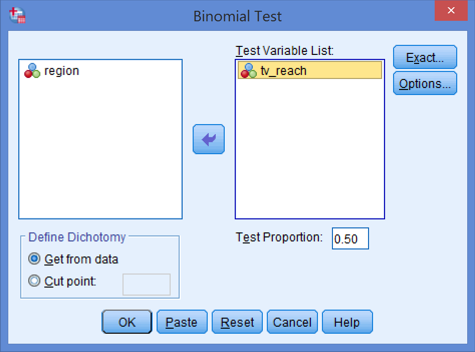
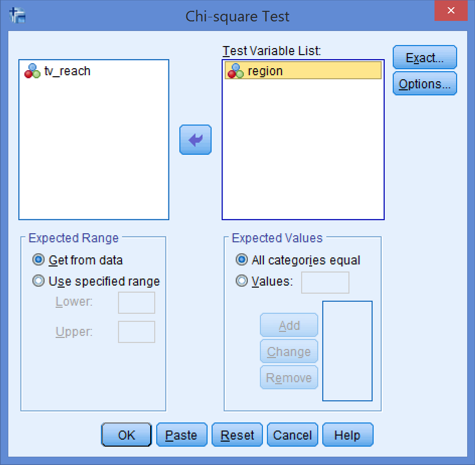

# Testing a Null Hypothesis: Am I Right or Am I Wrong? {#hypothesis}
> key concepts: research hypothesis, statistical null and alternative hypothesis, nil hypothesis, test statistic, p value, significance level (Type I error rate), Type I error, inflated Type I error, capitalization on chance, one-sided and two-sided tests and tests to which this distinction does not apply, rejection region.  

In the preceding chapter, we have learned that a confidence interval contains the population values that are plausible given the sample that we have drawn. In the current chapter, we narrow this down to the question whether the expectation of the researcher about the population is plausible. 

The expectation is usually called a (research) hypothesis and it must be translated into statistical hypotheses about a population value (parameter): a null hypothesis and an alternative hypothesis. 

We test the null hypothesis in the following way. We construct a sampling distribution in one of the ways we have learned in Chapter \@ref(probmodels) using the value specified in the null hypothesis as the imaginary population value. In other words, we act as if the null hypothesis is true. 

Then we calculate the probability of drawing a sample such as the one we have drawn or a sample that differs even more from a population for which the null hypothesis is true. If this p value is very low, say, below 5%, we reject the null hypothesis because our sample would be too unlikely if the null hypothesis is true. In this case, the test is statistically significant. The probability threshold that we use is called the significance level of the test.

### Test your intuition or knowledge {-}

```{r hypo-testing, fig.cap="Testing null hypotheses."}
# Use app null-ci.
```

Figure \@ref(fig:hypo-testing) shows a population with a hypothesized population mean, for example, average media literacy. Below, you see a sampling distribution and the bottom line shows the average media literacy in our sample. The coloured areas under the normal curve each represent 2.5% of the total area. 

1. What are the null and alternative hypotheses in Figure \@ref(fig:hypo-testing)? Is the null hypothesis a nil hypothesis here?

2. What represents the p value of the sample mean that we have found in Figure \@ref(fig:hypo-testing)? Does the p value depend on the type of null hypothesis: one-sided or two-sided?

3. What represents the significance level and rejection region in Figure \@ref(fig:hypo-testing)?

4. Is the test statistically significant? How do you decide?

5. What happens if you change the hypothesized population mean? Check your answer by using the slider.

6. Is it OK to change your null hypothesis when you know your sample mean? Why is it OK or not OK? 

Return to these question after studying this chapter.

## A Binary Decision

The overall goal of statistical inference is to increase our knowledge about a population if we only have a random sample from the population. In Chapter \@ref(param_estim), we estimated population values that are plausible considering the sample that we have drawn. For example, we looked for all plausible average weights of candies in the population using information about the weight of candies in our sample bag. This is what we do when we estimate a population value.  

Estimation is one of the two types of statistical inference, the other is null hypothesis testing. When we estimate a population value, we do not use our previous knowledge about the world of candies or whatever other subject we are investigating. We can be completely ignorant about the phenomenon that we are investigating. This approach is not entirely in line with a conception of scientific progress going by the name of _empirical cycle_, in which scientists develop theories about the empirical world, test these theories against data collected from this world, and improve their theories if they are contradicted by the data.  

Hypothesis testing is more in line with such a conception of scientific progress. It requires the researcher to formulate an expectation about the population, usually called a _hypothesis_. If the hypothesis is based on theory and previous research, the scientist uses previous knowledge. As a next step, the researcher tests the hypothesis against data collected for this purpose. If the data contradict the hypothesis, the hypothesis is rejected and the researcher has to improve theory. If the data does not contradict the hypothesis, it is not rejected and, for the time being, the hypothesis is accepted and we need not change our theory.  

Hypothesis testing, then, amounts to a choice from two options: reject or not reject, that is, for the time being accept, the hypothesis. This is a binary decision between believing that the population is as it is described in the hypothesis or believing that it is not. This is quite a different outcome than the range of plausible population values that we obtain when we estimate a confidence interval. Nevertheless, hypothesis testing and confidence intervals are tightly related as we will see later on in this chapter (Section \@ref(null-ci)).

## Formulating Statistical Hypotheses

```{r example-data, include=FALSE, echo=FALSE, eval=FALSE}
source("norm10.R") #function to normalize scores

# Households: tv station reach, region, household income.
set.seed(2583)
random <- runif(120)
households <- data.frame(region = ifelse(random <= 0.2, "North", ifelse(random <= 0.45, "East", ifelse(random <= 0.75, "South", "West"))))
set.seed(6111)
random <- runif(120)
households$tv_reach <- "no"
households$tv_reach[(households$region == "North" & random < 0.2) | (households$region == "East" & random < 0.7) | (households$region == "South" & random < 0.4) | (households$region == "West" & random < 0.9)] <- "yes"
households$tv_reach <- factor(households$tv_reach)
households$income <- rnorm(120, mean = 40000, sd = 12000) + ifelse(households$region == "West" | households$region == "East", runif(120) * 10000, 0)
attributes(households$region)$label <- "Region of residence"
attributes(households$tv_reach)$label <- "Can the household receive the tv station?"
attributes(households$income)$label <- "Household income"
haven::write_sav(households, "data/households.sav")

# Children: media literacy, sex, age, supervision.
set.seed(2583)
children <- data.frame(medliter = rnorm(87, mean = 4.3, sd = 1.8), sex = c(rep("girl", 47), rep("boy", 40)))
children$medliter <- children$medliter - min(children$medliter) + 1
set.seed(1174)
children$age <- round((children$medliter + 22 + rnorm(87, mean = 0, sd = 5.1))/3)
set.seed(3228)
children$supervision <- (children$medliter + rnorm(87, mean = 0, sd = 3.6))
children$supervision <- norm10(children$supervision) #normalize to 1-10
# Set labels.
attributes(children$sex)$label <- "Sex"
attributes(children$age)$label <- "Age (in years)"
attributes(children$medliter)$label <- "Media literacy"
children$medliter <- labelled::labelled(children$medliter, labels = c(`No media literacy at all` = 1, `Maximum media literacy` = 10))
attributes(children$supervision)$label <- "Parental supervision during media use"
children$supervision <- labelled::labelled(children$supervision, labels = c(`Never supervised` = 1, `Supervised all the time` = 10))
haven::write_sav(children, "data/children.sav")

# Voters: immigrant opinion, age (class: young vs. old).
set.seed(1324)
voters <- data.frame(age = round(runif(66) * 70 + 17))
voters$age_group <- factor(ifelse(voters$age < 30, "young (<30)", "old (30+)"))
set.seed(2431)
voters$immigrant <- ifelse(voters$age_group == "young (<30)", round(rnorm(66, mean = 5, sd = 1.4)), round(rnorm(66, mean = 5.1, sd = 1.8)))
voters$immigrant[voters$immigrant < 1] <- 1
voters$immigrant[voters$immigrant > 10] <- 10
attributes(voters$age)$label <- "Age"
attributes(voters$age_group)$label <- "Age group"
attributes(voters$immigrant)$label <- "Attitude towards immigrants"
voters$immigrant <- labelled::labelled(voters$immigrant, labels = c(`Very hostile towards immigrants` = 1, `Very welcoming to immigrants` = 10))
haven::write_sav(voters, "data/voters.sav")

# Donators: endorser of the campaign, remember campaign, exposure to campaign, willingness to donate to the campaign (pre and post).
set.seed(1245)
donators <- data.frame(willing_post = (rnorm(143, mean = 2, sd = 0.4))^2, remember = c(rep("yes", 71), rep("no", 72)))
donators$willing_post <- norm10(donators$willing_post) 
set.seed(24)
donators$willing_pre <- donators$willing_post + runif(143, -1.5, 0.3)
donators$willing_pre[donators$willing_pre < 1] <- donators$willing_pre[donators$willing_pre < 1] + 1 - min(donators$willing_pre) 
set.seed(834)
random <- runif(143)
donators$endorser <- "George Clooney"
donators$endorser[(donators$willing_post > 4 &  random > 0.4) | (random < 0.3)] <- "Oprah Winfrey"
donators$endorser[(donators$willing_post < 4 &  random < 0.3) | (random > 0.85)] <- "Bill Gates"
donators$endorser <- factor(donators$endorser)
donators$exposure <- round(norm10(sqrt(donators$willing_post) + runif(143, 0, 4.3)))
attributes(donators$willing_post)$label <- "Respondent's willingnes to donate at the campaign end"
attributes(donators$willing_pre)$label <- "Respondent's willingnes to donate at the campaign start"
attributes(donators$remember)$label <- "Respondent remembers the campaign?"
attributes(donators$endorser)$label <- "Celebrity endorsing the campaign"
attributes(donators$exposure)$label <- "Respondent's exposure to the campaign"
donators$willing_post <- labelled::labelled(donators$willing_post, labels = c(`I am very sure not to donate` = 1, `I am very sure to donate` = 10))
donators$willing_pre <- labelled::labelled(donators$willing_pre, labels = c(`I am very sure not to donate` = 1, `I am very sure to donate` = 10))
donators$exposure <- labelled::labelled(donators$exposure, labels = c(`No exposure` = 1, `Maximum exposure` = 10))
haven::write_sav(donators, "data/donators.sav")

#Consumers: brand awareness, ad exposure, word of mouth, gender.
set.seed(834)
consumers <- data.frame(ad_expo = norm10(sqrt(rnorm(62, 10, 4.8))), wom = c(rep("yes", 18), rep("no", 44)), gender = c(rep("female", 12), rep("male", 6), rep("female", 19), rep("male", 25)))
set.seed(825)
consumers$brand_aw <- norm10(consumers$ad_expo - as.integer(consumers$gender) * 1.2 - as.integer(consumers$wom) * 1.7 + rnorm(62, 0, 3.3))
attributes(consumers$ad_expo)$label <- "Exposure to brand advertisements"
attributes(consumers$wom)$label <- "Heard about the brand by word of mouth?"
attributes(consumers$gender)$label <- "Consumer's sex"
attributes(consumers$brand_aw)$label <- "Brand awareness"
consumers$ad_expo <- labelled::labelled(consumers$ad_expo, labels = c(`No exposure to ads` = 1, `Maximum exposure to ads` = 10))
consumers$brand_aw <- labelled::labelled(consumers$brand_aw, labels = c(`Does not recognize the brand at all` = 1, `Knows the brand very well` = 10))
haven::write_sav(consumers, "data/consumers.sav")
```

A _research hypothesis_ is a statement about the empirical world that can be tested against data. Communication scientists, for example, may hypothesize that:  

* a television station reaches half of all households in a country,  

* media literacy is below a particular standard (5.5 on a 10-point scale) among children,  

* opinions about immigrants are not equally polarized among young and old voters,  

* the celebrity endorsing a fundraising campaign makes a difference to people's willingness to donate,  

* more exposure to brand advertisements increases brand awareness,  

* and so on.  

As these examples illustrate, research hypotheses seldom refer to statistics such as means, proportions, variances, or correlations. Still, we need statistics to test a hypothesis. The researcher must translate the hypothesis into a new hypothesis specifying a statistic in the population, for example, the population mean. The new hypothesis is called a _statistical hypothesis_.  

Translating the research hypothesis into a statistical hypothesis is perhaps the most creative part of statistical analysis. This is just a fancy way of saying that it is difficult to give general guidelines stating which statistic fits which research hypothesis. All we can do is give some hints.  

```{r choice-diagram, echo=FALSE, fig.cap="Flow chart for selecting the appropriate statistical test."}
# Overview of tests with conditions/requirements and SPSS commands ; interactive decision/flow chart - show complete diagram and pressing a button or clicking a cell hides all choices/cells that are not up- and downstream from this cell.
# Use visNetwork:: package (visHierarchicalLayout()) or networkD3:: package (diagonalNetwork()).
library(visNetwork)
nodes <- data.frame(id = 1:27, level = c(1, rep(2, 7), rep(3, 6), rep(4, 13)), 
  label = c("Research Question", 
            "Category Share", 
            "Overall Score Level", 
            "Score Variation", 
            "Score Level Change", 
            "Different Group Score Levels", 
            "Different Group Shares", 
            "Concurrent Score Levels", 
            "1 Category", 
            "3+ Categories", 
            "2 Groups", 
            "3+ Groups", 
            "Linear", 
            "Bend", 
            "binomial test", 
            "one-sample chi-squared test", 
            "one-sample t test", 
            "bootstrap test on one median", 
            "(no test available)", 
            "Levene's F test", 
            "paired-samples t test", 
            "independent-samples t test", 
            "analysis of variance: F test", 
            "chi-squared test", 
            "t test on Pearson correlation", 
            "Regression: F (model) & t test (coefficient)", 
            "test on Spearman's rho"), 
  title = c("What characteristics of your subjects<br>are you interested in?", 
            "How many have ...?, Which part is ...?<br><b>Variables</b>: 1 dichotomy", 
            "How low/high is ...?<br><b>Variables</b>: 1 categorical", 
            "How much (dis)agreement ...? <br>Are scores more/less spread ...?<br><b>Variables</b>: 2 numeric", 
            "Does the score level increase/decrease ...?<br><b>Variables</b>: 1 numeric repeated", 
            "Does one group score higher than another group...?<br><b>Variables</b>: 1 categorical, 1 numeric", 
            "Do categories occur more/less <br>in one group than in another group...?<br><b>Variables</b>: 2 categorical", 
            "Does a score increase/decrease <br>if another score changes?<br><b>Variables</b>: 2+ numeric", 
            "What is the share of ...", 
            "Which categories occur<br>relatively frequently?", 
            "Does group ... score higher/<br>lower than group ...?", 
            "Do some groups score higher/<br>lower than other groups?", 
            "Can a straight line <br>represent the relation<br>between scores?", 
            "Is the relation between <br>scores clearly bend?", 
            "<b>Visual:</b> bar chart, pie chart<br><b>Measure:</b> proportion or percentage<br><b>Interpretation:</b> ... percent of the ... have/are ... <br><b>Assumptions</b>: none", 
            "<b>Visual:</b> bar chart, pie chart<br><b>Measure:</b> relative frequencies<br><b>Interpretation:</b> ... percent of the ... have/are ...<br>and/but ... percent have/are ...<br><b>Assumptions:</b> expected frequencies<br>never below 1 and max 20% below 5", 
            "<b>Visual:</b> histogram<br><b>Measure:</b> one mean,<br>Cohen's <i>d</i><br><b>Interpretation:</b> the subjects'<br>/respondents' average score<br>on ... is ... (M = ..., SD = ...)<br><b>Assumptions:</b> sample size above 30<br>or population normally<br>distributed; otherwise: bootstrap", 
            "<b>Visual:</b> boxplot<br><b>Measure:</b> one median<br><b>Interpretation:</b> half of the ...<br>have a score below/above ...<br><b>Assumptions:</b> none", 
            "<b>Visual:</b> bar chart (pie chart)<br><b>Measure:</b> one mode<br><b>Interpretation:</b> the most frequent/<br>prevalent score/category is ...<br><b>Assumptions:</b> none", 
            "<b>Visual:</b> error bar<br>chart, boxplot<br><b>Measure:</b> two variances<br>or standard deviations<br><b>Interpretation:</b> the scores on ... vary<BR>more/less among ... (SD/variance = ...) than<BR>among ... (SD/variance = ...)<br><b>Assumptions:</b> none", 
            "<b>Visual:</b> means plot<br>(error bar chart, boxplot)<br><b>Measure:</b> difference of<br>two means, Cohen's <i>d</i><br><b>Interpretation:</b> the average<br>score on ... increases/<br>decreases between ... (M = ..., SD = ...)<br>and ... (M = ..., SD = ...), this change is small/medium/large<br><b>Assumptions:</b> sample size above 30<br>or population normally distributed;<br>otherwise: bootstrap", 
            "<b>Visual:</b> means plot<br>(error bar chart, boxplot)<br><b>Measure:</b> difference of<br>two means, Cohen's <i>d</i><br><b>Interpretation:</b> there is a small/<br>medium/large difference between<br>the average score on ...<br>among ... (M = ..., SD = ...)<br>and among ... (M = ..., SD = ...)<br><b>Assumptions:</b> sample size above<br>30 or population normally<br>distributed; otherwise: bootstrap", 
            "<b>Visual:</b> means plot<b><br>Measure:</b> variance in means,<br>eta or eta<sup2</sup>, differences<br>between pairs of means<br><b>Interpretation:</b> there are<BR>no/small/medium/large differences<br>among the average scores on ... .<br>Group ... (M = ..., SD = ...)<br>has a lower/higher score than<br>group ... (M = ..., SD = ...)<br><b>Assumptions:</b> groups of equal<br>size or groups with equal<br>population variances (Levene's F test)", 
            "<b>Visual:</b> stacked or<br>clustered bar chart<br><b>Measure:</b> Phi, Cramer's V,<br>Goodman & Kruskals tau,<br>Kendalls tau-b<br><b>Interpretation:</b> the association<BR>between ... and ... is weak/medium/<br>strong. ... occurs relatively<BR>frequently among group ... but ...<br>is relatively rare with group ...<br><b>Assumptions:</b> expected<BR> frequencies never below 1<br>and max 20% below 5, otherwise<br>exact test; in a 2x2 table,<br>use Fisher's exact test", 
            "<b>Visual:</b> scatterplot (with regression<br>line)<br><b>Measure:</b> (Pearson) correlation<br><b>Interpretation:</b> There is a weak/medium/<br>strong correlation between ... and ...:<br>the higher the score on ..., the<br>higher/lower the score on ... .<br><b>Assumptions:</b> none.", 
            "<b>Visual:</b> scatterplots (with regression line)<br><b>Measures</b> for multiple regression:<BR><I>R</I><sup>2</sup>, regression coefficients (b or b*)<br><b>Interpretation:</b> When ... increases by<BR>one unit, the predicted value of ...<BR>increases/decreases with ... .<BR>This effect is weak/medium/strong.<BR>The variance in ... and ... (and ...)<BR>accounts for ...% of the variance<BR>in ... .<br><b>Assumptions:</b> residuals normally<BR>distributed and homoscedastic", 
            "<b>Visual:</b> scatterplot (with regression line)<br><b>Measure:</b> (Spearman's) rho<br><b>Interpretation:</b> There is a weak/<BR>medium/strong rank correlation between ...<BR>and ...: The higher the score on ..., the<BR>higher/lower the score on ... .<br><b>Assumptions:</b> not relevant (SPSS uses<BR>t aproximation if applicable)"), 
  shape = "dot", size = 20, font.size = 42, shadow = "FALSE")
edges <- data.frame(from = c(1, 1, 1, 1, 1, 1, 1, 2, 2, 6, 6, 8, 8, 9, 10, 3, 3, 3, 4, 7, 5, 11, 12, 13, 13, 14), to = c(2, 3, 4, 5, 6, 7, 8, 9, 10, 11, 12, 13, 14, 15, 16, 17, 18, 19, 20, 24, 21, 22, 23, 25, 26, 27), shadow = "TRUE")
visNetwork(nodes, edges, width = "100%") %>% 
  visEdges(arrows = "to") %>% 
  visHierarchicalLayout(direction = "LR", levelSeparation = 600) %>%
  visOptions(highlightNearest = list(enabled = TRUE, algorithm = "hierarchical", 
   degree = list(from = 3, to = 1))) %>%
  visInteraction(dragNodes = FALSE)
rm(nodes, edges)
```

1. For each of the research hypothesis examples (above), find the appropriate statistical test using Figure \@ref(fig:choice-diagram). Hint: Hover your mouse pointer over a node, click on a dot, drag with your left mouse button, and zoom with your mouse wheel.

### Proportions: shares  
This book covers tests for four types of statistics: proportions, means, variance/standard deviations, and associations. A proportion is the statistic best suited to test research hypotheses addressing the share of a category or entity in the population. The hypothesis that a television station reaches half of all households in a country provides an example. All households in the country constitute the population. The share of the television station is the proportion or percentage of all households watching this television station.  

If we want to use a statistic, we need to know the variable and observations for which the statistic must be calculated. In this example, a household does or does not watch the television statement, so our variable is a dichotomy with the two categories ("No, does not watch this station", "Yes, watches this station") usually coded as 0 versus 1 or 1 versus 2.  

Each household provides an observation, namely either the score 0 or the score 1 on this variable or no score if there are missing values. To test the research hypothesis that a television station reaches half of all households in a country, we have to formulate a statistical hypothesis about the proportion---of households viewing this television statement---in the population---all households in this country. For example, the researcher's statistical hypothesis could be that the proportion in the population is 0.5.  

We can also be interested in more than two categories, for example, does the television station reach half of all households in the north, east, south, and west of the country? This translates into a statistical hypothesis containing three or more proportions in the population: The proportion of households viewing this station is 0.5 in the north, it is 0.5 in the east, it is 0.5 in the south, and it is 0.5 in the west. Our statistical hypothesis actually is a relative frequency distribution, for example, Table \@ref(tab:hypo-freq).

```{r hypo-freq, echo=FALSE}
knitr::kable(data.frame(Region = c("North", "East", "South", "West"), HP = c(0.5, 0.5, 0.5, 0.5)), digits = 1, caption = "Statistical hypothesis about four proportions as a frequency table.", col.names = c("Region", "Hypothesized Proportion"))
```

A test for this type of statistical hypothesis is called a one-sample chi-squared test. It is up to the researcher to specify the hypothesized proportions for all categories. This is not a simple task: What reasons do you have to expect particular values, say a reach of fifty percent of all households instead of sixty percent?

The test is mainly used if the researcher has information on the proportions of the categories in the population. If we draw a sample from all citizens of a country, we usually know the frequency distribution of sex, age, educational level, and so on of all citizens from the national bureau of statistics. We can now test if the respondents in our sample have the same distribution with respect to sex, age, or educational level as the population; just use the population proportions in the hypothesis. If they do, the sample is _representative_ of the population with respect to sex, age, or educational level. This is an important check on the representativeness of our sample.

#### Testing proportions in SPSS

A binomial test on a single proportion can be executed in SPSS with the command _Analyze > Nonparametric Tests > Binomial_. In the dialog (Figure \@ref(fig:spss-binom)), you have to enter a variable. 

```{r spss-binom, echo=FALSE, out.width="475px", fig.cap="SPSS dialog for a binomial test on one proportion."}

```

If this variable is a dichotomy (it has only two values), you can leave the _Define Dichotomy_ option at "Get from data". SPSS will use the category with the lowest value as the reference category. It will test the sample proportion of this value against the test proportion that you specify elsewhere in this dialog.

If the variable has more than two categories or is not a dichotomy, use the "Cut point" option under _Define Dichotomy_ to divide all scores into two groups. The lowest score up to and including the cut point are used as the test category.

Figure \@ref(fig:binom-output) shows the output. The sample proportion does not differ significantly from 0.5. In this example, we would report: "We cannot reject the hypothesis that the TV station reaches half of all households, _p_ = .784."

```{r binom-output, echo=FALSE, fig.cap="SPSS output for a binomial test on one proportion."}
knitr::include_url("binomial.htm",  height="180px")
```

If we want to test a frequency distribution against a known or hypothesized population distribution, we must use a one-sample chi-squared test. This test is available in SPSS with the command _ANALYZE > NONPARAMETRIC TESTS > LEGACY DIALOGS > CHI SQUARE_. Select the categorical variable for which you want to test the distribution under _Test variable List_.

```{r spss-1chisq, echo=FALSE, out.width="475px", fig.cap="SPSS dialog for a chi-squared test on a frequency distribution."}

```

Select the option _All categories equal_ under _Expected Values_ if you hypothesize that all categories have the same proportions in the population. In the example, we hypothesize that households are equally distributed over the four regions. This is a plausible hypothesis if the four regions are known to contain a quarter of all households in the country or if the sample was stratified by region, that is, every region was meant to deliver the same number of households to the sample.

If the hypothesized distribution is not equal over all categories, specify the expected proportions, percentages, or sample frequencies under _Values_. You must specify an expected value for each category in the exact order in which the categories are coded. Be careful not to make mistakes. 

```{r 1chisq-output, echo=FALSE, fig.cap="SPSS output for a chi-squared test on a frequency distribution."}
knitr::include_url("1chisq.htm",  height="360px")
```

Although the frequencies of the four regions are not exactly the same in the sample, the hypothesis of equal population frequencies cannot be rejected, Chi-square (3) = 3.27, _p_ = .352.

#### SPSS Exercises

1. Use <a href="http://82.196.4.233:3838/data/households.sav" target="_blank">the data set "households.sav"</a> to test the hypothesis that the TV station does not reach 40 percent of all households in the population.

2. Test the hypothesis that the TV station reaches 55 percent of all households in the population.

3. Does half of the households have an income of at most 40,000? 

4. According information from the National Bureau of Statistics, 20 percent of all households have incomes up to 30,000, 50 percent have incomes between 30,000 and 50,000, and 30 percent has incomes over 50,000. Use a test to decide if our sample is representative with respect to sweetness. Hint: recode income first.

### Means and medians: levels
Research hypotheses that focus on the level of scores are usually best tested with the mean or another measure of central tendency such as the median value. For example, the hypothesis that media literacy is below a particular standard (5.5 on a 10-point scale) among children refers to a level: the level of media literacy scores. 

The hypothesis probably does not argue that all children have a media literacy score below 5.5. Instead, it means to say that the overall level is below this standard. The center of the distribution offers a good indication of the general score level.

For a numeric (interval or ratio measurement level) variable such as the 10-point scale in the example, the mean is a good measure of the distribution's center. In this example, our statistical hypothesis would be that average media literacy score of all children in the population is (below) 5.5.  

#### Testing one mean in SPSS

To execute a one sample t-test in SPSS, use the command _ANALYZE > COMPARE MEANS > ONE SAMPLE T TEST_. Select a numeric variable in the dialog and enter the hypothesized population mean under _Test Value_. 

Media literacy is measured on a ten point scale. Is average media literacy (in the population) equal to 5.5? A one sample t test tells us that average media literacy in our sample (_M_ = 4.47, _SD_ = 1.64) is statistically significantly different from 5.5, _t_ (86) = -5.87, _p_ < .001, 95%CI[-1.38, -0.68]. We are confident that the population average media literacy score is 0.68 to 1.38 below 5.5, so somewhere between 4.12 and 4.82.

```{r 1mean-output, echo=FALSE, fig.cap="SPSS output for a t test on one mean."}
knitr::include_url("1mean.htm",  height="270px")
```

#### SPSS Exercises

1. Use <a href="http://82.196.4.233:3838/data/children.sav" target="_blank">the "children.sav" data set</a> to test the hypothesis that average parental supervision of the child's media use is 5.5 (on a scale from 1 to 10) in the population.

2. Have a look at the confidence interval reported in Figure \@ref(fig:1mean-ouput). If you would test the hypothesis that average media literacy in the population is 4.5, would the test be statistically significant? Check your answer by applying this test.

### Variance: (dis)agreement
Although rare, research hypotheses may focus on the variation in scores rather than on score level. The hypothesis about polarization provides an example. Polarization means that we have scores well above the center and well below the center rather than all scores concentrated in the middle. If voters' opinions about immigrants are strongly polarized, we have a lot of voters strongly in favour of admitting immigrants as well as many voters strongly opposed to admitting emigrants.  

For a numeric variable, the variance or standard deviation---the latter is just the square root of the former---is the appropriate statistic to test a hypothesis about polarization. The research hypothesis concerns the variation of scores in two groups, for example, young versus old voters. The statistical hypothesis would be that the variance in opinions in the population of young voters is different from the variance in the population of old voters.  

#### Testing two variances in SPSS

Levene's F test for the null hypothesis that two groups have equal population variances is part of the independent-samples t test (see \@ref(comp-means)). The output in Figure \@ref(fig:Levene-output) shows that the polarization (variation) in attitudes towards immigrants is not the same among young and old voters, _F_ = 4.99, _p_ = .029. Polarization is stronger among old voters (_SD_ = 2.06) than among young voters (_SD_ = 1.26). 

```{r Levene-output, echo=FALSE, fig.cap="SPSS output for Levene's test as part of an independent-samples t test."}
knitr::include_url("Levene.htm",  height="400px")
```

In a similar way, we can test if three or more groups have equal population variances with Levene's F test using the option _Homogeneity of variance test_ in a one-way analysis of variance (command _Analyze >  COMPARE MEANS > ONE-WAY ANOVA_).

#### SPSS Exercise

1. In <a href="http://82.196.4.233:3838/data/voters.sav" target="_blank">"voters.sav"</a>, create a new variable grouping voter's age with classes 18-29, 30-49, 50-65, and 66+ years. Is the attitudes towards immigrants equally polarized among these four age groups in the population? Justify your answer with a statistical test.

### Association: relations between characteristics  
Finally, research hypotheses may address the relation between two or more variables. Relations between variables are at stake if the research hypothesis states or implies that one (type of) characteristic is related to another (type of) characteristic. The statistical name for a relation between variables is _association_.  

For example, if the identity of the endorser makes a difference to the willingness to donate, the endorser to whom a person is exposed (one characteristic) is related to this person's willingness to donate (another characteristic). Another example: If exposure to the campaign increases willingness to donate, a person's willingness to donate is positively related to this person's exposure to the campaign.  

```{r association, fig.cap="Different types of statistical associations."}
# Extend and simplify correlation-game (https://github.com/ShinyEd/ShinyEd/tree/master/correlation_game).
# Simplify user choices to association strength (none, weak, medium, strong) and association direction (positive, negative, neither). Report value(s) of appropriate measures of association/efect size. Don't show standard deviation line and ellipse. Don't include difficulty levels. Add choice of association type (nominal, ordinal, categorical * numeric, numeric * numeric) - this choice generates a new graph.
# 2 numerical variables: name them exposure (X) and willigness to donate (Y) ; report Spearman and Pearson correlation ; also generate non-linear monotonic relations (bend) and non-monotonic relations (quadratic) to train intuition for choosing appropriate test.
# Add 1 dichotomous (endorser = X, Clooney, Oprah) and 1 numerical variable (willigness to donate, Y): depict as jittered scatterplot with group means as horizontal line segments) ; report Cohen's d ; vary mean difference between groups (larger difference -> larger effect) and variation within group (larger variation -> smaller effect).
# Add 2 ordinal categorical variables (exposure = X (low, medium, high) and donate intention = Y (yes, maybe, no), 3 values each): depict with geom_count() and show frequency of each cell ; report Kendall's tau-b and Somers' d (and chi-squared?) ; vary cell frequencies such that positive, negative, non-monotonic, and no associations arise.
# Add 2 nominal categorical variables (endorser X (Clooney, Oprah, Gates) and know campaign = Y (Yes, No)): depict with geom_count() ; report Cramer's V and Goodman & Kruskals tau (and chi-squared?) ; vary cell frequencies such that positive, negative, non-monotonic, and no associations arise (as with the ordinal variables).
```

Figure \@ref(fig:association) helps you to sharpen your intuitions about statistical associations. Select the strength and direction of the association depicted in the graph and submit your answer to see if you are right. Select one of the options under _Association type:_ to generate a new plot.

1. For which type of association is association direction completely irrelevant?

2. For which pattern of scores are ordinal or numeric association measures problematic?

3. In a categorical by numeric association, what are the effects of the difference between the averages on the effect size (Cohen's d)? And what is the effect of variation of scores?

### Score level differences  
Association comes in two related flavours: a difference in score level between groups or the predominance of particular combinations of scores on different variables.  

The relation between the endorser's identity and willingness to donate is a specimen of the first flavour. All people are confronted with one of the celebrities as endorser of the fund-raising campaign. This is captured by a categorical variable: the endorsing celebrity. 

The categorical variable clusters people into groups: One group is confronted with Celebrity A, another group with Celebrity B, and so on. If the celebrity matters to the willingness to donate, the general level of donation willingness should be higher in the group exposed to one celebrity than in the group exposed to another celebrity.  

Thus, we return to statistics needed to test research hypotheses about score levels, namely measures of central tendency. If willingness to donate is a numeric variable, we can use group means to test the association between endorsing celebrity (grouping variable) and willingness to donate (score variable). The statistical hypothesis would then be that group means are not equal in the population of all people. 

If you closely inspect Figure \@ref(fig:choice-diagram), you will see that we prefer to use a _t_ distribution if we compare two different groups (independent-samples t test) or two repeated observations for the same group (paired-samples t test). In contrast, we use analysis of variance with an _F_ distribution if we have three or more groups. 

#### Comparing means in SPSS {#comp-means}

Independent-samples t test

<iframe width="640" height="360" src="https://www.youtube.com/embed/7_W2x7ut2wI" frameborder="0" allowfullscreen></iframe>

------------

Paired samples t test

<iframe width="640" height="360" src="https://www.youtube.com/embed/h5pF8qlIIwk" frameborder="0" allowfullscreen></iframe>

------------

One-way analysis of variance

<iframe width="640" height="360" src="https://www.youtube.com/embed/fnnUmvrIJgw" frameborder="0" allowfullscreen></iframe>

#### SPSS Exercises

1. Use <a href="http://82.196.4.233:3838/data/donators.sav" target="_blank">"donators.sav"</a> to test if people's willingness to donate at the campaign's end depends on the celebrity endorsing the campaign.

2. Is willingness to donate at the campaign's end higher for those who remember the campaign than for those who do not remember it?

3. Did willingness to donate increase in the population between the start and the end of the campaign?

### Combinations of scores
The other flavour of association is the situation that some combinations of scores on different variables are much more common than other combinations of scores. 

Think of the hypothesis that brand awareness is related to exposure to advertisements for the brand. If the hypothesis is true, people with high exposure and high brand awareness should occur much more often than people with high exposure and low brand awareness or low exposure and high brand awareness. 

The two variables here are exposure and brand awareness. One combination of scores on the two variables is high exposure combined with high brand awareness. This combination should be more common than high exposure combined with low brand awareness.  

Measures of association are statistics that put a number to the pattern of group score levels or combinations of scores. The exact statistic that we use depends on the measurement level of the variables. For numerical variables, measured at the interval or ratio level, we use Pearson's correlation coefficient or the regression coefficient. For ordinal variables with quite a lot of different scores, we use Spearman's rank correlation. 

For categorical variables, measured at the nominal or ordinal level, chi-squared indicates whether variables are statistically associated. The larger chi-squared, the less probable it is that the variables are not associated in the population. If variables are not associated, they are said to be _statistically independent_.  

Several measures exist that express the strength of the association between two categorical variables. We use Phi and Cramer's V (two nominal variables, symmetric association), Goodman & Kruskals tau (two nominal variables, asymmetric association), Kendalls tau-b (two categorical ordinal variables, symmetric association), and Somers' d (two categorical ordinal variables, symmetric association).

#### Testing associations in SPSS

Correlations

<iframe width="640" height="360" src="https://www.youtube.com/embed/Kis6IwuqKjc" frameborder="0" allowfullscreen></iframe>

-------------

Regression

<iframe width="640" height="360" src="https://www.youtube.com/embed/L9yFGtscyL8" frameborder="0" allowfullscreen></iframe>

-------------

Chi-squared test on a cross tabulation

<iframe width="640" height="360" src="https://www.youtube.com/embed/GgA2EE9wML4" frameborder="0" allowfullscreen></iframe>

#### SPSS Exercises

1. In the population of all consumers, is brand awareness linked to exposure to advertisements for the brand? Use <a href="http://82.196.4.233:3838/data/consumers.sav" target="_blank">"consumers.sav"</a> to answer this question.

2. How well can we predict brand awareness with ad exposure, having heard through word of mouth, and the consumer's sex?

3. Does word of mouth involve women rather then men? Interpret the contents, strength, and statistical significance of the association. Have a look at Section \@ref(SPSS-exact) if you forgot which significance to interpret.

## The Null and Alternative Hypothesis

In the preceding section, I have referred to statistical hypotheses without further qualification. There are, however, at least two different statistical hypotheses: the null hypothesis (_H_~0~) and the alternative hypothesis (_H_~1~ or _H_~A~). 

For reasons that will be explained in Section \@ref(p value), the _null hypothesis_ must equate the test statistic to a single value. For example, the statistical hypothesis that the proportion of all households in the population reached by a television station is .5 equates the population proportion to .5. 

In contrast, the statistical hypothesis that the average media literacy score of all children in the population is below 5.5 does not equate the population mean to one particular value. It is hypothesized to be smaller than 5.5 but it can be any number below 5.5.  

```{r null-alt, fig.cap="From research hypothesis to statistical ypotheses."}
# Let the student formulate/compose the null and alternative hypothesis for a given research hypothesis.
# Randomly select one research hypothesis from a hard-coded list. Present it to the user andlet the user compose the null and alternative hypothesis either as a string or using list boxes. If the user presses submit, the statistical hypotheses are checked or the correct hypotheses are shown.
# The list of research hypotheses contains both one-sided and two-sided hypotheses, with and without explicit (border) values (e.g.,  "average media literacy is 5.5" versus "there is no difference") ; all sample statistics are continuous.
# Give feedback if the student presses the Submit button.
```

Use Figure \@ref(fig:null-alt) to practice formulating statistical hypotheses.

1. Is the research hypothesis usually the null hypothesis or the alternative hypothesis?

### Alternative hypothesis

If the research hypothesis is not the null hypothesis, it is the _alternative hypothesis_. The alternative hypothesis covers all situations not covered by the null hypothesis and the other way around. The null hypothesis that the proportion of all households in the population reached by the television station is .5 is linked to the alternative hypothesis that the proportion is not .5. Thus, we cover all possible outcomes.  

The research hypothesis that average media literacy score of all children in the population is below 5.5, is an example of an alternative hypothesis. Most of the research hypothesis examples in the previous section are alternative hypotheses because they do not equate the statistic with a particular value:  

* If opinions about immigrants are hypothesized to be different for young and old voters, the variances are hypothesized to be unequal in the population. But the research hypothesis does not state how unequal.  

* If the celebrity endorsing a fundraising campaign makes a difference to the willingness of people to donate, the average willingness is not hypothesized to be equal for all groups but, again, the size of the difference is not specified.  

* If we hypothesize that more exposure to brand advertisements increases brand awareness, we expect the correlation or regression coefficient to be positive, that is, larger than zero. But we have not hypothesized a particular value, so the research hypothesis represents the alternative hypothesis.  

### Research hypotheses tend to be alternative hypotheses  
It is not a coincidence that most of the research hypotheses in the examples are alternative hypotheses instead of null hypotheses. This is quite usual in social research even though it is not necessarily so as some statistics textbooks would make us believe. Often, our theories tell us to expect differences or changes but not the size of differences or changes.  

If the research hypothesis is the alternative hypothesis, we have to formulate the null hypothesis ourselves. This is very important, because it is this hypothesis that is actually tested as we will see in a later section. Some examples:  

* An research hypothesis stating that average media literacy of children is below 5.5 is an alternative hypothesis. The associated null hypothesis would be that average media literacy is at least 5.5.

* If the alternative hypothesis states that variances or group means are unequal in the population, the null hypothesis would be that they are equal in the population.  
* An alternative hypothesis expecting a correlation between exposure and brand awareness requires the null hypothesis that there is no such association in the population.  

### Nil hypothesis
Null hypotheses are quite often stating that there is no difference or no association in the population. They equate the population statistic to zero. This type of null hypothesis is called a _nil hypothesis_ or just plainly _the nil_. 

A null hypothesis on association in the population simply assigns the value zero to the measure of association in the population. For example, Spearman's rho or Pearson's correlation between exposure and brand awareness are hypothesized to be zero in the population. For a measure of association, zero always means that there is no association.  

This also applies to the regression coefficient (_b_ or or _b*_ in the regression equation): If it is zero, the predictor variable is useless for predicting the outcome variable. In these cases, the null hypothesis is the nil. If statistical software does not report the null hypothesis that is being tested, you may assume that it equates the parameter of interest to zero.  

## One-Sided And Two-Sided Tests

__interactive content: illustrating two-sided versus one-sided tests__
```{r 1-2sided, fig.cap="One-sided versus two-sided statistical tests."}
# In app null-alt, replace user input for hypothesis texts by a horizontal line (x-axis, labeled with the test statistic name and a suitable scale) representing  sampling space ; let the user mark the value or range of the outcomes according to the null hypothesis and according to the alternative hypothesis with two slider range widgets. Note that a single value can be selected with a slider range. Mark the sample outcome ranges by a coloured line segment and a single sample outcome by a coloured dot.
# Give feedback if the user presses the submit button.
```

1. Figure \@ref(fig:1-2sided) shows a research hypothesis and a scale representing the possible sample outcomes (sampling space). Use the two sliders to mark the sample outcomes that are covered by the null and alternative hypotheses respectively. Note that you can select a single value with the sliders if you like.

The research hypothesis that average media literacy is below 5.5 in the population represents the alternative hypothesis because it does not fix the hypothesized population value to one number. The accompanying null hypothesis must state that the population mean is 5.5 or higher. 

This null hypothesis is slightly different from the ones we have encountered so far, which equated the population value to a single value, usually zero. If the null hypothesis equates a parameter to a single value, the null hypothesis can be rejected if the sample statistic is either too high or too low. There are two ways of rejecting the null hypothesis, so this type of hypotheses are called _two-sided_ or two-tailed.

In contrast, the null hypothesis that the population mean is 5.5 or higher is a _one-sided_ or one-tailed hypothesis. It can only be rejected if the sample statistic is at one side of the spectrum: only below (left-sided) or only above (right-sided) a particular value. A test of a one-sided null hypothesis is called a _one-sided test_. 

In a left-sided test of the media literacy hypothesis, the researcher is not interested in demonstrating that average media literacy among children can be larger than 5.5. Usually, she is not interested because she rules out the possibility. For example, she beliefs that average media literacy among children cannot be substantially higher than 5.5. The researcher brings prior knowledge about the world to bear that has convinced her that average media literacy among children can only be lower than 5.5 on average in the population. 

If there is a possibility that the score may also be higher than 5.5 and it is deemed important to note values well over 5.5 just as well as values well below 5.5, the research and null hypotheses should have been two-sided. Then, a sample average  well above 5.5 would also have rejected the null hypothesis. In a left-sided test, however, a notoriously high sample outcome cannot reject the null hypothesis. 

### Boundary value as hypothesized population value  
You may wonder how a one-sided null hypothesis equates the parameter of interest with one value as it should. The special value here is 5.5. If we can reject the null hypothesis that the population mean is 5.5 because our sample mean is sufficiently lower than 5.5, we can also reject any hypothesis about a population mean higher than 5.5. 

A population average over 5.5 differs even more from the sample average than a population average of 5.5 if our sample average is below 5.5. If the smaller difference between population average and sample average is statistically significant, the larger difference for population averages over 5.5 must also be statistically significant. So the boundary value of a one-sided null hypothesis is the value we use for a one-sided test.  

### One-sided -- two-sided distinction is not always relevant  
Note that the difference between one-sided and two-sided tests is only useful if we test a statistic against a particular value or if we test the difference between two groups. In the first situation, we may rule out the possibility that the population value is higher (or lower) than the hypothesized value if we have good reasons to believe that it can only be lower (or higher). In the second situation, we may expect that one group can only score higher than the other group and not the other way around.  

In contrast, we cannot meaningfully formulate a one-sided null hypothesis if we are comparing three groups or more. Even if we expect that Group A can only score higher than Group B and Group C, what about the difference between Group B and Group C? If we can't have meaningful one-sided null hypotheses, we cannot meaningfully distinguish between one-sided and two-sided null hypotheses.  

### Formulate statistical hypotheses in advance
Statistical hypotheses are important because they specify the statistic that we use in our test and they determine whether we do a two-sided or one-sided test. We have to formulate the statistical hypotheses before we have a look at our sample. After all, we want to give the sample data a fair chance to prove our hypothesis wrong. A statistical test is useless if we already know the result in the sample and adjust our hypotheses to that information.  

Finally, you should note that scientific papers usually report the research hypothesis but not the statistical hypotheses. The statistical hypotheses of a test are supposed to be know to all researchers. Make sure you know them as well!

## p value and Significance Level ($\alpha$) {#p-value}

The purpose of formulating a null hypothesis is that we can use the value specified in the null hypothesis as a hypothetical population value. This saves us the trouble of looking for plausible population values, which do if we estimate a confidence interval. 

Testing a null hypothesis, we just act as if the null hypothesis is true. We pretend that the value specified in the null hypothesis is the true population value. This allows us to create one sampling distribution that will tell us how plausible our sample is if the null hypothesis would be true.  For this reason, the null hypothesis must equate the parameter to one value. 

Let us assume that average media literacy is 3.9 in our sample. According to our null hypothesis, the population average is (at least) 5.5. If average media literacy of children in the population would really be 5.5, how plausible is it to draw a sample with 3.9 (or less) as average media literacy? We can use a hypothetical sampling distribution with 5.5 as mean value to answer this question.

```{r sign-left, fig.cap="Sampling distribution of a correlation coefficient."}
# Display a normal curve (M = 5.5) representing the sampling distribution of average media literacy. Colour 5% of the area situated in the left tail, add 5% as text. Add a vertical line representing the sample mean, initially 3.9, and display the percentage of the area under the curve to the left of this line.
# Let the user manipulate the sample mean (range 1-10) and the population mean according to the null hypothesis (range 1-10).
```

1. Figure \@ref(fig:sign-left) shows the sampling distribution of average media literacy as well as the mean found in our sample. What does the percentage directly to the left of the sample mean line (p value) mean?

2. The significance level is 5% here. What does the area marked with 5% mean?

3. How low must the sample mean be to have a p value below 5% (a significant test result)?

4. What happens to the p value of our initial sample mean (3.9) if we change the value of our null hypothesis? Is it always possible to formulate a null hypothesis such that the sample mean is significant?

### p value
If our sample statistic is a continuous variable, for example, average media literacy, we know that it does not make sense to calculate the probability of finding exactly the sample mean that we obtained. In Section \@ref(cont-random-var), we have learned that we work with p values in this situation. We use, for example, the probability of finding our sample mean or a mean that is even more distant from the hypothesized population mean.

The question now is: How large must the difference be between the value that we expect according to our null hypothesis (the hypothesized population value) and the value that we observe in our sample before we stop believing that the null hypothesis is true? If our null hypothesis expects average media literacy of all children to be (at least) 5.5, how small should the sample mean be before we reject the null hypothesis?  

The answer is that the difference should be so large that it is very improbable that we would draw a sample with the observed mean from a population with the hypothesized mean. In statistical terms, the p value of our sample outcome must be very low if the null hypothesis is true. With a very low p value, our sample is too improbably to sustain our belief that the null hypothesis is true.

### Statistical significance and rejection region
How low must we go? A commonly accepted threshold value is .05 (5%). If the p value is .05 or less, we decide that our sample is too improbable and implausible to be drawn from a population for which the null hypothesis is true. Therefore, we reject the null hypothesis and we say that the test is _statistically significant_.

The decision about the null hypothesis is simple if you have the p value. If the reported p value is lower than the significance level, we reject the null hypothesis. Otherwise, we do not reject the null hypothesis. 

> If p is low, the null must go and the test is statistically significant. 

This is the golden rule of null hypothesis testing (although some argue that the gold of this rule is fake and poisonous, see Chapter \@ref(crit-discus)).  

The values for the sample statistic for which the test is statistically significant, so the null hypothesis is rejected, is called the _rejection region_. If the sample statistic is in the rejection region of a test, we reject the null hypothesis, and the test is statistically significant. 

However, we usually do not know the rejection region in terms of the sample statistic, so we ordinarily use p values to determine if a test is statistically significant. SPSS reports p values, which are sometimes referred to as _significance_ or _Sig._. 

### Conditional probability  
It is important to remember: The p value that we calculate is a probability __under the assumption that the null hypothesis is true__. Therefore, it is a _conditional probability_. 

Compare it to the probability that we throw sixes with a dice. This probability is one out of six under the assumption that the dice is unbiased. Probabilities always rest on assumptions. If the assumptions are violated, we cannot calculate probabilities. 

If the dice is biased, we don't know the probability of throwing sixes. In the same way, we have no clue whatsoever of the probability of drawing a sample like the one we have if the null hypothesis is not true in the population. That's why it is so imported to specify a null hypothesis.  

### Significance level and Type I error  
The threshold value, conventionally .05, is called the _significance level_ of the test. If the null hypothesis is true, for example, average media literacy is 5.5 in the population, but we accidentally draw a sample with a mean well below 5.5, our p value is smaller than the significance level and we reject the null hypothesis.  

We must reject the null hypothesis in this situation; that is the rule of the game. But our conclusion that the null hypothesis is wrong, is an error here. We don't know and don't believe that we make this error but still we do. This error is called a _Type I error_: rejecting a hypothesis that is actually true.  

We cannot altogether avoid this error because samples can be very different from the population from which they are drawn. We have learned that in Chapter \@ref(samp-dist). The good thing is that we know the probability that we make this error. This probability is the significance level.  

You should understand the exact meaning of probabilities. A significance level of .05 allows five percent of all possible samples to be so different from the population that we reject the null hypothesis if it is true. 

In other words, if we draw a lot of samples and decide on the null hypothesis for each sample, we would reject a true null hypothesis in five percent of our decisions. So we have five percent chance of making a Type I error. 

We decide on that probability when we select the confidence level of the test and we think that .05 is an acceptable probability for making this type of error. But we do not know whether our sample belongs to the five percent.  

### p values in one-sided tests  

In the example of average media literacy, we have only taken into account the left tail of the sampling distribution to calculate the p value. If we expect that average media literacy is below 5.5, we only reckon with the chance that the sample mean is below 5.5, so we do a one-sided test.  

In this case, it makes sense to care only for the left tail of the sampling distribution. The entire probability of rejecting the null hypothesis while it is actually true is located in the left tail of the sampling distribution. 

Of course, a one-sided test may also focus solely on the right tail of the sampling distribution, for example, if we hypothesize that exposure to advertisements increases brand awareness among consumers, we expect a positive correlation or regression coefficient. Our null hypothesis specifies that the correlation or regression coefficient is at most zero and we only reject it if the sample value is well above zero.  

### Significance level in two-sided tests  

```{r sign-two, fig.cap=""}
# Display a normal curve (M = 5.5, range [1, 10]) representing the sampling distribution of average media literacy. Add one range slider (initial settings such that it cuts of 5% in the left tail and 0% at the right tail) and colour the areas under the curve to the left of the lower limit and the right of the upper limit. Add a second slider for the sample mean (initially at 3.9, restrict to range [1, 5.5]), which moves two vertical lines (one to the left and one to the right of the distribution's mean) in opposite directions, with the area that they bound in the tail displayed as a percentage (p values). Also display significance level (as a result of the first slider's settings) and the total p value (resulting from the second slider).
```

1. In Figure \@ref(fig:sign-two), use the _Rejection Region_ slider to determine the rejection region for a two-sided test at 5% significance level. what is the significance level of a one-sided test using the rejection area in the right tail that you have just determined?

2. What happens to the p value of the test if you change the sample mean?

What is the situation in a two-sided test, for example, if we test the null hypothesis that the variance in opinions about immigrants among young people is different from the variation in opinions among old people? Here, we reckon with both possibilities: larger variance among young peoples and larger variance among old people. So there are two ways in which we may reject a null hypothesis of no difference in variance that is true (Type I Error): if the variation is sufficiently larger among young people or if it is sufficiently larger among old people. Both ways have an associated probability and their sum is the significance level.  

What we actually do is that we divide the significance level by two and use half of the probability for the left tail and the other half for the right tail of the sampling distribution. If our significance level is .05, as it usually is, we use .025 as the maximum probability of finding a sample with a statistic that is so low that we would reject a null hypothesis that is true. We use the other .025 probability for drawing a sample with a statistic that is so high that we reject the null hypothesis.  

### p values in two-sided tests  
Just like the significance level, the p value in a two-sided test has to take into account that we may reject the null hypothesis in two different ways.  

A p value gives us the probability of drawing a sample with the value for the sample statistic that we have found in our current sample or a more extreme value. In other words, it is the probability of drawing a sample with a statistic that is at least as distant from the hypothesized population value as our current sample result.  

In a two-sided test, the distance can go in two directions: larger than the hypothesized value or smaller. As a consequence, the p value must also cover samples at the opposite side of the sampling distribution. Because we assume equal p values at both sides, we can double the one-sided p value to obtain the two-sided p value. And we can halve a two-wailed p value to obtain the one-sided p value.  

You do not need to worry about this if your statistics software reports the type of p value that you need: one-sided or two-sided. If there is no choice between one- and two-sided tests, the reported p value is always correct.  

However, if your software reports a one-sided p value but you need a two-sided p value, you have to double the reported p value. In contrast, if the software reports a two-sided p value while you need a one-sided p value, you have to divide the reported p value by two yourself because you do not want to take the probability in the other tail into account. Statistical software usually reports two-sided p values, so this situation may occur.  

### Unfounded one-sided null hypotheses  

```{r nonsig-1sided, fig.cap="Is the test statistically significant?"}
# Display the sampling distribution of average media literacy as a normal curve with 5% two-sided significance areas dark red and 5% one-sided significance areas light red/pink. Generate randomly one out of six possible values for the sample mean: (from left to right) in the 0-2.5% region, 2.5%-5%, 5%-50%, 50%-95%, 95%-97.5%, 97.5%-100%. Let the user select the answers (Yes/No) to three questions: "Is a left-sided test significant at 5%?", "Is a right-sided test significant at 5%?", "Is a two-sided test significant at 5%?". Give feedback when the user presses the submit button. 
```

1. Practice recognizing significant test results in Figure \@ref(fig:nonsig-1sided). In which situation is a one-sided test not statistically significant whereas a two-sided test is statistically significant?

But be careful. If your left-sided test hypothesizes that average media literacy is below 5.5 but your sample mean is above 5.5, your left-sided test can never be significant. After all, your sample result is fully in line with the null hypothesis.  

In this situation, the two-sided p value can be significant but you should never use the two-sided p value if your null hypothesis was one-sided. Changing your null hypothesis during the analysis, even from one-sided to two-sided, is cheating (see Section \@ref(cap-chance)) because you must formulate the null hypothesis before you know the sample result. You will have to live with the fact that you excluded outcomes from your one-sided test that perhaps should not have been excluded.  

## Test Statistic and Degrees of Freedom

A theoretical probability distribution links sample outcomes such as a sample mean to probabilities by means of a _test statistic_. A test statistic is named after the theoretical probability distribution to which it belongs: _z_ for the standard-normal or _z_ distribution, _t_ for the _t_ distribution, _F_ for the _F_ distribution and, you already guessed, chi-squared for the chi-squared distribution.  

A test statistic is calculated from the sample statistic that we want to test, for example, the sample proportion, mean, variance, or association but it uses the null hypothesis as well. A test statistic more or less standardizes the difference between the sample statistic and the population value that we expect under the null hypothesis. 

The exact formula and calculation of a test statistic is not important to us. Just note that the larger the difference between observation (sample outcome) and expectation (hypothesized population value), the more extreme the value of the test statistic, the less likely (lower p value) to draw a sample with the observed outcome or an outcome even more different from the hypothesized value, the more likely we are to reject the null hypothesis.  

Except for the normal distribution, the probability distributions that we use depend on the degrees of freedom of the test. The degrees of freedom can depend on sample size, the number of groups that we compare, or the number of rows and columns in a cross-tabulation. We don't need to worry about that. 

However, APA6 requires us to report the degrees of freedom. If SPSS reports the degrees of freedom, usually in a column with the header "df", you should include it between brackets after the name of the test statistic, for example: t (18) = 0.63 (see Figure \@ref(fig:bootstrap-indep)). Note that the _F_ test statistic has two degrees of freedom, both of which must be reported (separated by a comma). 

## Test Recipe and Rules for Reporting
Testing a null hypothesis consists of several steps, which are now summarized as a recipe.

1. Specify the statistical hypotheses.  

In the first step, translate the research hypothesis into a null and alternative hypothesis. This requires choosing the right statistics for testing the research hypothesis and choosing between a one-sided or two-sided test if applicable.  

2. Select the significance level of the test.  

Before we execute the test, we have to choose the maximum probability of rejecting the null hypothesis if it is actually true. This, as we know now, is the significance level. We select .05 (5%) as the significance level almost always. If we have a very large sample, e.g., some thousands of cases, we may select a lower significance level, for example, 0.01. See Chapter \@ref(power) for more details.  

3. Select how the sampling distribution is going to be created.  

Are you going to use bootstrapping, an exact approach, or a theoretical probability distribution? Theoretical probability distributions are the most common choice and we focus on them. Then, we have to know which theoretical probability distribution can be used for which test. If you are working with statistical software, selecting the right test, for example, a test on the means of two independent samples, you automatically select the right probability distribution, in this example, the _t_ distribution.  

4. Execute the test.  

Let your statistical software calculate the p value of the test and/or the value of the test statistic. It is important that this step is executed after the first three steps. The first three steps should be made without knowledge of the results in the sample.  

5. Decide on the null hypothesis.  

Reject the null hypothesis if the p value is lower than the significance level.  

6. Report the test results.  

The ultimate goal of the test is to increase our knowledge. To this end, we have to communicate our results both to fellow scientists and to the general reader who is interested in the subject of our research.  

### Reporting to fellow scientists
Fellow scientists must be able to see the exact statistical test results. According to APA6, we should report the test statistic, the associated degrees of freedom (if any), the value of the test statistic, the p value of the test statistic, and the confidence interval (if any). The APA6 requires a particular format for presenting statistical results and it demands that the results are included at the end of a sentence.  

The statistical results for a _t_-test on one mean, for example, would be:  

<center>_t_ (67) = 2.73, p = .004, 95%CI[4.13, 4.87]</center>  

* The degrees of freedom are between parentheses directly after the name of the test statistic.  

* The value of the test statistic is 2.73 in this example.  

* The p value is .004. Note that we report all results with two decimal places except probabilities, which are reported with three decimals. We are usually interested in small probabilities---less than .05---so we need the third decimal here.  

* The 95% confidence interval is 4.13 to 4.87, so with 95% confidence we state that the population mean is between 4.13 and 4.87.  

Not all tests have all items reported in the example above. For example, a _z_ test does not have degrees of freedom and _F_ or chi-squared tests do not have confidence intervals. Exact tests or bootstrap tests do not have a test statistic. Just report the items that your statistical software produces. But write them in the right format.  

###Reporting to the general reader
For fellow scientists and especially for the general reader, it is important to read an interpretation of the results that clarifies both the subject of the test and the test results. Make sure that you tell your reader who or what the test is about:  

* What is the population that you investigate?  

* What are the variables?  

* What are the relevant sample statistics?  

* Which comparison(s) do you make?  

* Are the results statistically significant and, if so, what are the estimates for the population?  

* If the results are significant, how large are the differences or associations?  

A test on one proportion, for example, the proportion of all households reached by a television station, could be reported as follows:  

    "The television station reaches significantly and substantially (_p_ = .61) more than half of all households in Greece, _z_ = 4.01, p < .001."  

The interpretation of this test tells us the population ("all households in Greece"), the variable ("reaching a household") and sample statistic of interest (_p_ for proportion). It tells us that the result is statistically significant, which a fellow scientist can check with the reported p value. 

Note that the actual p value is well below .001. If we would round it to three decimals, it would become .000. This suggests that the probability is zero but there is always some probability of rejecting the null hypothesis if it is true. For this reason, APA6 wants us to report p < .001 instead of p = .000. 

Finally, the interpretation tells us that the difference from .5 is substantial. Sometimes, we can express the difference in a number, which is called the _effect size_, and give a more precise interpretation. See Chapter \@ref(power) for more information.  

If you have the value of the test statistic but not the p value, you may report the significance level of the test instead of the p value. In this case, you either report "p < .05" if the test is significant or "n.s." if the test is <i>n</i>ot <i>s</i>ignificant.  

## Relation Between Null Hypothesis Test and Confidence Interval {#null-ci}

Null hypothesis testing and confidence interval estimation are related. The long and the short of it is that a 95% confidence interval contains all null hypotheses that would _not_ be rejected with the current sample at the 5% significance level, two-sided.  

```{r null-ci}
# Variant of app pop-means-ci in Ch. 3.
# Draw three horizontal lines, the top line labeled 'population', the middle one labeled 'sampling distribution', and the bottom line labeled 'sample'. All lines have a numerical scale (1-10). Add a normal curve to the sampling distribution axis with 2.5% of each tail area coloured and the mean indicated by a vertical line extending o the population axis and labeled there by 'Mean = ,number>'. Generate a sample mean within the range [4.5, 6.5] and mark it with a number on the lower line and a vertical line from the sample to well above the sampling distribution line (so it cuts through the normal curve). Add a slider to adjust the hypothesized population mean (range [3, 7]). The slider adjusts the horizontal position of the normal curve and population mean.
```

Figure \@ref(fig:null-ci) shows a population with a hypothesized population mean, for example, average media literacy. Below, you see a sampling distribution and the bottom line shows the average media literacy in our sample. The coloured areas under the normal curve each represent 2.5% of the total area. 

1. Why does the sampling distribution (normal curve) move horizontally if you change the hypothesized population mean?

2. What are the lowest and highest population means for which the null hypothesis is _not_ rejected?

3. What is the 95% confidence interval for the population mean? How does it relate to the null hypotheses that are not rejected?

Remember that the probability involved in a 95% confidence interval is not the probability that the population value is within the interval. The population value is a fixed number, not a random variable with a probability distribution. At least not in the approach to statistical inference that we follow here. For this reason, we say that we are 95% confident that the parameter lies within the 95% confidence interval but not that the population value is included in the interval with 95% probability.  

The probability refers to the sample that we have drawn. If the population value would have a value within the interval, our sample result is among the 95% samples that are most plausible to be drawn. But this is just another way of saying that a null hypothesis with this value for the parameter is sufficiently plausible (at a 5% significance level) considering the sample that we have drawn. So we do _not_ reject the null hypothesis if it specifies any of the parameter values included in the 95% confidence interval.  

### Testing a null hypothesis with a confidence interval  
It is easy to execute a null hypothesis test if you know the confidence interval. If the population value specified in the null hypothesis is within the confidence interval, do not reject the null hypothesis. Otherwise, reject the null hypothesis.

Let us imagine, for example, that the 95% confidence interval for average media literacy among children is 4.11 to 4.87. Our initial null hypothesis states that the average is at least 5.5. An average of 5.5 is clearly outside this 95% confidence interval, so this sample rejects the null hypothesis at the 5% significance level. 

We have already encountered this result in a previous section. Note, however, that our original test was one-sided but a confidence interval corresponds always to a two-sided test because it allows the parameter to be both smaller and larger than the sample value.  

It is also clear that any null hypothesis specifying a population mean above 5.5 would be rejected. We could already infer that from our one-sided null hypothesis test. What we could not see there, however, is that a hypothesis specifying a population mean of 4.9 or 4.0 would also have been rejected in a two-sided test at the 5% level. A confidence interval gives more information than a single null hypothesis test because it shows us test results for a range of null hypotheses.  

### Testing a null hypothesis with bootstrapping  
Using the confidence interval is the easiest and sometimes the only way of testing a null hypothesis if we create the sampling distribution with bootstrapping. For example, we may use the median as the preferred measure of central tendency rather than the mean if the distribution of scores is quite skewed and the sample is not very large. In this situation, a theoretical probability distribution for the sample median is not known, so we resort to bootstrapping.  

```{r null-bootstrap}
# Create a (left) skewed sample of media literacy scores (N = 30, such that the sampling dsitribution is skewed?). Generate a sampling distribution of median media literacy scores and display it as a histogram (with narrow bins). Show to vertical lines for the lower and upper limit of the confidence interval and display the percentage of cases to left/middle/right of these lines. Add a range slider, so the user can set the lower and upper limits of the 95% confidence interval for the sample median.
```

1. Figure \@ref(fig:null-bootstrap) shows the bootstrapped sampling distribution of sample medians for media literacy of teenagers. Use the sliders to determine the 95% confidence interval of the sample median.

2. Test the null hypothesis that teenager media literacy in the population is 6.0.

Bootstrapping creates an empirical sampling distribution: a lot of samples with a median calculated for each sample. We can use the interval containing the 95% of all sample medians in the middle of the distribution as our 95% confidence interval. If our null hypothesis about the population median is included in the interval, we accept the null hypothesis. Otherwise, we reject it.  

## Capitalization on Chance {#cap-chance}

The relation between null hypothesis testing and confidence intervals may have given the impression that one could test a range of null hypotheses using just one sample and one confidence interval. For example, we could simultaneously test the null hypotheses that average media literacy among children is 5.5, 4.5, or 3.5. Just check if these values are inside or outside the confidence interval and your done?  

This impression is wrong. The probabilities that we calculate using one sample assume that we only apply one test to the data. If we test the original null hypothesis that average media literacy is 5.5, we run a risk of five percent to reject the null hypothesis if the null hypothesis is true.  

If we apply a second test to the same sample, for example, testing the null hypothesis that average media literacy is 4.5, we again run this risk of five percent. But the risk of rejecting a true null hypothesis at least once increases dramatically if we do two tests. This risk is 9.75 percent, namely one minus the risk of rejecting no true null hypothesis, which is 1 - .95 * .95 = .0975.  

The situation becomes even worse if we do three or more tests on the same sample. The total level of rejecting at least one null hypothesis that is true, increases well above the significance level that we want to have, namely five percent.  

The phenomenon that we are dealing with probabilities of making Type I errors that are higher (_inflated Type I errors_) than the significance level that we want to use, is called _capitalization on chance_. Applying more than one test to the same data is one way to capitalize on chance. If you do a lot of tests on the same data, it is very rare not to find some statistically significant results even if all null hypotheses are true.  

### Capitalization on chance in post-hoc tests  
This type of capitalization on chance may occur, for example, in analysis of variance. To test the research hypothesis that the celebrity endorsing a fundraising campaign makes a difference to people's willingness to donate, we may organize an experiment using four versions of a video clip as the treatment, each clip featuring a different celebrity endorsing the campaign. This results in four groups of subjects, each group having an average score on their willingness to donate. As a first step, we test the null hypothesis that all groups have equal population means using an _F_-test (analysis of variance).  

If this test is statistically significant, we reject the null hypothesis and conclude that at least two groups have different population means. The next question is: Which groups, that is, endorsement by which celebrities, display a different willingness to donate? To answer this question, we must do post-hoc _t_-tests on pairs of groups. With four groups, we have six pairs of groups, so we have six _t_-tests on independent means. The probability of rejecting at least one true null hypothesis of no difference is much higher than five percent if we use a significance level of five percent for each single _t_-test.  

### Correcting for capitalization on chance  
We can correct in several ways for this type of capitalization on chance, for example, the Bonferroni correction. It merely divides the significance level that we use for each test by the number of tests that we do. In our example, we do six _t_-tests, so we divide the significance level of five percent by six. The resulting significance level for each _t_-test is .008. If a_t_-test's p value is below .008, we reject the null hypothesis but we do not reject it otherwise.  

The Bonferroni correction is a rather coarse correction, which is not entirely correct. But it has a simple logic that directly links to the problem of capitalization on chance. Therefore, it is a good correction to understand the problem, which is the main goal we want to attain here. We skip better but more complicated alternatives to Bonferroni correction.  

Note that we need not apply a correction if we specify a hypothesis beforehand about the two groups that we expect to differ. In the example of celebrity endorsement, we would not have to apply the Bonferroni correction to the _t_-test on the mean difference between subjects confronted to Celebrity A and Celebrity C if we had hypothesized that the willingness to donate differs here. Of course, we could have skipped the analysis of variance and gone straight to the _t_-test with such a hypothesis.

### Specifying hypotheses afterwards  
Capitalization on chance occurs if we apply different tests to the same variables in the same sample. This occurs in exploratory research in which we do not specify hypotheses beforehand but try out different predictors or different outcome variables. It occurs more strongly if we first have a look at our sample data and then formulate an hypothesis. Knowing the sample outcome, it is easy to specify a null hypothesis that will be rejected. This is plain cheating and it should be avoided at all times.

### Advantages of using confidence intervals  
If we cannot use the confidence interval to test a range of null hypotheses, what is the added value of a confidence interval over a single null hypothesis test? The confidence interval tells us the plausible values of the parameter rather than whether or not it is one particular value. In this sense, we just know more with a confidence interval than with a null hypothesis test.  

We can use the additional information if we would do a new null hypothesis test on a new sample. We would have a better idea of plausible null hypotheses. We could, for example, test whether media literacy is 4.49, the middle of the confidence interval in our previous research project. A confidence interval helps us to be more specific in the next research addressing our topic, whether this research is done by ourselves or by our colleagues.  

## Take-Home Points  

* We use a statistical test if we want to decide on a null hypothesis: reject or not reject? Usually, is or isn't there an effect (difference, association) in the population?  

* The decision rules should be specified beforehand: the directionality of the test (one-sided or two-sided) and the significance level.  

* The null and alternative hypotheses always concern a population statistic. Together they cover all possible outcomes for the statistic. The null hypothesis always specifies one (border) value for the population statistic.  

* We reject the null hypothesis if a test is statistically significant. This means that the probability of drawing a sample with the current or a more extreme outcome (more inconsistent with the null hypothesis) for the test statistic is below the significance level.  

* The 95% confidence interval includes all null hypotheses that would _not_ be rejected in a two-sided test at 5% significance level. It contains the population values that are not sufficiently contradicted by the data.  

* The calculated p value is only correct if the same data is used for no more than one null hypothesis test and the null hypothesis was formulated beforehand.   

* If the same data is used for more null hypotheses tests, the probability of a Type I error increases. We obtain too many significant results, which is called capitalization on chance.  