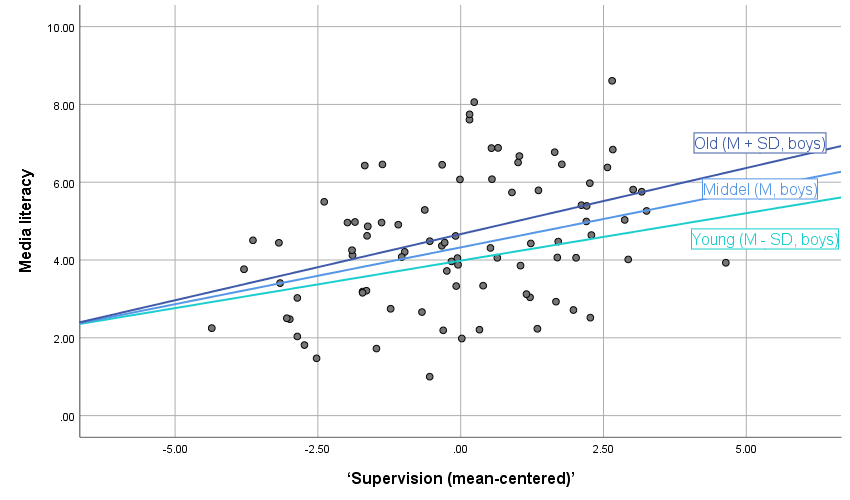

# Regression Analysis With A Numerical Moderator {#moderationcont}
> Key concepts: interaction variable, common support, simple slope, conditional effect, mean-centering.

Watch this micro lecture on regression models with a numerical moderator for an overview of the chapter.

```{r, echo=FALSE, out.width="640px", dev="png", screenshot.opts = list(delay = 5)}
knitr::include_url("https://www.youtube.com/embed/@@@@@", height = "360px")
```

### Summary {-}

```{block2, type='rmdimportant'}
My moderator is numerical. How can I construct different regression lines for different moderator values?
```

Chapter \@ref(moderationcat) shows us how we can include dichotomous and categorical variables as predictors and moderators in a regression model. Using dummy variables, we can analyze mean differences between groups and we can construct different regression lines for different groups (moderation). A graph showing the different regression models for different moderator groups communicates the results of a moderation model in an attractive way.

What if our moderator is not dichotomous or categorical but numerical? For example, the effect of exposure to an anti-smoking campaign on attitude towards smoking can be different for people of different age or for people who spend more time with smokers.

We can include a numerical moderator in a regression model just like a dichotomous moderator. Add the predictor, the moderator, and an interaction variable, which is the product of the moderator and the predictor. If both the predictor and moderator are numerical, the interaction variable is numerical. It gives us numbers, not groups.

The interpretation of an interaction effect is different if the moderator is numerical instead of dichotomous or categorical. In general, the regression coefficient of a numerical variable expresses the effect of a one unit change. For a numerical predictor, this is the predicted change in the dependent variable. For a numerical moderator, however, it is the predicted change in the effect of the predictor. The unstandardized regression coefficient for a numerical moderator, then, tells us the predicted change in the effect of the predictor for a one unit increase in the moderator. 

This interpretation is quite abstract and not easy to understand. It is better to visualize the regression lines for different values of the moderator. We usually draw regression lines for three interesting moderator values. The mean value of the moderator shows us the effect at a moderate level of the moderator. One standard deviation below or above the mean of the moderator represent attractive low and high moderator values. 

Just like a model with a dichotomous or categorical moderator, the effect of a predictor that is involved in moderation is a conditional effect. In other words, it is the effect for one particular value of the moderator, namely the value zero. Unfortunately, zero is not always a meaningful value for the moderator. If it does not exist or appear rarely on the moderator, it is better to mean-center the moderator. Mean-centering a variable changes the scores such that the mean of the original variable becomes zero on the mean-centered variable. The value zero is always meaningful for a mean-centered variable because it represents the mean score on the original variable. With a mean-centered moderator, the regression coefficient of the predictor always makes sense.

## A Numerical Moderator {#cont-moderator-regression}

With a categorical moderator, it is quite obvious for which values of the moderator we are going to calculate and depict the effect of the predictor on the dependent variable. If smoking status moderates the effect of exposure on attitude towards smoking, we will inspect a regression line for each smoking status category: smokers, former smokers, and non-smokers. But what if the moderator is a numerical variable, for example, the intensity of contact with smokers?

```{r continuous-moderator, fig.cap="How do contact values affect the conditional effect of exposure on attitude?", echo=FALSE, screenshot.opts = list(delay = 5), dev="png", out.width="775px"}
# Goal: Understand that there is a conditional effect for each value of the moderator by gradually changing the moderator value & understanding the linearity of the effect: a fixed slope change for a fixed difference in moderator values.
# Generate a data set with a linear interaction (attitude ~ exposure*contact). Display a scattergram with a regression line for the current value of the moderator (contact). Display regression equation as y = a + (b_1 + b_3*contact(5))*exposure + b_2*contact(5) with values for coefficients and for contact. Add slider allowing the user to change the moderator value (range [0, 10], initial value 0). Replace the previous regression line by a grey line, remove older regression lines, and add new regression line in black; also update regression equation.
# # Number of observations.
# n <- 85
# # Create predictor.
# set.seed(4932)
# exposure <- runif(n)*10
# # Create moderator.
# set.seed(4321)
# contact <- 0.12*(10 - exposure) + rnorm(n, mean = 4.5, sd = 2)
# # Create dependent variable.
# set.seed(390)
# attitude <- -0.26*exposure + 0.15*contact + 0.04*exposure*contact + rnorm(n, mean = 2, sd = 0.5)
knitr::include_app("http://82.196.4.233:3838/apps/continuous-moderator/", height="325px")
```

<A name="question9.1.1"></A>
```{block2, type='rmdquestion'}
1. The regression line depicted in Figure \@ref(fig:continuous-moderator) represents the conditional effect of exposure on attitude for the value of contact with smokers selected with the slider. How many different conditional effects are there? [](#answer9.1.1)
```

<A name="question9.1.2"></A>
```{block2, type='rmdquestion'}
2. Is the effect of campaign exposure on attitude towards smoking always negative? Or does more exposure lead to a more positive attitude (higher score) in some cases? If so, in which cases? Use the slider to find the answer. [](#answer9.1.2)
```

<A name="question9.1.3"></A>
```{block2, type='rmdquestion'}
3. How much does the slope increase if the moderator value is changed from 0 to 1? And how much if it changes from 6 to 7? [](#answer9.1.3)
```

People hanging around a lot with smokers may have a more positive attitude towards smoking than people who have little contact with smokers. If people whose company you value are smokers, you are less likely to condemn smoking. This is an overall effect of contact with smokers on attitude towards smoking.

In addition, the anti-smoking campaign may be less effective for people who spend a lot of time with smokers. The attitude towards smoking may be stronger among people who spend more time with smokers, so it is more difficult to change the attitude. In this situation, contact with smokers decreases the effect of campaign exposure on attitude. The effect of exposure is moderated by contact with smokers.

Our moderator, contact with smokers, is numerical. As a consequence, we can have an endless number of contact levels as groups for which the slope may change. This is the only difference with a categorical moderator. Other than that, we will analyze a numerical moderator in the same way as we analyzed a categorical moderator.

### Interaction variable {#interpret-cont-interaction}

We need one interaction variable to include a numerical moderator in a regression model. As before, the interaction variable is the product of the predictor and the moderator. Multiply the predictor by the moderator to obtain the interaction variable.

Although we have an endless number of different moderator values or "groups", we only need one interaction variable. It represents the gradual (linear) change of the effect of the predictor for higher values of the moderator. 

\begin{equation}
\small
\begin{split}
  attitude = &\ constant + b_1*exposure + b_2*contact + b_3*exposure*contact \\
  attitude = &\ constant + (b_1 + b_3*contact)*exposure + b_2*contact 
\end{split}
(\#eq:simplecontact) 
\normalsize
\end{equation}

To see this, it is helpful to inspect the regression equation with rearranged terms [Equation \@ref(eq:simplecontact)]. Every additional contact with smokers adds $b_3$ to the slope $(b_1 + b_3*contact)$ of the exposure effect. The addition is gradual---a little bit of additional contact with smokers changes the exposure effect a little bit---and it is linear: A unit increase in contact adds the same amount to the effect whether the effect is at a low or a high level.

We can interpret the regression coefficient of the interaction effect ($b_3$) here as the predicted change in the exposure effect (slope) for a one unit difference in contact (the moderator). A positive coefficient indicates that the exposure effect is more positive for higher levels of contact with smokers. A negative coefficient indicates that the effect is more negative for people with more contacts with smokers. 

Note that positive and negative are used here in their mathematical meaning, not in an appreciative way. A positive effect of exposure implies a more positive attitude towards smoking. Anti-smoking campaigners probably evaluate this as a negative result.

### Conditional effect {#conditional-effect-cont}

In the presence of an interaction effect of exposure and contact, the regression coefficients for exposure and contact represent conditional effects (see Section \@ref(conditional-effects)), namely, the effects for cases that score zero on the other variable. Plug in zero for the moderator and you will see that all terms with a moderator drop from the equation and only $b_1$ is left as the effect of exposure.  

\begin{equation}
\small
\begin{split}
  attitude = &\ constant + (b_1 + b_3*contact)*exposure + b_2*contact \\
  attitude = &\ constant + (b_1 + b_3*0)*exposure + b_2*0 \\
  attitude = &\ constant + b_1*exposure
\end{split}
(\#eq:conditionaleffect) 
\normalsize
\end{equation}

The zero score on the moderator is the _reference value_ for the conditional effect of the predictor. Cases that score zero on the moderator are the _reference group_ just like cases scoring zero on all dummy variables are the reference group in a model with a categorical moderator (Section \@ref(dichpredictor)). 

### Mean-centering

Because the effect of a predictor involved in an interaction is a conditional effect, a zero score on the moderator has a special role. It is the reference value for the effect of the predictor. For example, the effect of exposure on attitude applies to respondents with zero contacts with smokers if the regression model includes an exposure by contact interaction. If zero on the moderator is so important as a reference value, we may want to manipulate this value to ensure that it is meaningful.

```{r mean-centering-moderator, eval=TRUE, echo=FALSE, fig.cap="What happens if you mean-center the moderator variable?", out.width="775px", screenshot.opts = list(delay = 5), dev="png"}
# Goal: Understand how mean-centering affects the interpretion of the
# conditional effect of the predictor by seeing how the reference value changes
# with mean-centering (and centering on another value, e.g., M plus/minus 1 SD).
# Use same data set as in app continuous-moderator. 
# Display a scatterplot with a line representing the conditional regression line for exposure at moderator (contact) value = 0. Shade dots in scatterplot in accordance with distance of their moderator score to the moderator reference value. 
# Display the current reference value of the moderator: "Line for contact = 0"
# Add a slider 'Contact - x' (equal length as x axis, range [0, 10], initial value 0), labeled with values 0, M - SD, M, M + SD, and 10 (use nice round numbers for SD and M, not exactly the true values). Adjusting the slider updates the regression line in the scatterplot and the reference value label.
knitr::include_app("http://82.196.4.233:3838/apps/mean-centering-moderator/", height="310px")
```

<A name="question9.1.4"></A>
```{block2, type='rmdquestion'}
4. What is the correct interpretation of the estimated regression coefficient of exposure in Figure \@ref(fig:mean-centering-moderator)? [](#answer9.1.4)
```

<A name="question9.1.5"></A>
```{block2, type='rmdquestion'}
5. Participants with moderator scores that are very close to the selected moderator value are dark blue in the plot. Participants with scores that are quite close to the selected value are light blue. Would you conclude that the regression line represents a sizable group of participants? [](#answer9.1.5)
```

<A name="question9.1.6"></A>
```{block2, type='rmdquestion'}
6. What happens to the red regression line and the red regression equation if you subtract the mean (*M*) from the respondents' contact with smokers scores? Thus, you mean-center the moderator Contact. Use the slider **Center Contact. Subtract from Contact:** in Figure \@ref(fig:mean-centering-moderator) to check your answer. [](#answer9.1.6)
```

<A name="question9.1.7"></A>
```{block2, type='rmdquestion'}
7. If Contact is mean-centered, the regression coefficient of exposure represents the effect of exposure on attitude for respondents with a particular score on the original Contact variable. What is this original Contact score? Use the slider **Adjust the value of Contact (Moderator):** to check your answer. [](#answer9.1.7)
```

<A name="question9.1.8"></A>
```{block2, type='rmdquestion'}
8. If you have dragged the blue regression line to the red regression line, participants with moderator values close to the mean are (dark) blue (see Question 5). Would you conclude that the regression line represents a sizable group of participants now? [](#answer9.1.8)
```

What if there are no people with zero contact? Then, the interpretation of the regression coefficient $b_1$ for exposure does not make sense. In this situation, it is better to mean-center the moderator (contact) before you add it to the regression equation and before you calculate the interaction variable. 

To _mean-center_ a variable, you subtract the variable's mean from all scores on the variable. As a result, a mean score on the original variable becomes a zero score on the mean-centered variable. 

\begin{equation*}
\small
  contactcentered = contact - mean(contact)
\normalsize
\end{equation*}

With mean-centered numerical moderators, a conditional effect in the presence of interaction always makes sense. It is the effect of the predictor for respondents who have an average score on the moderator. An average score always falls within the range of scores that actually occur. If we mean-center the moderator variable contact with smokers, the regression coefficient $b_1$ for exposure expresses the effect of exposure on attitude for people with average contacts with smokers. This makes sense.

Remember that the interaction variable is the product of the predictor and moderator (Section \@ref(interaction-variable)). If any or both of these are mean-centered, you should multiply the mean-centered variable(s) to create the interaction variable, see Sections \@ref(conditional-effects) and \@ref(conditional-effect-cont).

### Symmetry of predictor and moderator

```{r symmetry-predictor-moderator, eval=FALSE, echo=FALSE, fig.cap=""}
# Goal: Understand the advantages of mean-centering the predictor by seeing how
# the reference value changes with mean-centering (and centering on another
# value, e.g., M plus/minus 1 SD).
# Use same data set as in app continuous-moderator: predictor = exposure,
# moderator = contact.
# Display scatterplot (x axis not labelled) with conditional regression effect
# for predictor (blue) at moderator value = 0 and conditional effect of
# moderator (red) for predictor = 0.
# Show two additional x axes marking the reference values of the predictor
# (blue) and moderator (red) (range [0, 10], initial value 0).
# Add sliders 'Exposure - x' and 'Contact - x' (equal length as two x axes,
# range [0, 10], initial value 0), labeled with values M - SD, M, and M + SD.
# Adjusting the sliders update the scale of the appropriate x axis (the marked
# point zero moves) and the regression lines in the scatterplot.

1. If you change the value on the slider 'Exposure - x', which regression line in the plot changes? Why this line?

2. Which variable is the predictor and which is the moderator if you adjust the value of the slider 'Exposure - x'?
```

If we want to interpret the conditional effect of contact on attitude ($b_2$), we must realize that this is the effect for people who score zero on the exposure variable if the exposure by contact interaction is included in the regression model. This is clear if we rearrange the regression equation as in Equation \@ref(eq:contactbyexposure).

\begin{equation}
\small
\begin{split}
  attitude = &\ constant + b_1*exposure + b_2*contact + b_3*exposure*contact \\
  attitude = &\ constant + b_1*exposure + (b_2 + b_3*exposure)*contact \\
  attitude = &\ constant + b_1*0 + (b_2 + b_3*0)*contact \\
  attitude = &\ constant + b_2*contact 
  \end{split}
(\#eq:contactbyexposure) 
\normalsize
\end{equation}

But wait a minute, this is what we would do if contact was the predictor and exposure the moderator. That is a completely different situation, is it not? No, technically it does not make a difference which variable is the predictor and which is the moderator. The predictor and moderator are symmetric. The difference is only in our theoretical expectations and in our interpretation.

For example, let us assume that the regression coefficient of the interaction effect of exposure and contact is 0.2. We can interpret this regression coefficient as the additional effect of exposure for people with one more contact with smokers. But we can also conclude that an additional unit of exposure increases the effect of contact with smokers on attitude by 0.2.

The conditional effect of the moderator, as stated above, is the effect of the moderator if the predictor is zero. This interpretation makes sense only if there are cases with zero scores on the predictor. In the current example, the scores on exposure range from 0 to 10, so zero exposure is meaningful. But it represents a borderline score with perhaps a very atypical effect of contact on attitude or few observations. For these reasons, it is recommended to *mean-center both the predictor and moderator if they are numerical*. In case of a dichotomous or categorical moderator (Section \@ref(categoricalmoderator)), the predictor can also be mean-centered.

### Visualization of the interaction effect

It can be quite tricky to interpret regression coefficients in a regression model that contains interaction effects. The safest strategy is to draw regression lines for different values of the moderator. But what are interesting values if the moderator is numerical?

```{r continuous-interaction-visualization, fig.cap="Which moderator values are helpful for visualizing moderation?", echo=FALSE, screenshot.opts = list(delay = 5), dev="png", out.width="775px"}
# Goal: Clarify the interpretation of the (unstandardized) interaction effect by
# showing regression lines at different (interesting) moderator scores (display
# slope value).
# Variant of the app continuous-moderator; ensure that there are few predictor
# values at the minimum and maximum values of the moderator. Allow user to pick
# several values for the moderator from a list containing: minimum, maximum,
# first tercile, second tercile, M - 2SD, M - 1SD, M, M + 1SD, M
# + 2SD. Display the selected lines in different colours.
knitr::include_app("http://82.196.4.233:3838/apps/continuous-interaction-visualization/", height="308px")
```

<A name="question9.1.9"></A>
```{block2, type='rmdquestion'}
9. Select one or more options in Figure \@ref(fig:continuous-interaction-visualization) to represent regression lines predicting attitude from exposure at different values of the moderator (contact with smokers). Respondents with moderator values close to the selected value are coloured. Which moderator values would you pick to communicate the results of moderation? Motivate your answer. [](#answer9.1.9)
```

As we have seen in Section \@ref(interpret-cont-interaction), the regression coefficient of an interaction effect with a numerical moderator can be directly interpreted. It represents the predicted difference in the unstandardized effect size for a one unit increase in the moderator. For example, one more contact with a smoker increases the exposure effect by 0.04.

The size of the interaction effect tells us the moderation trend, for instance, people who are more around smokers tend to be less opposed to smoking if they are exposed to the anti-smoking campaign. But we do not know how much an anti-smoking attitude is fostered by exposure to a campaign and whether exposure to the campaign increases anti-smoking attitude for everyone. Perhaps, people hanging out with smokers a lot may even get a more positive attitude towards smoking from campaign exposure.

We can be more specific about exposure effects at different levels of contact with smokers if we pick some interesting values of the moderator and calculate the conditional effects at these levels.

The minimum or maximum values of the moderator are usually not very interesting. We tend to have few observations for these values, so our confidence in the estimated effect at that level is low. Instead, the values one standard deviation below and above the mean of the moderator are popular values to be picked. One standard deviation below the mean (M - SD) indicates a low value, the mean (M) indicates a central value, and one standard deviation above the mean (M + SD) indicates a high value. 

Having picked these values, we can visualize moderation as different regression lines in a plot. We use exactly the same approach as in visualizing moderation by a categorical variable. As a first step, we construct equations for conditional effects of the predictor at different levels of the moderator. Plug the selected value of the moderator into the regression equation. If there are covariates, also plug in a meaningful value for the covariates, usually the average for numerical covariates and zero or one for dichotomous covariates. As a second step, we use the equations to add regression lines to a scatter plot.

If contact (the moderator) is mean-centered, as in the current example, we simply plug in zero for the moderator to obtain the equation for the regression line at the mean of the moderator (contact with smokers). We plug in the value of the standard deviation of contact with smokers to get the regression equation for people who scored one standard deviation above the mean on the moderator [illustrated by Eq. \@ref(eq:regsimpleslopemoderated)]. The standard deviation of contact is 2.0 in this example, so Equation \@ref(eq:regsimpleslopemoderated) replaces contact by 2.0 everywhere. We plug in minus the value of one standard deviation if we want the regression line for the moderator at the mean minus one standard deviation.

\begin{equation}
\small
\begin{split}
  attitude &= 3.6 + -0.1*exposure + 0.1*status + 0.1*contact \\
  &\ + 0.03*contact*exposure \\
  attitude &= 3.6 + -0.1*exposure + 0.1*(0) + 0.1*(2.0) + 0.03*(2.0)*exposure \\
    attitude &= 3.8 + -0.04*exposure 
\end{split}
(\#eq:regsimpleslopemoderated) 
\normalsize
\end{equation}

We also have to plug in a value for each covariate. This example contains one covariate, namely (smoking) status. We plug in the score for non-smokers (0). In the end, our predictor (exposure) should be the only variable in the right hand side of the regression equation [the last line in Equation \@ref(eq:regsimpleslopemoderated)]. Now, we can draw the regression lines in a scatterplot as we have learned in the preceding chapter (Instruction video \@ref(fig:SPSSregmodlines)).

Instead of writing out the full equations, add columns (Table \@ref(tab:cont-moderator-results)) to the regression coefficients table for each simple regression line that you want to draw: 

1. Add a column indicating which value you plug in for the moderator variable(s) and any covariates. In this example, _contact_ is the moderator variable, which appears both by itself and as part of the interaction variable. The variable _smoker_ is a covariate here; we select the non-smokers (coded 0).

2. Add a column to calculate the simple slope. Only use the variables that include the predictor, which is _exposure_ in this example. For each of these variables, multiply the regression coefficient by the plug-in value (if any). Sum the results to obtain the simple slope.

3. Add a column to calculate the constant. Use all variables that do _not_ include the predictor. For each of these variables, multiply the regression coefficient by the plug-in value (if any). Sum the results to obtain the constant.

```{r cont-moderator-results, echo=FALSE, message=FALSE, warning=FALSE}
# Table of regression coefficients for exposure moderated by contact.
# Additional columns for calculating the intercept and simpe slope of exposure for non-smokers.
# Create data frame with fake unstandardizd regression coefficients.
results <- data.frame(B = c("3.6", "-0.1", "0.1", "0.1", "0.03", ""),
                      #average contact for a non-smoker
                      Plugin0 = c("", "", "Smoker = 0", "Mean contact(mc) = 0", "Mean contact(mc) = 0", ""),
                      Slope0 = c("", "-0.1", "", "", "0.03 * 0", paste0("-0.1", 
                                footnote_marker_alphabet(1))),
                      Constant0 = c("3.6", "", "0.1 * 0", "0.1 * 0", "", paste0("3.6", 
                                footnote_marker_alphabet(1))),
                      #1SD above average contacts for a non-smoker
                      Plugin1 = c("", "", "Smoker = 0", "SD contact = 2.0", "SD contact = 2.0", ""),
                      Slope1 = c("", "-0.1", "", "", "0.03 * 2.0", paste0("-0.04", 
                                footnote_marker_alphabet(2))),
                      Constant1 = c("3.6", "", "0.1 * 0", "0.1 * 2.0", "", paste0("3.8", 
                                footnote_marker_alphabet(2))),
                      row.names = c("(Constant)", "Exposure", "Smoker", "Contact",
                                     "Exposure*Contact", "Result (sum)"),
                      check.names = FALSE)
# Table.
options(knitr.kable.NA = '')
knitr::kable(results, digits = 3, booktabs = TRUE,
             caption = "Calculation of the simple slope and constant at average contact and one standard deviation above average contact for non-smokers. The variable contact is mean-centered.",
             col.names = c("B", rep(c("1. Plugin", "2. Slope", "3. Constant"), 2)),
             align = "rlrrlrr",
             escape = F) %>%
  kable_styling(font_size = 12, full_width = F,
                latex_options = c("scale_down", "HOLD_position")) %>%
  add_header_above(c(" " = 2, "Average contact" = 3, "Average + 1 SD contact" = 3)) %>%
  footnote(alphabet = c("Equation for average contact: y = -0.1 * Exposure	+ 3.6.", "Equation for 1 SD above average contact: y = -0.04 * Exposure	+ 3.8."))
```

The footnotes to Table \@ref(tab:cont-moderator-results) show the resulting simple regression equations. You can interpret the slopes, which are unstandardized regression coefficients ($b$), or use the equations to draw regression lines.

If the moderator is not mean-centered, we have to plug in the value of the mean of the moderator and the value of the mean plus or minus the standard deviation of the moderator. Let us assume that the mean score of contact with smokers is 5.1 in this example. The moderator mean minus one standard deviation (2.0) equals 3.1 and the mean plus one standard deviation is 7.1.

### Statistical inference on conditional effects

```{r cont-moderator-output, echo=FALSE, message=FALSE, warning=FALSE}
# Table of regression coefficients for the effect of exposure moderated by contact with smokers. Similar to SPSS output (with standardized coefficients?).
# Create effect sizes.
smokers <- haven::read_spss("data/smokers.sav")
# Mean-center numerical predictors.
smokers$exposure_mc <- smokers$exposure - mean(smokers$exposure)
smokers$contact_mc <- smokers$contact - mean(smokers$contact)
# Unstandardized linear model.
model_1 <- lm(attitude ~ exposure_mc*contact_mc + status2, data = smokers)
# Table with results in SPSS style.
results <- coef(summary(model_1))
# Adjust parameter names
attributes(results)$dimnames[[1]][1] <- "(Constant)"
attributes(results)$dimnames[[1]][2] <- "Exposure (mean-centered)"
attributes(results)$dimnames[[1]][3] <- "Contact (mean-centered)"
attributes(results)$dimnames[[1]][4] <- "Status (smoker)"
attributes(results)$dimnames[[1]][5] <- "Exposure*Contact (mean-centered)"
# Confidence intervals
ci <- confint.lm(model_1)
results <- cbind(results, ci)
# Correctly standardized coefficients.
smokers <- smokers %>%
  mutate(
    z_exposure = (exposure - mean(exposure))/sd(exposure),
    z_contact = (contact - mean(contact))/sd(contact),
    z_status2 = (status2 - mean(status2))/sd(status2),
    z_expocontact = z_exposure * z_contact,
    z_attitude = (attitude - mean(attitude))/sd(attitude)
  )
model_2 <- lm(z_attitude ~ z_exposure + z_contact + z_status2 + z_expocontact, data = smokers)
results_2 <- coef(summary(model_2))
results <- cbind(results[, 1:2], results_2[, 1], results[, 3:6])
results[1, 3] <- NA
# Set column names.
attributes(results)$dimnames[[2]] <- c("B", "Std. Error", "Beta", "t", "Sig.", "Lower Bound", "Upper Bound")
# Table.
options(knitr.kable.NA = '')
knitr::kable(results, digits = 3, booktabs = TRUE,
             caption = "Predicting attitude towards smoking: regression analysis results with exposure and contact mean-centered.") %>%
  kable_styling(font_size = 12, full_width = F,
                latex_options = c("scale_down", "HOLD_position"))
# Helper function for displaying results within the text.
source("report_n.R")
# Partial cleanup.
rm(model_1, ci, results_2, model_2)
```

The regression model yields a p value and confidence interval for the predictor at the reference value of the moderator. In the model estimated in Table \@ref(tab:cont-moderator-output), for instance, we obtain a p value of `r report_n(results[2,5], 3)` and a 95% confidence interval of [`r report_n(results[2,6],2)`, `r report_n(results[2,7],2)`] for the effect of exposure on attitude. This is the conditional effect of exposure on attitude for cases that score zero on the moderator variable (contact with smokers).

If the moderator variable _contact_ is mean-centered, the p value tests the null hypothesis that the effect of exposure is zero for people who have average contact with smokers. The confidence interval tells us that the effect of exposure on attitude for people with average contacts with smokers ranges between `r report_n(results[2,6],2)` and `r report_n(results[2,7],2)` with 95% confidence. If the moderator is not mean-centered, the results apply to people who have no contact with smokers.

Note that mean-centering of the moderator changes, so to speak, the regression line that we test. Instead of testing the effect of exposure for people with no smoker contact, we test the effect for people with average contact with smokers if the moderator is mean-centered. If we would like to get the p value or confidence interval for the regression line at one standard deviation above (or below) the mean, we have to center the moderator at that value before we estimate the regression model. In this course, however, we will not do so. 

```{r echo=FALSE}
#Cleanup.
rm(results, report_n)
```

### Common support

In Section \@ref(commonsupportdichotomous), we checked the support of the predictor in the data for different groups of the moderator. The basic idea is that we can only sensibly estimate and interpret a conditional effect at a moderator level if we have observations over the entire range of the predictor. For each moderator group, we checked the distribution of the predictor.

With a numerical moderator we can also do this if we group moderator scores. Hainmueller et al. [-@RefWorks:3838] recommend creating three groups, each containing one third of all observations. These low, medium, and high groups correspond more or less with the minus one standard deviation/mean/plus one standard deviation values that we used for visualizing and testing conditional effects. Create a histogram for the predictor in each of these groups to check common support of moderation in the data, as explained in micro lecture \@ref(fig:SPSSregSupport1).

```{r cont-moderator-support, echo=FALSE, message=FALSE, warning=FALSE, fig.cap="Common support of the predictor variable (exposure) at three levels of the moderator variable (contact)."}
# Display predictor (exposure) values for three groups of the moderator (contact).
smokers %>% #data read in previous code chunk
  mutate(contact_bin = factor(ntile(contact, 3),
                              levels = c(1, 2, 3),
                              labels = c("Low contact", "Medium contact", "High contact"))) %>% 
  ggplot(aes(x = exposure)) +
    geom_histogram(fill = brewercolors[5], binwidth = 1) +
    facet_wrap(~contact_bin, ncol = 1) +
    scale_x_continuous(name = "Exposure", breaks = 0:10) +
    theme_general()

# Cleanup.
rm(smokers)
```

According to Figure \@ref(fig:cont-moderator-support), the predictor variable exposure covers the entire range from 0 to 10 at medium and high contact levels. At low contact level, however, the lowest exposure score is 1 instead of zero. In all, we have common support for moderation of the exposure effect by contact for exposure scores from 1 to 10. This is quite a broad range but we should note that we have few observations of low exposure at the low contact level as well as few observations of high exposure at the high contact level.

### Assumptions

The general assumptions for regression analysis (Section \@ref(regr-inference)) also apply to the interaction effect with a numerical moderator. The checks are the same: See if the residuals are more or less normally distributed and check the residuals by predicted values plot.

Note that the linearity assumption also applies to the interaction effect. If the interaction effect is positive, the exposure (predictor) effect must be higher for higher values of contact with smokers (moderator). More precisely, a unit difference on the moderator should result in a fixed increase (or decrease) of the effect of the predictor. You may have noticed this linear change in the effect size in Figure \@ref(fig:continuous-moderator) at the beginning of this section on numerical moderators.

It is difficult to check this assumption, so let us not pursue this here. Just remember that the interaction effect is assumed to be linear: a continuously increasing or decreasing effect of the predictor at higher moderator values.

```{r eval=FALSE, echo=FALSE}
### Comparing nested regression models

Discuss F Change test here with distinction between 'main' effects in model without interaction predictor and conditional effects in (nested?) model with interaction predictor ; additional SPSS clip?
Cf. Fam: Discuss a two-step approach to moderation? In the first model estimate effects without the interaction predictor, so we have the average or main effects (as in ANOVA). In the second model, add the interaction predictor. Now, the former main effect is the effect for the reference group or value (zero) on the moderator.
Pros/cons: Adds F Change test; F Change test does not add to significance test of interaction predictor?; highlights interpretation difference of seemingly the same effect (main effect becomes conditional effect); main effects are interesting only if there is no interaction effect?
```

### Higher-order interaction effects

An interaction effect with one moderator, whether numerical or categorical, is called _first-order interaction_ or _two-way interaction_. It is possible to have a moderated effect that is moderated itself by a second moderator. For example, the change in the exposure effect due to a person's contact with smokers may be different for smokers than for non-smokers. This is called a _second-order interaction_ or _higher-order interaction_. We can include more moderators, yielding even higher higher-order interactions, such as three or four moderators.

An interaction variable that is the product of the predictor and two moderators can be used to include a second-order interaction in a regression model. If you include a second-order interaction, you must also include the effects of the variables involved in the interaction as well as all first-order interactions among these variables in the regression model. All in all, these models become very complicated to interpret and they are beyond the scope of the current course.

### Answers {-}

<A name="answer9.1.1"></A>
```{block2, type='rmdanswer'}
Answer to Question 1. 

* In principle, there is an unlimited number of conditional effects if the
moderator is a continuous variable.
* In the app, however, the slider allows you to increase or decrease contact
score by 0.1. In the app, there are effectively 101 (0 to 10 in steps of 0.1) moderator values that you
can select, so there are 101 different regression lines that can be depicted. [](#question9.1.1)
```
  
<A name="answer9.1.2"></A>
```{block2, type='rmdanswer'}
Answer to Question 2. 

* Move the slider from left to right to find the moderator value at which the
regression line is horizontal. For higher moderator values, the slope of the
regression line is positive. Here, more exposure leads to a more positive
attitude.
* Or have a close look at the equations. The regression coefficient of the
(simple) slope of the exposure effect is zero if the part between brackets (b1
+ b3*contact) is zero. We know b1 and b3, so we must solve the equation:

> -0.26 + 0.04 * contact = 0

Your high-school algebra may help you:

> 0.04 * contact = 0.26

> contact = 0.26 / 0.04

> contact = 0.26 / 0.04 = 6.5 [](#question9.1.2)
```
  
<A name="answer9.1.3"></A>
```{block2, type='rmdanswer'}
Answer to Question 3. 

* Each increment of 1 unit of contact increases the (simple) slope of the
exposure effect on attitude by 0.04, that is, by the value of the interaction
effect.
* This is easy to see in the equation for the effect of exposure:

> (-0.26 + 0.04 * contact) * exposure

* Plug in 0 for contact: The simple slope is -0.26.
* Plug in 1 for contact: The simple slope is -0.26 + 0.04 * 1.
* The difference is 0.04. This difference is the same for every increase of
one unit in contact, so it is also the difference between the slopes at
contact levels six and seven. [](#question9.1.3)
```
  
<A name="answer9.1.4"></A>
```{block2, type='rmdanswer'}
Answer to Question 4. 

* In the initial situation, the regression line in this figure represents the
predictive effect of exposure on attitude for respondents who score zero on the
moderator (contact with smokers).
* In this regression model, the regression coefficient of exposure is -0.26,
so an additional unit of exposure decreases the predicted attitude by 0.26 for
respondents who have no (zero) contacts with smokers. [](#question9.1.4)
```
  
<A name="answer9.1.5"></A>
```{block2, type='rmdanswer'}
Answer to Question 5. 

* We can spot some light-blue dots in the graph but no dark blue dots. There is no sizable set of participants with (hardly) any contact with smokers. There are (hardly) any participants to whom the effect expressed by -.26 applies.
* In other words, this regression coefficient is not supported by data, so it is quite meaningless. [](#question9.1.5)
```
  
<A name="answer9.1.6"></A>
```{block2, type='rmdanswer'}
Answer to Question 6. 

* Mean Contact score is 5. The regression coefficient of exposure changes to
-0.06, namely -0.26 + 0.04 * 5. Accordingly, the red regression line becomes
almost horizontal. [](#question9.1.6)
```
  
<A name="answer9.1.7"></A>
```{block2, type='rmdanswer'}
Answer to Question 7. 

* The regression line of the mean-centered Contact moderator coincides with
the blue regression line if we select 5 as value of the original Contact
variable. 
* Apparently, the reference group for the regression coefficient of exposure in
case of a mean-centered moderator, consists of respondents who score 5 on the
original Contact with smokers moderator.
* By mean centering, we assign the score zero to respondents who used to have
a mean score on the moderator Contact with smokers. Now that they score zero
on the new mean-centered variable, they have become the reference group. [](#question9.1.7)
```
  
<A name="answer9.1.8"></A>
```{block2, type='rmdanswer'}
Answer to Question 8. 

* Now there are many (dark) blue dots, so there is a sizable number of participants who have around average contact with smokers. The regression coefficient for the effect of exposure applies to quite some participants in the sample, so it is meaningful.
* The mean of a variable is usually a value with a lot of observations nearby. This makes it a good reference value in a moderation model. [](#question9.1.8)
```
  
<A name="answer9.1.9"></A>
```{block2, type='rmdanswer'}
Answer to Question 9. 

* The important thing is to understand that a regression line that depends on
few observations is not very trustworthy. The line usually does not represent
the observations well. In addition, these few observations may have different
predictor and dependent variable values in a new sample, so the regression line may be
quite different at this moderator value in a new sample.
* The minimum and maximum value observed in the current sample represent
regression lines that are quite outside the dot cloud. They are based on very
few observations, so they are not very trustworthy.
* Observations with moderator values at two standard deviations away from the
mean (options: M - 2SD and M + 2SD) are still quite rare.
* Observations with moderator values at one standard deviations away from the
mean (options: M - 1SD and M + 1SD) are quite common. These regression
lines are nicely embedded in the dot cloud. They are good candidates for
interpreting moderation.
* Of course, moderator values even closer to the mean, such as moderator values
below or above which we find one third of all scores (the first and third
terciles) are also well supported by observations, as is the moderator mean
itself. [](#question9.1.9)
```
  
## Reporting Regression Results {#reportmoderation}

```{r report-moderation-calculation, echo=FALSE}
# Generate data with categorical*continuous and continuous*continuous moderation.
# Number of observations.
n <- 150
# Create predictors
set.seed(4932)
exposure <- runif(n)*10
set.seed(823)
former <- rbinom(n, 1, 0.40)
set.seed(401)
smoker <- rbinom(n, 1, 0.20)
smoker[former == 1] <- 0
set.seed(4321)
contact <- 0.12*(10 - exposure) + rnorm(n, mean = 4.5, sd = 2)
# Mean-centered predictors.
exposure_mc <- exposure - mean(exposure)
contact_mc <- contact - mean(contact)
# Create dependent variable for mean-centered numerical predictor and moderator.
set.seed(390)
attitude <- -0.26*exposure_mc + 0.25*contact_mc + 0.08*exposure_mc*contact_mc - 1.6*former + 0.06*smoker - 0.12*former*exposure_mc + 0.05*smoker*exposure_mc + rnorm(n, mean = -1, sd = 1)
# Regression.
regmodel_1 <- lm(attitude ~ exposure_mc*contact_mc + exposure_mc*former + exposure_mc*smoker)
# Collect model test results.
summ <- summary(regmodel_1)
resultsF <- cbind(c("1", "", ""),
                  c("Regression", "Residual", "Total"),
                  c(format(round(var(attitude)*(n-1) - sum(summ$residuals^2), digits = 3), nsmall = 3), 
                    format(round(sum(summ$residuals^2), digits = 3), nsmall = 3),
                    format(round(var(attitude)*(n-1), digits = 3), nsmall = 3)),
                  c(round(summ$fstatistic[2]), round(summ$fstatistic[3]), n - 1),
                  c(format(round((var(attitude)*(n-1) - sum(summ$residuals^2))/summ$fstatistic[2],digits=3), nsmall = 3), format(round((var(attitude)*(n-1))/summ$fstatistic[3],digits=3), nsmall = 3), ""),
                  c(format(round(summ$fstatistic[1], digits = 3), nsmall = 3), "", ""),
                  c(format(round(pf(summ$fstatistic[1], summ$fstatistic[2], summ$fstatistic[3], lower.tail = FALSE), digits = 3), nsmall = 3), "", "")
                )
# Table with coefficient results in SPSS style.
results <- coef(summary(regmodel_1))
# Confidence intervals
ci <- confint.lm(regmodel_1)
# Reorder for APA6 table.
table <- cbind(paste0(format(round(results[,1], digits=2), nsmall=2),
                      ifelse(results[,4] < 0.001, "***", 
                        ifelse(results[,4] < 0.01, "**",
                          ifelse(results[,4] < 0.05, "*", "")))),
                 paste0("[", format(round(ci[,1], digits=2), nsmall = 2),
                        ", ", 
                        format(round(ci[,2], digits=2), nsmall = 2), "]"))
# Add R2 and F
table <- rbind(table, c(format(round(summ$r.squared, digits=2), nsmall = 2), ""),
               c(paste0(format(round(summ$fstatistic[1], digits=2), nsmall=2),
                      ifelse(pf(summ$fstatistic[1], summ$fstatistic[2], summ$fstatistic[3], lower.tail = FALSE) < 0.001, "***", 
                        ifelse(pf(summ$fstatistic[1], summ$fstatistic[2], summ$fstatistic[3], lower.tail = FALSE) < 0.01, "**",
                          ifelse(pf(summ$fstatistic[1], summ$fstatistic[2], summ$fstatistic[3], lower.tail = FALSE) < 0.05, "*", "")))), ""))
# Adjust parameter names
rownames(table) <- c("Constant", "Exposure", "Contact", "Former smoker", "Smoker", "Exposure * Contact", "Exposure * Former smoker", "Exposure * Smoker", "R^2^", "F")
attributes(table)$dimnames[[1]][1] <- "Constant"
attributes(results)$dimnames[[1]][6] <- "exposure*contact"
attributes(results)$dimnames[[1]][7] <- "exposure*former smoker"
attributes(results)$dimnames[[1]][8] <- "exposure*smoker"
# Set column names.
colnames(table) <- c("B", "95% CI")
# Helper function for displaying results within the text.
source("report_n.R")
```

If we report a regression model, we first present the significance test and predictive power of the entire regression model. We may report that the regression model is statistically significant, F (`r resultsF[[1,4]]`, `r resultsF[[2,4]]`) = `r report_n(as.numeric(resultsF[[1,6]]),2)`, p `r ifelse(resultsF[[1,7]] == "0.000", "< 0.001", paste0("=", resultsF[[1,7]]))`, so the regression model very likely helps to predict attitude towards smoking in the population. Note that the APA6-style table (Table \@ref(tab:report-moderation-table)) only reports the F value and its significance level.

How well does the regression model predict attitude towards smoking? The effect size of a regression model or its predictive power is summarized by $R^2$ (_R Square_), which is the proportion of the variance in the dependent variable scores (attitude towards smoking) that can be predicted with the regression model. In this example, $R^2$ is `r report_n(summ$r.squared, 2)`, so the regression model predicts `r report_n(summ$r.squared * 100, 0)`% of the variance in attitude towards smoking among the respondents. In communication research, $R^2$ is usually smaller. 

$R^2$ tells us how well the regression model predicts the dependent variable in the sample. Every predictor that we add to the regression model helps to predict results in the sample even if the predictor does not help to predict the dependent variable in the population. For a better idea of the predictive power of the regression model in the population, we may use _Adjusted R Square_. Adjusted R Square is usually slightly lower than R Square. In the example, Adjusted R Square is `r report_n(summ$adj.r.squared, 2)` (not reported in Table \@ref(tab:report-moderation-table)).

As a next step, we discuss the size, statistical significance, and confidence intervals of the regression coefficients. If a predictor is involved in one or more interaction effects, we must be very clear about the reference value or reference group to which the effect applies. In the example below, non-smokers are the reference group on the smoking status variable because they have code zero. Average number of contacts with smokers is the reference value on the contact variable because this variable is mean-centered.

Exposure, in our example, has a negative predictive effect on attitude towards smoking (_b_ = `r report_n(results[2,1])`) for non-smokers with average contacts with smokers, t = `r report_n(results[2,3])`, `r ifelse(results[2,4] < .0005, "p < .001", paste0("p = ", report_n(results[2,4], digits=3)))`, 95%CI[`r report_n(ci[2,1])`, `r report_n(ci[2,2])`]. Note that SPSS does not report the degrees of freedom for the t test on a regression coefficient, so we cannot report them.

```{r report-moderation-table, echo=FALSE}
# Table.
options(knitr.kable.NA = '')
knitr::kable(table, booktabs = TRUE, align = c("l", "c"),
             caption = "Predicting attitude towards smoking with smoking status and contact with smokers as moderators. Results in APA6 style. Exposure and contact are mean-centered.") %>%
  footnote(general = "_N_ = 150. CI = confidence interval.",
           symbol =  "*\\* _p_ < .05. \\*\\* _p_ < .01. \\*** _p_ < .001.",
           general_title = "Note.", title_format = c("italic"),
           symbol_title = "",
           footnote_as_chunk = T) %>%
  kable_styling(font_size = 12, full_width = F, position = "float_right",
                latex_options = c("HOLD_position"))
```

Instead of presenting the numerical results in the text, we may summarize them in an APA6 style table, such as Table \@ref(tab:report-moderation-table). Note that t and p values are not reported in this table, the focus is on the confidence intervals. The significance level is indicated by stars.

A sizable and statistically significant interaction effect signals that an effect is moderated. In the example reported in Table \@ref(tab:report-moderation-table), the effect of exposure on attitude seems to be moderated by contact with smokers (_b_ = `r report_n(results[6,1])`, `r ifelse(results[6,4] < .0005, "p < .001", paste0("p = ", report_n(results[6,4], digits=3)))`) and by smoking status (_b_ = `r report_n(results[7,1])`, `r ifelse(results[7,4] < .0005, "p < 0.001", paste0("p = ", report_n(results[7,4], digits=3)))`). 

The regression coefficients for interaction effects must be interpreted as effect differences. For a categorical moderator, the coefficient describes the effect size difference between the category represented by the dummy variable and the reference group. The negative effect of exposure is stronger for former smokers than for the reference group non-smokers. The average difference is `r report_n(results[7,1])`.

For a numerical moderator, we can interpret the general pattern reflected by the interaction effect. A positive interaction effect, such as `r report_n(results[6, 1])` for the interaction between exposure and smoker contact, signals that the effect of exposure is more strongly positive or less negative at higher levels of contact with smokers. 

This interpretation in terms of effect differences remains difficult to understand. It is recommended to select some interesting values for the moderator and report the size of the effect for each value. For a categorical moderator, each category is of interest. For a numerical moderator, the mean and one standard deviation below and above the mean are usually interesting values. The regression coefficients show whether the effect is positive, negative, or nearly zero at different values of the moderator.

Visualize the regression lines for different values of the moderator in addition to presenting the numerical results. If the regression model contains covariates, mention the values that you have used for the covariates. Select one of the categories for a categorical covariate. For numerical covariates, the mean is a good choice. If you are working with mean-centered predictors, be sure to use the mean-centered predictor for the horizontal axis (as in Figure \@ref(fig:report-moderator-visual)), not the original predictor.

```{r report-moderator-visual, fig.cap="The effect of exposure on attitude towards smoking. Left: Effects for groups with different smoking status (at average contact with smokers). Right: Effects at different levels of contact with smokers (effects for non-smokers).", out.width='50%', fig.asp=1, fig.show='hold', echo=FALSE}
# Create grouping variable. 
status <- rep(0, n)
status[former == 1] <- 1
status[smoker == 1] <- 2
status <- factor(status, labels = c("Non-smoker", "Former smoker", "Smoker"))
df <- data.frame(attitude, contact, exposure, former, smoker, status)
ggplot(df) +
  geom_point(aes(x = exposure_mc, y = attitude, colour = status),
             size = 4) +
  geom_abline(aes(slope = results[2,1], intercept = results[1,1], 
              colour = "Non-smoker"), 
              show.legend = F,
              size = 1) + #nonsmoker
  geom_abline(aes(slope = (results[2,1] + results[7,1]), intercept = (results[1,1] + results[4,1]), 
              colour = "Former smoker"), 
              show.legend = F,
              size = 1) + #former smoker
  geom_abline(aes(slope = (results[2,1] + results[8,1]), intercept = (results[1,1] + results[5,1]), 
              colour = "Smoker"), 
              show.legend = F, 
              size = 1) + #smoker
  scale_colour_manual(name = "Status", values = c("Non-smoker" = unname(brewercolors["Blue"]),
                                                          "Former smoker" = unname(brewercolors["Orange"]),
                                                          "Smoker" = unname(brewercolors["Red"]))) +   theme_classic(base_size = 18) +
  xlab("Exposure (mean-centered)") +
  ylab("Attitude towards smoking") +
  theme(legend.position = "bottom")
# define colours.
cl <- RColorBrewer::brewer.pal(5, "Blues")
ggplot(df, aes(x = exposure_mc, y = attitude)) +
  geom_point(size = 4) +
  geom_abline(aes(slope = (results[2,1] + results[6,1]*sd(contact)), intercept = (results[1,1] + results[3,1]*(sd(contact))), colour = "M+SD"), size = 1) +
  geom_abline(aes(slope = (results[2,1]), intercept = (results[1,1]), colour = "M"), size = 1)  +
  geom_abline(aes(slope = (results[2,1] - results[6,1]*sd(contact)), intercept = (results[1,1] - results[3,1]*sd(contact)), colour = " M-SD"), size = 1) +
  theme_classic(base_size = 18) +
  xlab("Exposure (mean-centered)") +
  ylab("Attitude towards smoking") +
  scale_color_manual(name = "Contact", values = c(" M-SD" = cl[5], "M" = cl[4], "M+SD" = cl[3])) +
  theme(legend.position = "bottom")

# It is possible to translate the regression equation for a mean-centered predictor back to the original scale of the predictor. The simple slope (of the conditional effects) remains the same. The intercept has to be adjusted: It is the intercept estimated for the mean-centered predictor minus the mean of the original predictor times the slope. Graphically speaking, the intercept must be moved from the mean of the original predictor, which is zero on the mean-centered predictor) to zero on the original predictor, which is minus the original mean on the mean-centered predictor. The inercept with the original predictor, then, is M steps to the left from zero on the regressio line for the mean-centered predictor.
# ggplot(df, aes(x = exposure, y = attitude, colour = status)) +
#   geom_point(size = 4) +
#   geom_abline(slope = results[2,1], intercept = (results[1,1] - results[2,1]*mean(exposure)), colour = "red", size = 1) + #nonsmoker
#   geom_abline(slope = (results[2,1] + results[7,1]), intercept = (results[1,1] + results[4,1] - (results[2,1] + results[7,1])*mean(exposure)), colour = "green", size = 1) + #former smoker
#   geom_abline(slope = (results[2,1] + results[8,1]), intercept = (results[1,1] + results[5,1] - (results[2,1] + results[8,1])*mean(exposure)), colour = "blue", size = 1) + #smoker
#   theme_classic(base_size = 18) +
#   xlab("Exposure") +
#   ylab("Attitude towards smoking") +
#   theme(legend.position = "bottom")
# ggplot(df, aes(x = exposure, y = attitude, colour = contact)) +
#   geom_point(size = 4) +
#   geom_abline(slope = (results[2,1] + results[6,1]*sd(contact)), intercept = (results[1,1] + results[3,1]*(sd(contact)) - (results[2,1] +  results[6,1]*sd(contact))*mean(exposure)), colour = cl[3], size = 1) + #M + SD
#   geom_abline(slope = (results[2,1]), intercept = (results[1,1] - results[2,1]*mean(exposure)), colour = cl[4], size = 1)  + #M
#   geom_abline(slope = (results[2,1] - results[6,1]*sd(contact)), intercept = (results[1,1] - results[3,1]*sd(contact) - (results[2,1] - results[6,1]*sd(contact))*mean(exposure)), colour = cl[5], size = 1) +
#   theme_classic(base_size = 18) + #M - SD
#   xlab("Exposure") +
#   ylab("Attitude towards smoking") +
#   scale_color_continuous(breaks = c(mean(contact)-sd(contact), mean(contact), mean(contact)+sd(contact)), labels = c("M-SD", "M", "M+SD")) +
#   theme(legend.position = "bottom", legend.key.size = unit(1.6, "cm") )

#Cleanup.
rm(ci, df, results, resultsF, table, attitude, cl, contact, exposure, former, n, regmodel_1, smoker, status, summ, report_n)
```

The left panel in Figure \@ref(fig:report-moderator-visual) clearly shows that the effect of exposure on attitude is more or less the same for non-smokers and smokers. The effect is different for former smokers, for whom the exposure effect is more strongly negative. It is more difficult to communicate this conclusion with the table of regression coefficients.

Check that the predictor has good support at the selected values of the moderator. In the left-hand plot of Figure \@ref(fig:report-moderator-visual), the groups (colours) vary nicely over the entire range of the predictor _exposure_, so that is okay. We need histograms to check common support for the right-hand plot. 

Do not report that common support of the predictor at different moderator values is good. If it is bad, warn the reader that we cannot fully trust the estimated moderation because we do not have a nice range of predictor values within each level of the moderator. If the predictor is supported only within a restricted range, you may report this range.

Finally, inspect the residual plots but do not include them in the report. Warn the reader if the assumptions of the linear regression model are not met. Do not mention the assumptions if they are met.

## A Numerical Moderator in SPSS {#RegressionContModSPSS}

### Instructions

```{r SPSSregcenter, echo=FALSE, out.width="640px", fig.cap="(ref:regcenterSPSS)", dev="png", screenshot.opts = list(delay = 5)}
knitr::include_url("https://www.youtube.com/embed/JAYohFTdOH0", height = "360px")
# Goal: Mean-centering numerical variables (both predictor and moderator) in SPSS.
# Example: smokers.sav, the effect of campaign exposure on attitude towards smoking moderated by contacts that people have with smokers.
# SPSS menu: 
#  1. determine average score on a variable: Analyze > Descriptive Statistics > Frequencies ; select Statistics > Mean (and Minimum, Maximum to check range) and unselect Display frequency tables
#  2. create a new variable with the average subtracted: Transform > Compute, select variable, give new name (indicating centering), and subtract value of average from Frequencies output
#  3. Calculate the interaction predictor from the two mean-centered variables.
# Inspect output: descriptives (and unstandardized coefficients) in regression analysis ;  never mind rounding errors or differences due to listwise deletion of missing values)
```

----

```{r SPSSreglines2, echo=FALSE, out.width="640px", fig.cap="(ref:reglines2SPSS)", dev="png", screenshot.opts = list(delay = 5)}
knitr::include_url("https://www.youtube.com/embed/ApsTQJ6L-0k", height = "360px")
# Goal: Graph regression lines for different moderator values in a scatterplot.
# Example: smokers.sav, the effect of campaign exposure on attitude towards smoking moderated by contacts that people have with smokers (both mean-centered), smoking status as covariate.
# Techniques: using reference lines for M, M - SD, and M + SD ; with mean-centered moderator, add SD to obtain reference line for M - SD and M + SD.
# SPSS menu: {after having applied} regression analysis with descriptives, reconstruct regression equation, calculate mean of moderator minus one SD and plug into the equation ; use mean or reference value for covariat(s) ; Graphs > Legacy Dialogs > Scatter/Dot > Simple Scatter, in the Chart Editor, add reference line (Options > Reference Line from Equation)
# Interpret results. 
```

----

```{r SPSSregSupport2, echo=FALSE, out.width="640px", fig.cap="(ref:regSupport2SPSS)", dev="png", screenshot.opts = list(delay = 5)}
knitr::include_url("https://www.youtube.com/embed/pUo-i48NNbw", height = "360px")
# Goal: Checking common support with a continuous moderator; group moderator in 3 groups (terciles) and create (panelled) histograms for the predictor scores in each moderator group
# Example: smokers.sav, the effect of campaign exposure on attitude towards smoking moderated by contacts that people have with smokers.
# SPSS menu: Transform > Visual Binning
# Interpret output: 

# : (for enthusiasts?) don't interpret the standardized regression coefficients (Beta) for interaction variables in SPSS because they are calculated in the wrong way ; the predictor and moderator variables are multiplied to obtain the interaction variable and aferwards they are standardized ; instead, the predictor and moderator variables should be standardized before they are multiplied ; if you want to interpret the standardized regression coefficients, you have to standardize _all_ numerical variables yourself (Analyze > Descriptive Statistics > Descriptives with option 'Save standardized values as variables' checked) before you calculate the interaction variable and include them in the regression analysis ; in this situation, the output of the regression analysis lists the standardized regression weights in the column 'Unstandardized Coefficients'. 
```

### Exercises

<A name="question9.3.1"></A>
```{block2, type='rmdquestion'}
1. With the data in [smokers.sav](http://82.196.4.233:3838/data/smokers.sav), check if the effect of campaign exposure on attitude towards smoking depends on the contacts that people have with smokers. __For now, do not mean-center the variables.__ Use the respondent's smoking status (_status2_) as covariate. Interpret the regression coefficients and check the assumptions of the regression model. [](#answer9.3.1)
```

<A name="question9.3.2"></A>
```{block2, type='rmdquestion'}
2. Visualize the moderating effect of contact with smokers on the exposure effect (Exercise 1) in a scatter plot with three regression lines. Explain the information conveyed by the plot to your reader. [](#answer9.3.2)
```

<A name="question9.3.3"></A>
```{block2, type='rmdquestion'}
3. Mean-center the predictor and moderator and repeat the regression analysis of Exercise 1. Explain the differences in the results. [](#answer9.3.3)
```

<A name="question9.3.4"></A>
```{block2, type='rmdquestion'}
4. Check common support of the predictor for the moderator. Divide the moderator into three groups, each containing about a third of all observations. [](#answer9.3.4)
```

<A name="question9.3.5"></A>
```{block2, type='rmdquestion'}
5. Let us hypothesize that children's media literacy depends on sex, age, and parental supervision. Is the effect of parental supervision moderated by the child's age?
    Use [children.sav](http://82.196.4.233:3838/data/children.sav) to answer this research question and apply mean-centering. 
    Report the results as required in this course (APA6), include a moderation plot, and discuss common support. [](#answer9.3.5)
```

<A name="question9.3.6"></A>
```{block2, type='rmdquestion'}
6. Is the effect of parental supervision moderated by sex? Use the data of Exercise 5 to answer this question. You may omit the age predictor from the model. Again, illustrate your answer with a moderation plot. [](#answer9.3.6)
```

### Answers {-}

<A name="answer9.3.1"></A>
```{block2, type='rmdanswer'}
Answer to Exercise 1. 

SPSS syntax:  
  
\* Check data.  
FREQUENCIES VARIABLES=exposure status2 contact attitude  
  /ORDER=ANALYSIS.  
\* Compute interaction variable.  
COMPUTE expo_contact=exposure \* contact.  
VARIABLE LABELS  expo_contact 'Interaction exposure \* contact'.  
EXECUTE.  
\* Multiple regression.  
\* Statistic Descriptives is added to get the means that we need  
\* to plug into the regression equation in the moderation plot.  
REGRESSION  
  /DESCRIPTIVES MEAN STDDEV CORR SIG N  
  /MISSING LISTWISE  
  /STATISTICS COEFF OUTS CI(95) R ANOVA  
  /CRITERIA=PIN(.05) POUT(.10)  
  /NOORIGIN   
  /DEPENDENT attitude  
  /METHOD=ENTER exposure contact expo_contact status2  
  /SCATTERPLOT=(\*ZRESID ,\*ZPRED)  
  /RESIDUALS HISTOGRAM(ZRESID).  
  
Check data:  
  
There are no impossible values on the variables.  
  
Check assumptions:  
  
* The residuals are skewed, so the assumption of a normal distribution can be
violated.
* The residuals seem to average to zero at all levels of the predicted
scores. This supports a linear model. Note that it is not a problem that the
residuals tend to be further from zero if they are below zero.
* Prediction errors seem to be more or less of equal size at different levels
of the dependent variable, so the assumpion of homoscedasticity seems to be met.
  
Interpret the results:  
  
* The regression model predicts 21 per cent of the variation in the dependent
variable, *F* (4, 80) = 5.44, *p* = .001.
* None of the regression coefficients, however, is statistically significant.
We are not confident that the directions of the estimated effects are the true
directions; they may have the opposite direction in the population.
* But we should realize that the significance tests of the moderated
effects apply to the effect at one particular level of the moderator (namely zero). At this level of the moderator, the estimated coefficient is not sufficiently
different from zero. At other levels of the moderator, however, the
coefficient can be sufficiently different from zero for the test to be
statistically significant.
* The effects of exposure and contact with smokers must be interpreted with
care due to their interaction effect. These are conditional effects.
* The estimated effect of exposure applies to adults who score zero on the
variable contact with smokers. In this context, exposure makes the predicted
attitude towards smoking more negative (up to a 0.61 decrease for an
additional unit of exposure) rather than more positive (up to an increase of
0.08), *b* = -0.27, *t* = -1.54, *p* = .128, 95%CI[-0.61, 0.08].
* Contact with smokers may make the attitude more positive but also more
negative for adults who are not exposed to the anti-smoking campaign, *b* =
0.07, *t* = 0.41, *p* = .682, 95%CI[-0.28, 0.42].
* The interaction effect is positive but it may also be negative, *b* = .02, *t* =
0.53, *p* = .595, 95%CI[-0.05, 0.09]. Exposure seems to be less effective in
making the attitude towards smoking more negative if the adult has more
contacts with smokers but the opposite may also be true.
* Note that none of the effects is statistically significant at the .05 level.
This does not mean, however, that there is no effect. The sample is rather
small, so our significance tests may not pick up the true effects. To avoid
the erroneous conclusion that there is no effect, the interpretation of the
results states that the effect may go either way: positive or negative. [](#question9.3.1)
```

<A name="answer9.3.2"></A>
```{block2, type='rmdanswer'}
Answer to Exercise 2. 

SPSS syntax:  
  
\* Create scatterplot.  
GRAPH  
  /SCATTERPLOT(BIVAR)=exposure WITH attitude  
  /MISSING=LISTWISE.  
  
Manually add three regression lines:  
  
* Write out the regression equations for different values of the moderator.
* Plug in the estimated values of the regression coefficients, the means of
covariates, and three values for the moderator using its M and SD.
  
The initial equation for non-smokers (status = 0):  
  
attitude = .648 + -.265\*exposure + .072\*contact + 
  .018\*exposure\*contact + 0.533\*status  
  
attitude = .648 + -.265\*exposure + .072\*contact + 
  .018\*exposure\*contact + 0.533\*0  
  
attitude = .648 + (-.265 + .018\*contact)\*exposure + .072\*contact  
  
The equation with Contact = M - SD  
  
attitude = .648 + (-.265 + .018\*(5.091 - 1.974))\*exposure + .072\*(5.091 - 1.974)  
  
attitude = .648 + (-.265 + .018\*3.117)\*exposure + .072\*3.117  
  
attitude = .648 + (-.265 + .056)\*exposure + .224  
  
attitude = .872 + -.209\*exposure  
  
The equation with Contact = M  
  
attitude = .648 + (-.265 + .018\*5.091)\*exposure + .072\*5.091  
  
attitude = .648 + (-.265 + .092)\*exposure + .367  
  
attitude = 1.015 + -.173\*exposure  
  
The equation with Contact = M + SD  
  
attitude = .648 + (-.265 + .018\*(5.091 + 1.974))\*exposure + .072\*(5.091 + 1.974)  
  
attitude = .648 + (-.265 + .018\*7.065)\*exposure + .072\*7.065  
  
attitude = .648 + (-.265 + .127)\*exposure + .509  
  
attitude = 1.157 + -.138\*exposure  
  
Interpret the results:  
    
* The negative predictive effect of exposure on attitude towards smoking is
slightly stronger (more negative) for adults with fewer contacts with smokers. [](#question9.3.2)
```

<A name="answer9.3.3"></A>
```{block2, type='rmdanswer'}
Answer to Exercise 3. 

SPSS syntax:  
  
\* Check data.  
FREQUENCIES VARIABLES=exposure status2 contact attitude  
  /ORDER=ANALYSIS.  
\* Mean-center predictor and moderator.  
\* Ask for means of predictor and exposure.  
FREQUENCIES VARIABLES=exposure contact  
  /FORMAT=NOTABLE  
  /STATISTICS=MEAN  
  /ORDER=ANALYSIS.  
\* Subtract mean from variable.  
COMPUTE exposure_c=exposure - 4.866.  
VARIABLE LABELS  exposure_c 'Exposure (mean-centered)'.  
COMPUTE contact_c=contact - 5.091.  
VARIABLE LABELS  contact_c 'Contact (mean-centered)'.  
EXECUTE.  
\* Compute new interaction variable.  
COMPUTE expo_contact_c=exposure_c \* contact_c.  
VARIABLE LABELS  expo_contact_c 'Interaction exposure \* contact  (mean-centered)'.  
EXECUTE.  
\* Multiple regression.  
\* Statistic Descriptives is added to get the means that we need  
\* to plug into the regression equation in the moderation plot.  
REGRESSION  
  /DESCRIPTIVES MEAN STDDEV CORR SIG N  
  /MISSING LISTWISE  
  /STATISTICS COEFF OUTS CI(95) R ANOVA  
  /CRITERIA=PIN(.05) POUT(.10)  
  /NOORIGIN   
  /DEPENDENT attitude  
  /METHOD=ENTER exposure_c contact_c expo_contact_c status2  
  /SCATTERPLOT=(\*ZRESID ,\*ZPRED)  
  /RESIDUALS HISTOGRAM(ZRESID).  
  
Check data: See Exercise 1.  
  
Check assumptions: See Exercise 1.  
  
Interpret the results:  
  
* The size and significance of the interaction effect have not changed at all.
Mean-centering only changes the reference values for the effects of the
predictor and the moderator.
* The coefficient for exposure now expresses the predictive effect of exposure
for adults with average contact with smokers. They have more contact with
smokers than the reference group in Exercise 1, who had no contact with
smokers. The interaction effect tells us that the effect of exposure becomes
less negative at higher levels of contact. This explains that we have a lower
value for the exposure coefficient now. It still is negative, so more exposure
to the anti-smoking campaign predicts a more negative attitude towards
smoking for adults with average contact with smokers.
* In contrast, the positive effect of contact with smokers on attitude is
stronger now (*b* = 0.16) than in Exercise 1 (*b* = 0.07). The interaction effect
tells us that contact has a more positive effect on smoking attitude for
higher levels of campaign exposure. As a result, the effect of contact at
average exposure is stronger than at zero exposure.
  
* Why do we have a statistical significant result for the effect of exposure
now but not in Exercise 1?
* The size of the unstandardized effect is lower (*b* = -0.17) now than in
Exercise 1 (*b* = -0.27). It is closer to zero so we would not expect
statistical significance. However, the standard error is much smaller now: *SE*
= 0.06 against *SE* = 0.17 in Exercise 1. We have quite some observations with
about average contact score (the reference value if we mean-center) but hardly
any observations with minimum (zero) contact score. With fewer observations,
we are less certain about estimates, so we have a larger standard error, and
it is more difficult to be confident that the regression coefficient is not
zero in the population. [](#question9.3.3)
```

<A name="answer9.3.4"></A>
```{block2, type='rmdanswer'}
Answer to Exercise 4. 

SPSS syntax:  
  
\* Group the moderator.  
\* Visual Binning with:  
\* Make Cutpoints > Equal Percentiles > Number of Cutpoints: 2.  

\*contact.  
RECODE  contact (MISSING=COPY)  
  (LO THRU 4.25076386584132=1)  
  (LO THRU 5.83711577142397=2)   
  (LO THRU HI=3) (ELSE=SYSMIS) INTO contact_3.  
VARIABLE LABELS  contact_3 'Contact with smokers (Binned)'.  
FORMATS  contact_3 (F5.0).  
VALUE LABELS  contact_3 1 '' 2 '' 3 ''.  
VARIABLE LEVEL  contact_3 (ORDINAL).  
EXECUTE.  
\* Histograms of the predictor for each moderator group.  
GRAPH  
  /HISTOGRAM=exposure  
  /PANEL ROWVAR=contact_3 ROWOP=CROSS.  
  
Interpret the results:  

* Common support of the exposure predictor is poor at low contact levels. Especially low exposure hardly occurs at low contact level. This explains the high standard error for the exposure effect in Exercise 1 as explained in Exercise 3. [](#question9.3.4)
```

<A name="answer9.3.5"></A>
```{block2, type='rmdanswer'}
Answer to Exercise 5. 

SPSS syntax:  
    
\* Check data.  
FREQUENCIES VARIABLES=medliter sex age supervision  
  /STATISTICS=MEAN  
  /ORDER=ANALYSIS.  
\* Set impossible values to missing.  
\* Define Variable Properties.  
\*sex.  
MISSING VALUES sex(1).  
\*supervision.  
MISSING VALUES supervision(25.00).  
EXECUTE.  
\* Turn sex into a 0/1 variable.  
RECODE sex (2=0) (3=1) INTO girl.  
VARIABLE LABELS  girl 'The child is a girl.'.  
EXECUTE.  
\* Mean-center predictor and moderator.  
\* Ask for means of predictor and exposure.  
FREQUENCIES VARIABLES=age supervision  
  /FORMAT=NOTABLE  
  /STATISTICS=MEAN  
  /ORDER=ANALYSIS.  
\* Subtract mean from variable.  
COMPUTE age_c=age - 8.609.  
VARIABLE LABELS  age_c 'Age (mean-centered)'.  
COMPUTE supervision_c=supervision - 5.358.  
VARIABLE LABELS  supervision_c 'Supervision (mean-centered)'.  
EXECUTE.  
\* Check mean centering.  
FREQUENCIES VARIABLES=age_c supervision_c  
  /FORMAT=NOTABLE  
  /STATISTICS=MEAN  
  /ORDER=ANALYSIS.  
\* Compute interaction variable.  
COMPUTE age_supervision_c=age_c \* supervision_c.  
VARIABLE LABELS  age_supervision_c 'Interaction age \* supervision (mean-centered)'.  
EXECUTE.  
\* Multiple regression.  
\* Statistic Descriptives is added to get the means that we need  
\* to plug into the regression equation in the moderation plot.  
REGRESSION  
  /DESCRIPTIVES MEAN STDDEV CORR SIG N  
  /MISSING LISTWISE  
  /STATISTICS COEFF OUTS CI(95) R ANOVA  
  /CRITERIA=PIN(.05) POUT(.10)  
  /NOORIGIN   
  /DEPENDENT medliter  
  /METHOD=ENTER girl age_c supervision_c age_supervision_c  
  /SCATTERPLOT=(\*ZRESID ,\*ZPRED)  
  /RESIDUALS HISTOGRAM(ZRESID).  
\* Create scatterplot for moderation plot.  
\* Use the mean-centered variable.  
GRAPH  
  /SCATTERPLOT(BIVAR)=supervision_c WITH medliter  
  /MISSING=LISTWISE.  
\* Manually add three regression lines.  
    
Check data:  
  
* Score '25' for parental supervision cannot be right because the scale runs
to 10. Define this score as a missing value.
* The sex category '1' cannot be right either.  
  
Check assumptions:  
  
* The residuals are quite normally distributed, as they should.  
* The residuals are centered around zero for all levels of the predicted
scores (linearity) but the variation in residuals seems to be a bit larger at
higher predicted values (the residuals may not be homoscedastic).
  
Interpret the results:  
    
* The regression model predicts 19 per cent of the differences in media
literacy among children, *F* (4, 80) = 4.58, *p* = .002.
* There is no remarkable difference between girls and boys, *t* = 0.58, *p* =
.566, 95%CI[-0.47; 0.86]. Girls may be upto 0.86 more media literate on
average than boys but we cannot rule out that boys have on average more media
literacy (up to 0.47).
* Age has a statistically significant positive effect on media literacy for
children at average parental supervision, *t* = 2.02, *p* = .047, 95%CI[0.003;
0.35].
* Parental supervision has a positive effect on media literacy for children at average age, *t* = 3.36, *p* = .001, 95%CI[0.12; 0.47].  
* There is no statistically significant interaction effect between age and
parental supervision on media literacy, *t* = .50, *p* =.615, 95%CI[-0.07; 0.12].
If there is an interaction effect in the population, it can be negative nearly
as well as positive.

* Write out the regression equations for different values of the moderator.
* Plug in the estimated values of the regression coefficients, the selected
category of the covariate, and three values for the moderator using its *M* and
*SD*.
* Create regression lines for the effect of media literacy at three levels of
parental supervision (*M - SD*, *M*, and *M + SD*) in the scatterplot of media
literacy by mean-centered parental supervision.
  
Estimated regression equation:   
    
medliter = 4.325 + 0.193 \* girl + 0.176 \* age_centered + 0.292 \* supervision_centered + 
  0.025 \* age_centered \* supervision_c  
  
With rearranged terms and sex plugged in for boys:  
  
medliter = 4.325 + 0.193 \* 0 + 0.176 \* age_centered + 
  (0.292  + 0.025 \* age_centered) \* supervision_centered  
  
Age at M - SD (mean-centered so M = 0, SD = 1.937) for boys:  
  
medliter = 4.325 + 0.176\*(0 - 1.937) + (0.292 + 0.025\*(0 - 1.937))\*supervision  
  
medliter = 4.325 + -0.341 + (0.292 + -0.048)\*supervision  
  
medliter = 3.984 + 0.244\*supervision  
    
Age at M (M = 0) for boys:  
  
medliter = 4.325 + .176\*(0) + (0.292 + .025\*(0))\*supervision  
  
medliter = 4.325 + 0.292\*supervision  
  
Age at M + SD (M = 0, SD = 1.937) for boys:  
  
medliter = 4.325 + .176\*(0 + 1.937) + (0.292 + 0.025\*(0 + 1.937))\*supervision  
  
medliter = 4.325 + 0.341 + (0.292 + 0.048)\*supervision  
  
medliter = 4.666 + 0.340\*supervision  

For girls, the intercept (constant) is the only thing that is different than for boys:

With rearranged terms and sex plugged in for girls:  
  
medliter = 4.325 + 0.193 \* 1 + 0.176 \* age_centered + 
  (0.292  + 0.025 \* age_centered) \* supervision_centered  
  
Age at M - SD (mean-centered so M = 0, SD = 1.937) for girls:  
  
medliter = 4.325 + 0.193 \* 1 + 0.176\*(0 - 1.937) + (0.292 + 0.025\*(0 - 1.937))\*supervision
  
medliter = 4.325 + 0.193 + -0.341 + (0.292 + -0.048)\*supervision  
  
medliter = 4.177 + 0.244\*supervision  
    
Age at M (M = 0) for girls:  
  
medliter = 4.325 + 0.193 \* 1 + .176\*(0) + (0.292 + .025\*(0))\*supervision  
  
medliter = 4.518 + 0.292\*supervision  
  
Age at M + SD (M = 0, SD = 1.937) for girls:  
  
medliter = 4.325 + 0.193 \* 1 + .176\*(0 + 1.937) + (0.292 + 0.025\*(0 + 1.937))\*supervision  
  
medliter = 4.325 + 0.193 + 0.341 + (0.292 + 0.048)\*supervision  
  
medliter = 4.859 + 0.340\*supervision  
  
Note: Age was mean-centered for all 87 cases but the regression model only
uses the 85 cases without a missing value on any of the variables. As a
result, the mean of age scores in the regression model is not exactly zero. We
can still use zero here because we merely want to refer to an age value that
is in the center of the distribution. Both zero and nearly zero are in the
center. 



* The regression lines in the moderation plot have quite similar slopes, which
illustrates the absence of a substantial interaction effect. [](#question9.3.5)
```

<A name="answer9.3.6"></A>
```{block2, type='rmdanswer'}
Answer to Exercise 6. 

SPSS syntax:  
  
\* Check data.  
FREQUENCIES VARIABLES=medliter sex supervision  
  /STATISTICS=MEAN  
  /ORDER=ANALYSIS.  
\* Set impossible values to missing.  
\* Define Variable Properties.  
\*sex.  
MISSING VALUES sex(1).  
\*supervision.  
MISSING VALUES supervision(25.00).  
EXECUTE.  
\* Turn sex into a 0/1 variable.  
RECODE sex (2=0) (3=1) INTO girl.  
VARIABLE LABELS  girl 'The child is a girl.'.  
EXECUTE.  
\* Mean-center the predictor.  
\* Ask for means of parental supervision.  
FREQUENCIES VARIABLES=supervision  
  /FORMAT=NOTABLE  
  /STATISTICS=MEAN  
  /ORDER=ANALYSIS.  
\* Subtract mean from variable.  
COMPUTE supervision_c=supervision - 5.358.  
VARIABLE LABELS  supervision_c 'Supervision (mean-centered)'.  
EXECUTE.  
\* Compute interaction variable.  
COMPUTE girl_supervision_c=girl \* supervision_c.  
VARIABLE LABELS  girl_supervision_c 'Interaction girl \* supervision (mean-centered)'.  
EXECUTE.  
\* Multiple regression.  
\* Statistic Descriptives is added to get the means that we need  
\* to plug into the regression equation in the moderation plot.  
REGRESSION  
  /DESCRIPTIVES MEAN STDDEV CORR SIG N  
  /MISSING LISTWISE  
  /STATISTICS COEFF OUTS CI(95) R ANOVA  
  /CRITERIA=PIN(.05) POUT(.10)  
  /NOORIGIN   
  /DEPENDENT medliter  
  /METHOD=ENTER girl supervision_c girl_supervision_c  
  /SCATTERPLOT=(\*ZRESID ,\*ZPRED)  
  /RESIDUALS HISTOGRAM(ZRESID).  
\* Scatterplot with dots coloured by sex.  
\* Use the mean-centered predictor.  
GRAPH  
  /SCATTERPLOT(BIVAR)=supervision_c WITH medliter BY girl  
  /MISSING=LISTWISE.  
\* Note: This model does not contain a covariate, so SPSS can draw the lines.  
\* Provided that your SPSS installation contains the command:
\* Graphs > Regression Variable Plots.  
\* Color by: sex.  
\* With options: Scatterplot Fit Lines: Linear,  
\*    Grouping: Fit Line for each categorical colour group.  
\* Use the mean-centered or not mean-centered predictor.  
STATS REGRESS PLOT YVARS=medliter XVARS=supervision_c COLOR=sex   
/OPTIONS CATEGORICAL=BARS GROUP=1 INDENT=15 YSCALE=75   
/FITLINES LINEAR APPLYTO=GROUP.  
  
Check data: See Exercise 5.  
  
Check assumptions:  
  
As with the regression model in Exercise 5. 

* The residuals are quite normally distributed and centered around zero for
all levels of the predicted scores (linearity).
* The variation in residuals seems to be a bit larger at higher predicted
values (the residuals may not be homoscedastic).
  
Interpret the results:  
  
* The regression model predicts 15 per cent of the variation in the dependent
variable, *F* (3, 81) = 4.76, *p* = .004.
* There is no remarkable difference between girls and boys, *t* = 0.37, *p* =
.711, 95%CI[-0.55; 0.80] for children at average supervision level. Girls may
have up to 0.80 more media literacy on average than boys but we cannot rule
out that boys have on average more media literacy (up to 0.55).
* Parental supervision has a statistically significant positive effect on
media literacy for boys, *b* = 0.39, *t* = 2.99, *p* = .004, 95%CI[0.13;
0.65]. This effect is weaker for girls, *b* = 0.26 (= 0.39 + -0.13), but the
difference between boys and girls (*b* = -0.13) is not statistically
significant, *t* = -0.76, *p* = .448, 95%CI[-0.48; 0.22].

* If you add the regression lines for boys and girls manually, use the
mean-centered supervision variable and the following equations:
  
Equation for boys (girl = 0):  
  
medliter = 4.374 + 0.125\*girl + 0.389\*supervision_c + -0.134\*girl\*supervision_c  
  
medliter = 4.374 + 0.125\*0 + (0.389 + -0.134\*girl)\*supervision_c  
  
medliter = 4.374 + (0.389 + -0.134\*0)\*supervision_c  
  
medliter = 4.374 + 0.389\*supervision_c  
  
Equation for girls (girl = 1):  
  
medliter = 4.374 + 0.125\*girl + 0.389\*supervision_c + -0.134\*girl\*supervision_c  
  
medliter = 4.374 + 0.125\*1 + (0.389 + -0.134\*girl)\*supervision_c  
  
medliter = 4.499 + (0.389 + -0.134\*1)\*supervision_c  
  
medliter = 4.499 + 0.255\*supervision_c [](#question9.3.6)
```

## Test Your Understanding

Figure \@ref(fig:moderator-overview) shows the relation between exposure to an anti-smoking campaign and attitude towards smoking. The effect of exposure on attitude is moderated by daily contacts with people who smoke.

```{r moderator-overview, fig.cap="How does moderation work in a regression model?", echo=FALSE, screenshot.opts = list(delay = 5), dev="png", out.width="775px"}
# Use app continuous-moderator.
knitr::include_app("http://82.196.4.233:3838/apps/continuous-moderator1/", height="325px")
```

<A name="question9.4.1"></A>
```{block2, type='rmdquestion'}
1. What does the red line in Figure \@ref(fig:moderator-overview) mean? [](#answer9.4.1)
```

<A name="question9.4.2"></A>
```{block2, type='rmdquestion'}
2. What happens if you change the position on the slider? Explain your answer. [](#answer9.4.2)
```

<A name="question9.4.3"></A>
```{block2, type='rmdquestion'}
3. Why does _contact_ (with smokers) appear in between brackets together with the regression coefficient for exposure in the regression equation? [](#answer9.4.3)
```

<A name="question9.4.4"></A>
```{block2, type='rmdquestion'}
4. Which of the regression coefficients represent(s) a conditional effect? Explain your answer. [](#answer9.4.4)
```

<A name="question9.4.5"></A>
```{block2, type='rmdquestion'}
5. What is the null hypothesis of a significance test on the interaction effect ($b_3$)? [](#answer9.4.5)
```

<A name="question9.4.6"></A>
```{block2, type='rmdquestion'}
6. If we mean-center contact, which regression coefficients change? Why do they change? [](#answer9.4.6)
```

### Answers {-}

```{block2, type='rmdanswer', echo=!ch9}
Answers to the Test Your Understanding questions will be shown in the web book when the last tutor group has discussed this chapter.
```

<A name="answer9.4.1"></A>
```{block2, type='rmdanswer', echo=ch9}
Answer to Question 1. 

* The (red) regression line represents the (estimated) predictive effect of
exposure on attitude for a particular value of contact (with smokers).
* Contact is a moderator of the effect of exposure on attitude. In the initial
plot after loading the app, the value of contact is zero, so the regression
line expresses the predictive effect of exposure on attitude for respondents
who have no contact with smokers. [](#question9.4.1)
```

<A name="answer9.4.2"></A>
```{block2, type='rmdanswer', echo=ch9}
Answer to Question 2. 

* A change of the slider changes the moderator value, so the regression line
is re-estimated for respondents with another number of contacts with smokers.
As a result, the regression line is redrawn (the previous regression line is
shown in grey).
* Because the regression line represents respondents with a different
moderator score, the regression line is based on other observations (dots in
the plot). The observations with scores closest to the selected moderator
value are coloured blue. Changing the moderator value changes the relevant
observations.
* If the moderator value increases, the regression line's decrease is less
steep and at some point changes into an increase from left to right. [](#question9.4.2)
```

<A name="answer9.4.3"></A>
```{block2, type='rmdanswer', echo=ch9}
Answer to Question 3. 

* Due to the interaction effect between exposure and contact in the model, the
predictive effect of exposure depends on the respondent's contact score. For
this reason, the respondent's contact score and its interaction regression
coefficient are included in the (conditional) predictive effect of exposure.
Thus, contact adds to (or subtracts from) the predictive effect of exposure.
* The slope of the regression line becomes less negative or more positive for
higher moderator (contact) values because the interaction effect is positive
(0.04). Every additional unit on the moderator adds 0.04 to the regression
slope of the conditional effect of exposure. [](#question9.4.3)
```

<A name="answer9.4.4"></A>
```{block2, type='rmdanswer', echo=ch9}
Answer to Question 4. 

* Both effects are conditional because the two independent variables (exposure
and contact) are included in an interaction effect.
* The effect of exposure on attitude represents the effect for one particular
value of the moderator variable contact.
* But moderation is symmetrical in the sense that we can also see exposure as
moderator of the effect of contact (join the interaction effect between
brackets with the contact effect), so the contact effect (b2) is the
predictive effect of contact for respondents scoring zero on the exposure
predictor. [](#question9.4.4)
```

<A name="answer9.4.5"></A>
```{block2, type='rmdanswer', echo=ch9}
Answer to Question 5. 

* The null hypothesis of an interaction effect in a (multiple) regression
model is that there is no interaction effect between these predictors at all
in the population.
* In other words, the null hypothesis states that the effect of a predictor is
the same at all levels of the moderator in the population. [](#question9.4.5)
```

<A name="answer9.4.6"></A>
```{block2, type='rmdanswer', echo=ch9}
Answer to Question 6. 

* If we mean-center contact (the moderator), the reference group changes for effects that are moderated by contact.
* In the model, exposure is the only variable that interacts with contact, so its regression coefficient changes. [](#question9.4.6)
```

## Take-Home Points  

* An interaction variable represents moderation in a regression model also if the moderator is numerical. 

* An interaction variable is the product of the predictor and moderator. 

* The effect of the predictor in a model with an interaction variable does _not_ represent a main or average effect. It is a conditional effect: The effect for cases that score zero on the moderator. The same applies to the effect of the moderator, which is the conditional effect for cases scoring zero on the predictor.

* The unstandardized regression coefficient of the interaction variable specifies the predicted change in the effect of the predictor on the dependent variable for a one unit increase in the moderator variable.

* We recommend to mean-center a numerical moderator and a numerical predictor that are involved in an interaction effect. Observations with a mean score on the moderator are a substantively interesting reference group.

* To interpret moderation, describe the effects (slopes, unstandardized regression coefficients) and visualize the regression lines for some interesting levels of the moderator, such as the mean and one standard deviation below or above the mean.