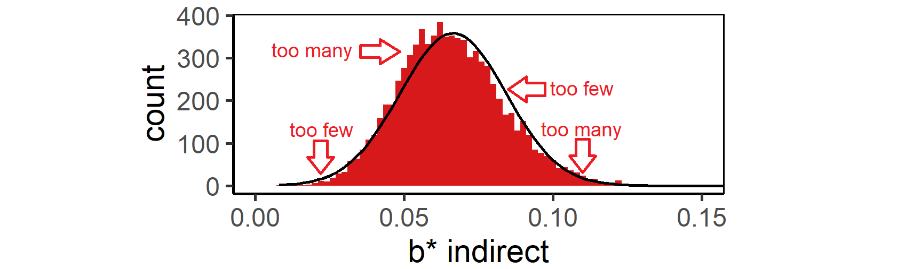
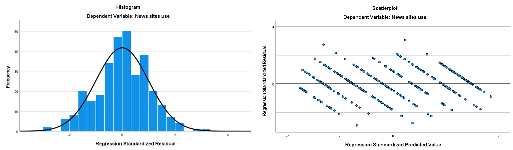
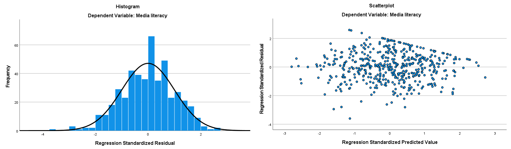
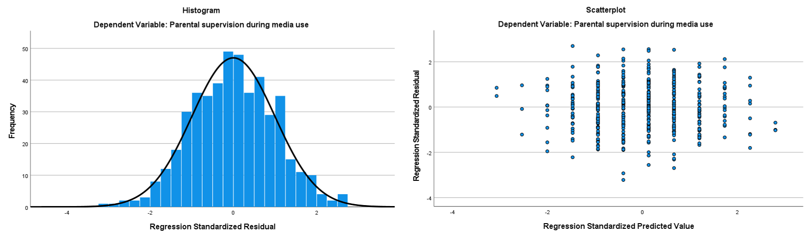

# Mediation with Regression Analysis {#mediation}
> Key concepts: causality, causal and time order, common cause, direct, indirect, and total effects, causal model, path diagram and path model, parallel and serial mediation, partial mediation, covariate, controlling mediator values.

Watch this micro lecture on mediation for an overview of the chapter.

```{r, echo=FALSE, out.width="640px", fig.pos='H', fig.align='center', dev="png", screenshot.opts = list(delay = 5)}
knitr::include_url("https://www.youtube.com/embed/_cKP8d3ROtM", height = "360px")
```

### Summary {-}

```{block2, type='rmdimportant'}
Can I add a causal order to the predictors in my regression models?
```

If we add a causal order among the predictors of our regression model, we obtain a causal model or path model. The causal model includes an indirect effect: The first predictor affects the scores on the second predictor, which affects the scores on the dependent variable that we usually call the outcome variable. For example, age affects news site use, which affects newspaper reading time. In this path model, the second predictor (news site use) mediates the effect of the first predictor on the outcome variable. The second predictor is called a mediator.

We can estimate a path model as a series of regression models. The size of an indirect effect equals the product of the direct effects that constitute the indirect effect. With additional software, we can estimate the confidence interval of an indirect effect. 

The causal order underlying the path model is an assumption that we make. A regression model shows the predictive effects, which do not have to be causal. We cannot prove that the predictive effects are causal. We can only think of arguments that make a causal interpretation of a predictive effect plausible.

## Mediation as Causal Process

```{r mediation-commoncause, fig.pos='H', fig.align='center', fig.cap="How does a common cause affect regression coefficients? The values in this path diagram represent standardized regression coefficients.", echo=FALSE, screenshot.opts = list(delay = 5), dev="png", out.width="775px"}
# Goal: Sensitize students to the concept of a common cause creating a spurious effect and mediation as indirect effect.
# Display causal diagram of age (predictor), political interest (mediator), and newspaper reading time (outcome) including a curved arrow representing the indirect effect of the predictor via the mediator on the outcome (if difficult to program, then just add label: "Indirect efect: 0.24"). If easy to program: relate width of arrows to the effect size (with some minimum width). Add values of partial effect sizes as labels to all direct effects and the indirect effect. Allow the user to change the correlations among the three variables (sliders with range [-.9, .9], initial values random choice in more limited range) and adjust the effect sizes to them.
knitr::include_app("http://82.196.4.233:3838/apps/mediation-commoncause/", height="325px")
# # Initial correlations.
# #correlation between Predictor and mediator.
# r_PM <- round(runif(n = 1, min = -.7, max = .7), digits = 2)
# #correlation between mediator and Outcome.
# r_MO <- round(runif(n = 1, min = -.7, max = .7), digits = 2)
# #correlation between Predictor and Outcome.
# r_PO <- round(runif(n = 1, min = -.7, max = .7), digits = 2)
# # Partial standardized regression coefficients.
# b_PM <- r_PM
# b_PO <- round((r_PO - r_PM*r_MO)/(1 - r_PM^2), digits = 2)
# b_MO <- round((r_MO - r_PM*r_PO)/(1 - r_PM^2), digits = 2)
# b_indirect <- round(b_PM * b_MO, digits = 2)
```

<A name="question9.5.1"></A>
```{block2, type='rmdquestion'}
1. Why is political interest called a mediator in Figure \@ref(fig:mediation-commoncause)? [](#answer9.5.1)
```

<A name="question9.5.2"></A>
```{block2, type='rmdquestion'}
2. In Figure \@ref(fig:mediation-commoncause), what does the long, curved arrow represent? Can you motivate your answer with the values that are linked to the arrows? [](#answer9.5.2)
```

<A name="question9.5.3"></A>
```{block2, type='rmdquestion'}
3. Adjust the correlations in such a way that the effect of age on reading time is fully mediated by political interest. How can we see that the effect is fully mediated? [](#answer9.5.3)
```

### Criteria for a causal relation {#causalcriteria}
Researchers are usually interested in causal effects, so let us theorize a causal order between age and reading newspapers. From previous research and personal experience, we strongly suspect that older people spend more time on reading newspapers than young people. In statistical language, we expect a positive correlation between age and newspaper reading time. Can age be a cause of current newspaper reading?

Correlation is the first criterion. A causal relation implies correlation or another type of statistical association. If newspaper reading is not correlated with age, it is hard to imagine that age affects newspaper reading. But correlation does not imply causation, as the saying goes. Correlated variables do not have to be causally related. We need additional arguments to add plausibility to a causal relation.

The second criterion is the time order between cause and consequence. A cause must appear before the consequence. In our example, a person's age must be fixed before she displays the behaviour that we want to explain, namely reading newspapers. The time order is very plausible here because age stands for the moment a person was born, which must be prior in time to reading newspapers. If there is a causal relation between age and reading newspapers, age must be the cause and newspaper reading the consequence.

A third criterion for causality is that the correlation is not spurious. In Section \@ref(spuriousness), we have encountered a spurious effect as an effect that incorrectly includes the effect of a confounder (reinforcer).

In the context of causality, spuriousness is linked to a confounder that is a _common cause_ to both the assumed cause (predictor) and consequence (dependent variable). Age, for instance, can be a common cause both to having (grand)children and reading newspapers. Older people tend to have more (grand)children and they read more newspapers. If we do not control for age when we regress newspaper reading time on the number of (grand)children a person has, we may find a positive effect.

This effect is probably not causal: We do not spend more time reading newspapers because we have more (grand)children. Unless we use newspaper reading to ignore our children and grandchildren when they are around. Most if not all of the effect of (grand)children on newspaper reading is spurious because it results from a common cause, namely age or the habits and opportunities represented by age.

To interpret an effect that we find as causal, then, we must ensure that there are no confounding variables that are common causes to both our predictors and dependent variable. Including them as controls in the regression model is a way to solve the problem. Unfortunately, we cannot be sure that we have included all common causes in our model. The best we can do is using experimental randomization to minimize the chance of having confounders (Section \@ref(randomization)).

### Mediation as indirect effect {#indirecteffect}

A common cause does not have to remove the entire effect between a predictor and dependent variable. Even if part of newspaper reading is caused by age, another part can be caused by a variable related to age, for example, interest in politics. During their lifetime, people may gain more experience with politics and, for that reason, become more interested in reading about politics. This may cause them to invest more time in reading newspapers for collecting information.

Not all people become more interested in politics as they grow older and their interest in politics does not have to increase regularly during all of their lifetime. The relation between age and interest in politics, therefore, will not be perfect. This allows us to technically distinguish between the effect of age and the effect of interest in politics.

If we include both age and interest in politics as predictors in a regression model for newspaper reading time, the partial effect (Section \@ref(partialeffect)) of interest in politics is corrected for the spurious correlation between interest in politics and newspaper reading caused by age as their common cause. The partial effect of political interest can be interpreted as causal if current interest in politics was attained before the newspaper readings that we measure (very plausible) and age is the only common cause of interest in politics and newspaper reading (highly questionable).

```{r causaldiagram, echo=FALSE, fig.pos='H', fig.align='center', fig.cap="Causal diagram for the effects of age and interest in politics on newspaper reading time.", fig.asp=0.3}
library(ggplot2)
# Create coordinates for the variable names.
variables <- data.frame(x = c(0.3, 0.5, 0.7), 
                        y = c(.1, .3, .1),
                        label = c("Age", "Pol.Interest", "Reading Time"))
ggplot(variables, aes(x, y)) + 
  geom_segment(aes(x = x[1], y = y[1], xend = x[3] - 0.06, yend = y[1]), arrow = arrow(length = unit(0.04, "npc"), type = "closed")) + 
  geom_segment(aes(x = x[1], y = y[1], xend = x[2] - 0.04, yend = y[2] - 0.04), arrow = arrow(length = unit(0.04, "npc"), type = "closed")) + 
  geom_segment(aes(x = x[2], y = y[2], xend = x[3] - 0.04, yend = y[3] + 0.04), arrow = arrow(length = unit(0.04, "npc"), type = "closed")) + 
  geom_label(aes(label=label)) + 
  coord_cartesian(xlim = c(0.2, 0.8), ylim = c(0, 0.4)) +
  theme_void()
# Cleanup.
rm(variables)
```

Now let us draw the _causal diagram_ for this simple example (Figure \@ref(fig:causaldiagram)). A causal diagram contains the names of the variables with arrows pointing from causes to consequences. The causal order of variables is represented from left to right. In Figure \@ref(fig:causaldiagram), the very first cause (age) is at the left, the final consequence (newspaper reading time) is at the right, and interest in politics is placed in the middle. In this layout, the arrows always point to the right.

In the causal order that we theorize, age is causally prior (antecedent) to interest in politics, which is causally prior to current newspaper reading time. We have an _indirect effect_ of age on newspaper reading by way of interest in politics. When adults grow older, they tend to be more interested in politics and because of this, they tend to spend more time on reading newspapers. We say that interest in politics _mediates_ the effect of age on newspaper reading time. Interest in politics is a _mediator_, an _intermediary variable_, or an _intervening variable_ in this causal diagram.

A causal diagram like Figure \@ref(fig:causaldiagram) is also called a _path diagram_. Each indirect effect is a sequence of direct effects. Each direct effect is a "step" from one variable to another variable, represented by an arrow. An indirect effect, then, can be regarded as a _path_ that we can follow to "travel" from one variable to another variable. 

```{r causaldiagram2, echo=FALSE, fig.pos='H', fig.align='center', fig.cap="Causal diagram for the effect of age on newspaper reading time mediated by interest in politics and news site use.", fig.asp=0.3}
library(ggplot2)
# Create coordinates for the variable names.
variables <- data.frame(x = c(0.2, 0.4, 0.6, 0.8), 
                        y = c(.1, .3, .3, .1),
                        label = c("Age", "Pol.Interest", "News Site Use", "Reading Time"))
ggplot(variables, aes(x, y)) + 
  geom_segment(aes(x = x[1], y = y[1], xend = x[4] - 0.07, yend = y[1]), arrow = arrow(length = unit(0.04, "npc"), type = "closed")) + 
  geom_segment(aes(x = x[1], y = y[1], xend = x[2] - 0.04, yend = y[2] - 0.04), arrow = arrow(length = unit(0.04, "npc"), type = "closed")) + 
  geom_segment(aes(x = x[2], y = y[2], xend = x[3] - 0.07, yend = y[3]), arrow = arrow(length = unit(0.04, "npc"), type = "closed")) + 
  geom_segment(aes(x = x[3], y = y[3], xend = x[4] - 0.04, yend = y[4] + 0.04), arrow = arrow(length = unit(0.04, "npc"), type = "closed")) + 
  geom_label(aes(label=label)) + 
  coord_cartesian(xlim = c(0.1, 0.9), ylim = c(0, 0.4)) +
  theme_void()
# Cleanup.
rm(variables)
```

An indirect effect may contain more than one step or mediator. If we include news site use in the model (Figure \@ref(fig:causaldiagram2)), we would have an indirect effect of age via interest in politics via news site use on newspaper reading time.

```{block2, type='rmdimportant'}
*  Mediation: A causal relationship between a predictor, one or more mediators, and an outcome variable.
* Indirect effect: An effect in which three (or more) variables affect each other in a causal order: the predictor affects the mediator, the mediator affects another mediator or the outcome variable.
```

### Causal process

In our example (Figure \@ref(fig:causaldiagram2)), age has a direct effect on newspaper reading time. What does the direct effect mean? If we start thinking about why older people spend more time on reading newspapers, we soon realize that this is probably not some biological process. It is hard to believe that an ageing human body requires more newspaper reading time. The effect is more likely to be social.

In the middle of the 20th century, newspapers were among the most important sources of information. A person who was born and grew up in that period is accustomed to using newspapers as main information source. For later generations, however, news sites on the internet have become important sources of information. Newspapers being less important to them, they are less oriented and accustomed to reading newspapers.

This line of reasoning shows us two things. First, we discover that our common cause may actually represent different things. Age, for instance, refers to life experience in its effect on interest in politics. In contrast, it relates to the period of coming of age in its direct effect on newspaper reading time.

Our second discovery is that we usually look for mediators if we want to understand a direct effect. Date of birth affects exposure to people using newspapers as information sources, which affects the habit of reading newspapers, which finally affects the time spent on reading newspapers later on. Exposure and habit are mediators here. A direct effect of age on newspaper reading represents a causal process that may contain many intermediary steps. Adding mediators to our model is a way of getting more insight in the causal process.

### Answers {-}

<A name="answer9.5.1"></A>
```{block2, type='rmdanswer'}
Answer to Question 1. 

* Political interest is a mediator in this model because it is predicted by age and, in turn, it predicts reading time.
* If we interpret the arrows as causal influence, age is causally prior to political interest, which is causally prior to reading time.
* A mediator is also called an intermediary or intervening variable. [](#question9.5.1)
```
  
<A name="answer9.5.2"></A>
```{block2, type='rmdanswer'}
Answer to Question 2. 

* The curved arrow is the standardized indirect (predictive) effect of age via political interest on reading time.
* It summarizes the assumed causal process that age influences political interest, which influences reading time. For example, older people are more interested in politics and because they are more interested in politics, they spend more time on reading newspapers.
* The standardized indirect effect represents the predicted difference (in standard deviations) of reading time that results from a difference in political interest that results from a difference of one standard deviation in age.
* An indirect effect is equal to the product of the direct effects, just like an indirect correlation is the product of correlations. In the example, the value of the indirect effect is indeed equal (within rounding error) to the product of the effects of age on political interest and political interest on reading time. [](#question9.5.2)
```
  
<A name="answer9.5.3"></A>
```{block2, type='rmdanswer'}
Answer to Question 3. 

* An effect of a predictor on an outcome is fully mediated if the indirect
effect via the mediator is equal to the overall correlation between the
predictor and the outcome. In other words, the correlation only represents the
indirect effect, so there cannot be a direct effect.
* Of course, it makes no sense to say that an effect is fully mediated if
there is no indirect effect (and no direct effect). So we must start with a
non-zero correlation between predictor and outcome.
* As a next step, we must select values for the correlation between predictor
(age) and mediator (political interest) and for the correlation between
mediator and outcome (reading time) such that their product (the indirect
correlation) is equal to the correlation between age and reading time. Use,
for instance, 0.3 for the correlation between age and reading time, 0.5 for the
correlation between age and political interest, and 0.6 for the correlation
between political interest and reading time. Note that 0.5 * 0.6 = 0.3. [](#question9.5.3)
```
  
## Path Model with Regression Analysis

Mediation or, more generally, path models can be estimated with a series of regression models. Every variable in the path diagram with at least one predictor (or incoming arrow) is a dependent variable, so for each of them, we estimate a regression model. The regression model contains all variables as predictors that may cause changes in the dependent variable. In other words, all variables that are causally prior to the outcome are used as predictors. In a well-designed causal diagram, all variables to the left of the outcome are causally prior to it.

```{r mediation-regression, echo=FALSE, fig.pos='H', fig.align='center', out.width="640px", fig.cap="Path diagram with unstandardized effect sizes and their 95% confidence intervals.", screenshot.alt = "figures/mediation-regression.png"}
# Goal: Exemplify the different regression models required to estimate the direct effects in a path model.
# Image of path model with age, education level (in years), political interest, news site use, and (current) newspaper reading time. Distinguish between hypothesized direct effects and non-hypothesized direct effects. Display the unstandardized regression coefficients with their 95% confidence intervals for the direct effects of all variables that are causally prior to the selected dependent variable.
# Basic colours and layout.
source("../apps/plottheme/styling.R")
# Create effect sizes.
readers <- haven::read_spss("data/readers.sav")
model_1 <- lm(education ~ age, data = readers)
model_2 <- lm(polinterest ~ age + education, data = readers)
model_3 <- lm(newssite ~ age + education + polinterest, data = readers)
model_4 <- lm(readingtime ~ age + education + polinterest + newssite, data = readers)
# Create network
library(visNetwork)
nodes <- data.frame(
  id = 1:5, x = c(0, 100, 550, 750, 1000),
  y = c(500, 0, 0, 500, 250),
  label = c("Age (/10)", "Education", "Pol. Interest", "News Site Use", "Newspaper \n Reading Time"), 
  shape = "box", font.size = 42, shadow = "FALSE", physics = FALSE, borderWidth = 1, color = list(background = "white", border = "black") )
edges <- data.frame(from = c(1, seq(1, 2), seq(1, 3), seq(1, 4)), 
                    to = c(2, rep(3, 2), rep(4,3), rep(5,4)),
                    width = c(rep(4, 4), 1, rep(4, 2), 1, rep(4, 2)),
                    font.color = c(brewercolors[[1]], rep(brewercolors[[5]],2), brewercolors[[1]], rep(brewercolors[[5]],5), brewercolors[[1]]),
                    color.highlight = rep(brewercolors[[5]]),
                    shadow = c(rep(TRUE, 4), FALSE, rep(TRUE, 2), FALSE, rep(TRUE, 2)),
                    label = c(
  paste0(round(model_1$coefficients[2], digits = 2), " \n [",
         round(confint(model_1)[2,1], digits = 2), "; ",
         round(confint(model_1)[2,2], digits = 2), "]"),
  paste0(round(model_2$coefficients[2], digits = 2), " \n [",
         round(confint(model_2)[2,1], digits = 2), "; ",
         round(confint(model_2)[2,2], digits = 2), "]"),
  paste0(round(model_2$coefficients[3], digits = 2), " \n [",
         round(confint(model_2)[3,1], digits = 2), "; ",
         round(confint(model_2)[3,2], digits = 2), "]"),
  paste0(round(model_3$coefficients[2], digits = 2), " \n [",
         round(confint(model_3)[2,1], digits = 2), "; ",
         round(confint(model_3)[2,2], digits = 2), "]"),
  paste0(round(model_3$coefficients[3], digits = 2), " \n [",
         round(confint(model_3)[3,1], digits = 2), "; ",
         round(confint(model_3)[3,2], digits = 2), "]"),
  paste0(round(model_3$coefficients[4], digits = 2), " \n [",
         round(confint(model_3)[4,1], digits = 2), "; ",
         round(confint(model_3)[4,2], digits = 2), "]"),
  paste0(round(model_4$coefficients[2], digits = 2), " \n [",
         round(confint(model_4)[2,1], digits = 2), "; ",
         round(confint(model_4)[2,2], digits = 2), "]"),
  paste0(round(model_4$coefficients[3], digits = 2), " \n [",
         round(confint(model_4)[3,1], digits = 2), "; ",
         round(confint(model_4)[3,2], digits = 2), "]"),
  paste0(round(model_4$coefficients[4], digits = 2), " \n [",
         round(confint(model_4)[4,1], digits = 2), "; ",
         round(confint(model_4)[4,2], digits = 2), "]"),
  paste0(round(model_4$coefficients[5], digits = 2), " \n [",
         round(confint(model_4)[5,1], digits = 2), "; ",
         round(confint(model_4)[5,2], digits = 2), "]")
                    ))
# Display network.
visNetwork(nodes, edges, width = "100%") %>% 
  visEdges(arrows = "to", font = list(size = 30)) %>% 
  visOptions(highlightNearest = list(enabled = TRUE, algorithm = "hierarchical", 
   degree = list(from = 1, to = 0))) %>%
  visInteraction(dragNodes = TRUE, multiselect = TRUE)
```

<A name="question9.6.1"></A>
```{block2, type='rmdquestion'}
1. In the causal diagram depicted in Figure \@ref(fig:mediation-regression), click on a variable name to highlight the effects in a regression analysis with this variable as the outcome. How many regression analyses does the causal diagram include and what do the results mean? [](#answer9.6.1)
```

<A name="question9.6.2"></A>
```{block2, type='rmdquestion'}
2. The fat arrows were hypothesized whereas the thin ones were not. Why are the thin ones included in the regression analyses (they have coefficient estimates too)? [](#answer9.6.2)
```

In the path diagram displayed in Figure \@ref(fig:mediation-regression), we would regress newspaper reading time, the final dependent variable, on all other variables. As a next step, we would predict news site use as outcome from all variables except reading time. 

Note that we include education level as predictor of news site use and newspaper reading even if we did not draw a direct arrow. Education level is theorized to be causally prior to news use site, so it can have a direct effect. We hypothesized that it did not have a direct effect on news site use and reading time, so we omitted arrows in our hypothesized model. We must include education as a predictor to check that it does not have these direct effects.

A third regression model would predict political interest from education level and age. The final regression model predicts education level from age .

### Requirements
We can estimate mediation and path models with regression analysis if we meet the following requirements:

1. Each variable used as a dependent variable is numeric. This is a general requirement of a linear regression model. In a path diagram, it means that all mediators and dependent variables must be numeric.

    For detail lovers: Variables with only incoming arrows may be dichotomous but that requires logistic regression, which we do not discuss.

2. Each variable used as a predictor must be a numeric or dichotomous (dummy) variable. Again, this is a general requirement of regression models.

3. There are no causal feedback loops. Causality must work in one direction. It must be impossible to travel from a variable back to it while following the direction of the arrows. Note that it can be difficult to assign a causal order. For example, does political interest cause (low) political cynicism or the other way around? Or are they not causally related at all?

4. All regression models meet the assumptions for regression analysis. Check if the residuals are normally distributed, centered around zero for all levels of the predicted outcome scores, and that scores are predicted equally well at all outcome levels (see Section \@ref(regr-inference)).

### Size of indirect effects {#size-indirect-effects}

The regression results tell us the sizes and statistical significance of all direct effects on the dependent variable. Both unstandardized and standardized regression coefficients can be used to interpret effects in the usual way. But how do we obtain the size, confidence interval, and statistical significance of indirect effects?

The size of an indirect effect is calculated in exactly the same way as the size of indirect correlations (Section \@ref(indirectcorrelation)): Just multiply the size of direct effects. This can be done with either the standardized regression coefficients or the unstandardized regression coefficients.

```{r pathdiagram-unstandardized, echo=FALSE, fig.pos='H', fig.align='center', out.width="640px", fig.cap="Path diagram with unstandardized effect sizes and their 95% confidence intervals.", screenshot.alt = "figures/pathdiagram-unstandardized.png"}
# Causal model/path diagram with unstandardized effect sizes (and 95% confidence intervals). All effects.
# Display network.
visNetwork(nodes, edges, width = "100%") %>% 
  visEdges(arrows = "to", font = list(size = 30)) %>% 
  visInteraction(dragNodes = TRUE)
rm(nodes, edges)
``` 

<A name="question9.6.3"></A>
```{block2, type='rmdquestion'}
3. Calculate the size of each indirect effect of age on news site use in Figure \@ref(fig:pathdiagram-unstandardized). [](#answer9.6.3)
```

It may sound weird that we can multiply the unstandardized regression coefficients but it really works. In Figure \@ref(fig:pathdiagram-unstandardized), for instance, the unstandardized partial effect of age (measured in tens of years) on interest in politics is `r round(model_2$coefficients[2], digits=2)`. This means that an additional 10 years of life predict an average increase in interest in politics of `r round(model_2$coefficients[2], digits=2)`. 

In its turn, interest in politics has an unstandardized effect of `r round(model_4$coefficients[4], digits=2)` on reading time (in minutes). An additional unit of interest in politics predicts an average increase in reading time of `r round(model_4$coefficients[4], digits=2)` minutes.

Ten additional years of life only predict an increase of `r round(model_2$coefficients[2], digits=2)` in political interest, not a full unit increase. The predicted increase of `r round(model_2$coefficients[2], digits=2)` in political interest predicts `r round(model_2$coefficients[2], digits=2)` * `r round(model_4$coefficients[4], digits=2)` = `r round(model_2$coefficients[2] * model_4$coefficients[4], digits=2)` minutes of additional newspaper reading time.  As a result, an additional ten years of life predict `r round(model_2$coefficients[2], digits=2)` * `r round(model_4$coefficients[4], digits=2)` = `r round(model_2$coefficients[2] * model_4$coefficients[4], digits=2)` minutes of additional newspaper reading time as an indirect effect via political interest. 

Note that the indirect effect is interpreted in terms of the measurement units of the initial predictor (age in tens of years) and the final outcome (reading time in minutes): A difference in (tens of) years predicts a difference in reading time in minutes. As a consequence, we can directly compare unstandardized indirect effect sizes of different paths between the same predictor and outcome, as we will see in Section \@ref(partialfullmediation).

### Direction of indirect effects

Multiplication of direct effects assigns the right direction (positive or negative) to indirect effects. In the example above, age has a positive effect on interest in politics, which has a positive effect on newspaper reading time. If age goes up, interest in politics goes up and if interest in politics goes up, reading time increases. Thus, higher age is indirectly associated with more reading time through interest in politics: Plus times plus yields a plus.

If people with more interest in politics use news sites more frequently, there is a positive regression effect. If more news site use is associated with less newspaper reading (a negative effect), the indirect effect of interest in politics on reading time via news site use is negative. People with more interest in politics spend less time on reading newspapers because they use news sites more: Positive times negative yields a negative.

### Parallel and serial mediation {#partialserialmediation}

If each indirect effect in a path model contains at most one mediator, we have _single mediation_ or _parallel mediation_. Figure \@ref(fig:mediationparallel) illustrates single and parallel mediation. 

```{r mediationparallel, echo=FALSE, fig.pos='H', fig.align='center', fig.cap="Causal diagrams for single (left) and parallel mediation (right).", fig.asp=0.6, fig.show="hold", out.width="50%"}
library(ggplot2)
# Single mediation.
# Create coordinates for the variable names.
variables <- data.frame(x = c(0.3, 0.5, 0.7), 
                        y = c(.2, .6, .2),
                        label = c("Age", "Pol.Interest", "Reading Time"))
ggplot(variables, aes(x, y)) + 
  geom_segment(aes(x = x[1], y = y[1], xend = x[3] - 0.09, yend = y[1]), arrow = arrow(length = unit(0.04, "npc"), type = "closed")) + 
  geom_segment(aes(x = x[1], y = y[1], xend = x[2] - 0.04, yend = y[2] - 0.04), arrow = arrow(length = unit(0.04, "npc"), type = "closed")) + 
  geom_segment(aes(x = x[2], y = y[2], xend = x[3] - 0.04, yend = y[3] + 0.04), arrow = arrow(length = unit(0.04, "npc"), type = "closed")) + 
  geom_label(aes(label=label), size = 7) + 
  coord_cartesian(xlim = c(0.2, 0.8), ylim = c(0, 0.8)) +
  theme_void()
# Parallel mediation.
# Create coordinates for the variable names.
variables <- data.frame(x = c(0.3, 0.5, 0.7, 0.5), 
                        y = c(.4, .6, .4, .2),
                        label = c("Age", "Pol.Interest", "Reading Time", "News Site Use"))
ggplot(variables, aes(x, y)) + 
  geom_segment(aes(x = x[1], y = y[1], xend = x[3] - 0.09, yend = y[1]), arrow = arrow(length = unit(0.04, "npc"), type = "closed")) + 
  geom_segment(aes(x = x[1], y = y[1], xend = x[2] - 0.07, yend = y[2] - 0.01), arrow = arrow(length = unit(0.04, "npc"), type = "closed")) +
  geom_segment(aes(x = x[1], y = y[1], xend = x[4] - 0.09, yend = y[4] + 0.01), arrow = arrow(length = unit(0.04, "npc"), type = "closed")) +
  geom_segment(aes(x = x[2], y = y[2], xend = x[3] - 0.09, yend = y[3] + 0.03), arrow = arrow(length = unit(0.04, "npc"), type = "closed")) +
  geom_segment(aes(x = x[4], y = y[4], xend = x[3] - 0.09, yend = y[3] - 0.03), arrow = arrow(length = unit(0.04, "npc"), type = "closed")) +
  geom_label(aes(label=label), size = 7) + 
  coord_cartesian(xlim = c(0.2, 0.8), ylim = c(0, 0.8)) +
  theme_void()
# Cleanup.
rm(variables)
```

If at least one of the indirect effects in a path model contains two or more mediators, we are dealing with _serial mediation_. Figure \@ref(fig:mediationserial) illustrates serial mediation. It contains an indirect effect from age on reading time with two mediators: Age > Political Interest > News Site Use > Reading Time. The distinction between parallel and serial mediation is relevant to the software (PROCESS) that we will use to estimate indirect and total effects (Section \@ref(SPSSPROCESS)).

```{r mediationserial, echo=FALSE, fig.pos='H', fig.align='center', fig.cap="Causal diagram for serial mediation.", fig.asp=0.3}
library(ggplot2)
# Create coordinates for the variable names.
variables <- data.frame(x = c(0.3, 0.45, 0.7, 0.55), 
                        y = c(.2, .3, .2, .1),
                        label = c("Age", "Pol.Interest", "Reading Time", "News Site Use"))
ggplot(variables, aes(x, y)) + 
  geom_segment(aes(x = x[1], y = y[1], xend = x[3] - 0.06, yend = y[1]), arrow = arrow(length = unit(0.04, "npc"), type = "closed")) + 
  geom_segment(aes(x = x[1], y = y[1], xend = x[2] - 0.05, yend = y[2] - 0.01), arrow = arrow(length = unit(0.04, "npc"), type = "closed")) +   geom_segment(aes(x = x[1], y = y[1], xend = x[4] - 0.06, yend = y[4] + 0.01), arrow = arrow(length = unit(0.04, "npc"), type = "closed")) +
  geom_segment(aes(x = x[2], y = y[2], xend = x[3] - 0.06, yend = y[3] + 0.03), arrow = arrow(length = unit(0.04, "npc"), type = "closed")) +
  geom_segment(aes(x = x[2], y = y[2], xend = x[4] - 0.02, yend = y[4] + 0.04), arrow = arrow(length = unit(0.04, "npc"), type = "closed")) +
  geom_segment(aes(x = x[4], y = y[4], xend = x[3] - 0.06, yend = y[3] - 0.03), arrow = arrow(length = unit(0.04, "npc"), type = "closed")) +
  geom_label(aes(label=label)) + 
  coord_cartesian(xlim = c(0.2, 0.8), ylim = c(0, 0.4)) +
  theme_void()
# Cleanup.
rm(variables)
```

### Partial and full mediation {#partialfullmediation}

```{r age-indirect, echo=FALSE}
# Table with all effects of age on newspaper reading time.
results <- rbind( 
  c("1", "Age -> Reading Time", "", "", "", "", "", "", "", ""), 
  c("", round(model_4$coefficients[2], digits=2), "", "", "", "", "", "", "=", round(model_4$coefficients[2], digits=2)), 
  c("2", "Age -> Education", "", "Education -> Reading Time", "", "", "", "", "", ""), 
  c("", round(model_1$coefficients[2], digits=2), "x", round(model_4$coefficients[3], digits=2), "", "", "", "", "=", round(model_1$coefficients[2]*model_4$coefficients[3], digits=3)),
  c("3", "Age -> Education", "", "Education -> Pol. Interest", "", "Pol. Interest -> Reading Time", "", "", "", ""), 
  c("", round(model_1$coefficients[2], digits=2), "x", round(model_2$coefficients[3], digits=2), "x", round(model_4$coefficients[4], digits=2), "", "", "=", round(model_1$coefficients[2]*model_2$coefficients[3]*model_4$coefficients[4], digits=2)),
  c("4", "Age -> Education", "", "Education -> Pol. Interest", "", "Pol. Interest -> News Sites", "", "News Sites -> Reading Time", "", ""), 
  c("", round(model_1$coefficients[2], digits=2), "x", round(model_2$coefficients[3], digits=2), "x", round(model_3$coefficients[4], digits=2), "x", round(model_4$coefficients[5], digits=2), "=", round(model_1$coefficients[2]*model_2$coefficients[3]*model_3$coefficients[4]*model_4$coefficients[5], digits=2)),
  c("5", "Age -> Education", "", "Education -> News Sites", "", "News Sites -> Reading Time", "", "", "", ""), 
  c("", round(model_1$coefficients[2], digits=2), "x", round(model_3$coefficients[3], digits=2), "x", round(model_4$coefficients[5], digits=2), "", "", "=", round(model_1$coefficients[2]*model_3$coefficients[3]*model_4$coefficients[5], digits=2)),
  c("6", "Age -> Pol. Interest", "", "Pol. Interest -> Reading Time", "", "", "", "", "", ""), 
  c("", round(model_2$coefficients[2], digits=2), "x", round(model_4$coefficients[4], digits=2), "", "", "", "", "=", round(model_2$coefficients[2]*model_4$coefficients[4], digits=2)),
  c("7", "Age -> Pol. Interest", "", "Pol. Interest -> News SItes", "", "News Sites -> Reading Time", "", "", "", ""), 
  c("", round(model_2$coefficients[2], digits=2), "x", round(model_3$coefficients[4], digits=2), "x", round(model_4$coefficients[5], digits=2), "", "", "=", round(model_2$coefficients[2]*model_3$coefficients[4]*model_4$coefficients[5], digits=2)),
  c("8", "Age -> News Sites", "", "News Sites -> Reading Time", "", "", "", "", "", ""), 
  c("", round(model_3$coefficients[2], digits=2), "x", round(model_4$coefficients[5], digits=2), "", "", "", "", "=", round(model_3$coefficients[2]*model_4$coefficients[5], digits=2)),
  c("", "Total Effect", "", "", "", "", "", "", "=", round(model_4$coefficients[2] + model_1$coefficients[2]*model_4$coefficients[3] + model_1$coefficients[2]*model_2$coefficients[3]*model_4$coefficients[4] + model_1$coefficients[2]*model_2$coefficients[3]*model_3$coefficients[4]*model_4$coefficients[5] + model_1$coefficients[2]*model_3$coefficients[3]*model_4$coefficients[5] + model_2$coefficients[2]*model_4$coefficients[4] + model_2$coefficients[2]*model_3$coefficients[4]*model_4$coefficients[5] + model_3$coefficients[2]*model_4$coefficients[5], digits=2))
  )
knitr::kable(results, booktabs = TRUE,
             caption = "All unstandardized direct and indirect effects of age on newspaper reading time in Figure \\@ref(fig:pathdiagram-unstandardized).", col.names = c("", "Effect","", "Effect","", "Effect","", "Effect","", "Total size"), align = c("l", "c", "c", "c", "c", "c", "c", "c", "r")) %>%
  kable_styling(font_size = 12, full_width = F,
                latex_options = c("scale_down", "HOLD_position"))
```

Table \@ref(tab:age-indirect) lists all direct and indirect effects of age on newspaper reading time in Figure \@ref(fig:pathdiagram-unstandardized). We can trace eight different paths from age to newspaper reading time. For each path, we multiply the unstandardized effect sizes to obtain the size of the indirect effect. 

The unstandardized direct effect and indirect effects between a predictor and outcome can be compared directly because they are all expressed in the same measurement units, namely the predicted change in the dependent variable (reading time in minutes) for a difference of one unit in the predictor (ten additional years of life) (Section \@ref(size-indirect-effects)). Because of this, we can sum the unstandardized direct and indirect effects to obtain the total unstandardized effect.

With this in mind, we see that the relation between age and newspaper reading time is dominated by the positive direct effect (_b_ = `r round(model_4$coefficients[2], digits=2)`) and the positive indirect effect via news site use (_b_ = `r round(model_3$coefficients[2]*model_4$coefficients[5], digits=2)`). The remaining indirect effects are relatively small as indirect effects usually are. 

Summing all effects, we obtain a _total effect_ of age on newspaper reading time around `r round(model_4$coefficients[2] + model_1$coefficients[2]*model_4$coefficients[3] + model_1$coefficients[2]*model_2$coefficients[3]*model_4$coefficients[4] + model_1$coefficients[2]*model_2$coefficients[3]*model_3$coefficients[4]*model_4$coefficients[5] + model_1$coefficients[2]*model_3$coefficients[3]*model_4$coefficients[5] + model_2$coefficients[2]*model_4$coefficients[4] + model_2$coefficients[2]*model_3$coefficients[4]*model_4$coefficients[5] + model_3$coefficients[2]*model_4$coefficients[5], digits=0)` (_b_ = `r round(model_4$coefficients[2] + model_1$coefficients[2]*model_4$coefficients[3] + model_1$coefficients[2]*model_2$coefficients[3]*model_4$coefficients[4] + model_1$coefficients[2]*model_2$coefficients[3]*model_3$coefficients[4]*model_4$coefficients[5] + model_1$coefficients[2]*model_3$coefficients[3]*model_4$coefficients[5] + model_2$coefficients[2]*model_4$coefficients[4] + model_2$coefficients[2]*model_3$coefficients[4]*model_4$coefficients[5] + model_3$coefficients[2]*model_4$coefficients[5], digits=2)`). A person who is ten years older but in other respects the same as another person, is predicted to spend on average `r round(model_4$coefficients[2] + model_1$coefficients[2]*model_4$coefficients[3] + model_1$coefficients[2]*model_2$coefficients[3]*model_4$coefficients[4] + model_1$coefficients[2]*model_2$coefficients[3]*model_3$coefficients[4]*model_4$coefficients[5] + model_1$coefficients[2]*model_3$coefficients[3]*model_4$coefficients[5] + model_2$coefficients[2]*model_4$coefficients[4] + model_2$coefficients[2]*model_3$coefficients[4]*model_4$coefficients[5] + model_3$coefficients[2]*model_4$coefficients[5], digits=0)` additional minutes on reading newspapers per day. 

If the direct effect of a predictor on the outcome is zero in a model with mediators, the predictor's effect is _fully mediated_. This clearly is not the case in our example: There still is a substantial direct effect of age on newspaper reading time. This is what we usually encounter; it is called _partial mediation_.

Sometimes, researchers decide that an effect is fully mediated if the direct effect is no longer statistically significant once a mediator is added to the model. This strategy is contestable because a statistically non-significant direct effect does not mean that the effect is absent (zero) in the population. It can be absent but it is much more likely to be present but just too small to be picked up by our significance test (see Chapter \@ref(crit-discus)).

The distinction between full and partial mediation is a little bit problematic. From a substantive point of view, we may argue that direct effects are probably always mediated. As we have seen in Section \@ref(indirecteffect), a direct effect usually summarizes a causal process that consists of intermediary steps, which is mediation. We may wonder whether it makes theoretical sense to talk about unmediated effects. Do we really believe that age can directly affect newspaper reading time?

If the variables that we entered in the model as mediators do not create any indirect effects, the direct effect is equal to the total effect. We may conclude that the direct effect is not mediated by the mediators that are included in the model. For example, if education, political interest, and news site use do not create indirect effects from age on newspaper reading time (Figure \@ref(fig:pathdiagram-unstandardized)), we only have the direct effect of age on reading time in our model. However, this effect is very likely to be mediated by other variables that we did not include in the model. We should not conclude that the effect is unmediated because we have not found mediation yet.

### Significance of indirect effects

```{r mediation-inference, fig.pos='H', fig.align='center', fig.cap="Does the sampling distribution of an indirect effect resemble the sampling distributions of its direct effects?", echo=FALSE, out.width="775px", screenshot.opts = list(delay = 5), dev="png"}
# Goal: Understand that each sample yields a size of the indirect effect, that
# is added to the sampling distribution. Compare this sampling distribution with
# the sampling distributions of the direct effects, to show that the sampling
# distribution of the indirect effect is skewed.
# Sample and display correlations between Age (predictor), Pol.Interest
# (mediator), and Reading Time (outcome) as in app mediation-commoncause but
# sample the correlations from a normal distribution rnorm(mean = 0.5, sd =
# 0.05) for Age->Pol.Interest, rnorm(mean = 0.2, sd = 0.05) for
# Age->ReadingTime, and rnorm(mean = 0.4, sd = 0.05) for
# Pol.Interest->ReadingTime.
# Display standardized regression coefficients for Age->Pol.Interest in blue,
# for Pol.Interest->ReadingTime in green, and for the indirect effect in black.
# In a second row, add three histograms with counts for values of the
# standardized regression coefficients for the direct effect of
# Age->Pol.Interest (blue bars), Pol.Interest->ReadingTime (green bars), and the
# indirect effect (gray bars).
# Add buttons to draw 1 sample, 1,000 samples (if used, superimpose normal curve
# over each histogram), and to reset.
knitr::include_app("http://82.196.4.233:3838/apps/mediation-inference/", height="375px")
```

<A name="question9.6.4"></A>
```{block2, type='rmdquestion'}
4. How is the sampling distribution of indirect effect size created? Before, simultaneously, or after the sampling distributions of direct effect sizes are created? Check your answer using the __Draw a single sample__ button in Figure \@ref(fig:mediation-inference) repeatedly. [](#answer9.6.4)
```

<A name="question9.6.5"></A>
```{block2, type='rmdquestion'}
5. Take a few thousand samples. Do all three sampling distributions have the same shape? [](#answer9.6.5)
```

SPSS does not calculate the size of indirect effects for us or their confidence intervals and _p_ values. It is easy to calculate the sizes of indirect effects, as we have seen in a preceding section: just take the product of direct effects. In contrast, it is not possible to calculate the confidence interval or _p_ value of an indirect effect in a reliable way from the confidence intervals or _p_ values of the direct effects [see @RefWorks:3873: Section 4.4 for a detailed and critical discussion of approaches that try to calculate the _p_ value of an indirect effect from _p_ values of direct effects].

For statistical inference on the indirect effect, we need the sampling distribution of the size of the indirect effect. This sampling distribution is not the same as the product or some other combination of the sampling distributions of the direct effects that make up the indirect effect. The situation is similar to the sampling distribution of the difference between two sample means (independent-samples _t_ test), which is not equal to the difference between the sampling distribution of one mean and the sampling distribution of the other mean (Section \@ref(complicatedsampling)). 

We use bootstrapping to create the sampling distribution of the size of an indirect effect. We have learned the principles and limitations of bootstrapping in Section \@ref(boot-approx), so we do not have to go into details here. Suffice it to repeat that our original sample must not be too small and it must be quite representative of the population if we apply bootstrapping.

```{r indirect-sim, echo=FALSE}
# Example of bootstrapped CI and p value for the indirect effects of age via political interest and/or news site use on reading time, similar to output from PROCESS (Model 6 with 2 mediators).
results <- rbind(
  c("Total indirect effect", "1.47", ".42", ".62", "2.25"),
  c("Age - Pol. Interest - Reading Time", ".05", ".03", ".01", ".14"),
  c("Age - Pol. Interest - News Site Use - Reading Time", "-.02", ".01", "-.05", ".00"), 
  c("Age - News Site Use - Reading Time", "1.44", ".42", ".60", "2.23")
)

knitr::kable(results, booktabs = TRUE,
             caption = "Bootstrap results for unstandardized indirect effects in a model with two mediators. Effect size, standard error, lower and upper levels of the 95\\% confidence interval.", col.names = c("", "Effect", "Boot SE", "BootLLCI", "BootULCI"), align = c("l", "r", "r", "r", "r"))  %>%
  kable_styling(font_size = 12, full_width = F,
                latex_options = c("scale_down", "HOLD_position"))

 # Cleanup.
rm(results)
```
 
The confidence interval of an indirect effect can be calculated from its bootstrapped sampling distribution. Table \@ref(tab:indirect-sim) shows bootstrap results for the indirect effects in a model with age as predictor, newspaper reading time as dependent variable, and interest in politics and news site use as mediators. 

In total, there is a substantial indirect effect of age on newspaper reading time in this model. We are confident that this effect is positive [_b_ = 1.47, 95% CI [0.62, 2.25] (bootstrapped)]. It is easy to see that the indirect effect of age via news site use on reading time is by far the most important indirect effect [_b_ = 1.44, 95% CI [0.60, 2.23] (bootstrapped)]. On its own, it is responsible for almost the entire total indirect effect.

It may happen that an indirect effect is not statistically significant (the confidence interval includes zero) whereas all direct effects that constitute the indirect effect are statistically significant. In Figure \@ref(fig:causaldiagram3), for example, both the effect of age on political interest (_b_ = 0.30, 95% CI [0.22, 0.38]) and the effect of political interest on reading time (_b_ = 0.20, 95% CI [0.12, 0.28]) are statistically significant at the .05 level. The indirect effect of age via political interest on reading time, however, is not statistically significant at this level [_b_ = 0.30 * 0.20 = 0.06, 95% CI [-0.02, 0.14], (bootstrapped)]. 

```{r causaldiagram3, echo=FALSE, fig.pos='H', fig.align='center', fig.cap="Causal diagram for the effects of age and interest in politics on newspaper reading time: unstandardized estimates with 95% confidence intervals.", fig.asp=0.3}
library(ggplot2)
# Create coordinates for the variable names.
variables <- data.frame(x = c(0.3, 0.5, 0.7), 
                        y = c(.1, .3, .1),
                        label = c("Age", "Pol.Interest", "Reading Time"))
ggplot(variables, aes(x, y)) + 
  geom_segment(aes(x = x[1], y = y[1], xend = x[3] - 0.06, yend = y[1]), arrow = arrow(length = unit(0.04, "npc"), type = "closed")) + 
  geom_segment(aes(x = x[1], y = y[1], xend = x[2] - 0.04, yend = y[2] - 0.04), arrow = arrow(length = unit(0.04, "npc"), type = "closed")) + 
  geom_segment(aes(x = x[2], y = y[2], xend = x[3] - 0.04, yend = y[3] + 0.04), arrow = arrow(length = unit(0.04, "npc"), type = "closed")) + 
  geom_label(aes(label=label)) + 
  geom_text(x = c(0.35, 0.5, 0.65), y = c(.26, .07, .26), label = c(expression(paste(italic("b\n"), " = 0.30,\n95% CI [0.22, 0.38]")), expression(paste("Indirect: ", italic("b"), " = 0.06, 95% CI [-0.02, 0.14]")), expression(paste(italic("b\n"), " = 0.20,\n95% CI [0.12, 0.28]")))) +
  coord_cartesian(xlim = c(0.2, 0.8), ylim = c(0, 0.4)) +
  theme_void()
# Cleanup.
rm(variables)
```

This sounds like a paradox but it should not upset you. The unstandardized indirect effect tends to be weaker than the direct effects, that is, closer to zero (for instance, see Table \@ref(tab:age-indirect)). With a weaker effect, it is more difficult to reject the null hypothesis that the effect is zero in the population. We need a larger sample to reject null hypotheses for smaller effects (see Chapter \@ref(power) on power). In this case, report that all direct effects that create the indirect effect are statistically significant, so non-significance is likely to arise from low test power rather than from absence of an indirect effect in the population. 

### Answers {-}

<A name="answer9.6.1"></A>
```{block2, type='rmdanswer'}
Answer to Question 1. 

* There are four variables with incoming arrows in this model. Each of them can be a dependent variable in a regression model, so we can estimate four regression models.
* The unstandardized and standardized regression coefficients tell us the (unstandardized or standardized) sizes of the direct effects in the path model.
* For example, news site use has an unstandardized effect of -1.55 on newspaper reading time in the diagram. A difference of one unit of news site use predicts a decrease in newspaper reading time of 1.55 units. We are 95 per cent confident that this decrease is in between 0.6 and 2.5 units in the population. [](#question9.6.1)
```
  
<A name="answer9.6.2"></A>
```{block2, type='rmdanswer'}
Answer to Question 2. 

* If we do not include effects between variables that were not hypothesized in our regression model, we actually assume that the effects are zero.
* If this assumption is not correct, the results for hypothesized effects are wrong.
* If we exclude the effect of a predictor on an outcome from the model, we deny this predictor the opportunity to be a common cause to the outcome and another predictor. Thus, we fail to signal and filter out the spurious correlation due to this common cause.
* For these reasons, it is better to include all variables that are causally prior to the dependent variable as predictors. [](#question9.6.2)
```
  
<A name="answer9.6.3"></A>
```{block2, type='rmdanswer'}
Answer to Question 3. 

* Calculate the size of a indirect effect by multiplying the regression coefficients of all direct effects that make up the indirect effect.
* Indirect effects:

> Age > Education > Pol. Interest > News Site Use: -0.13 * 0.28 * 0.12 = -0.004
> Age > Education > News Site Use: -0.13 * 0.06 = -0.008
> Age > Pol. Interest > News Site Use: 0.14 * 0.12 = 0.017

* All indirects effects are close to zero. An additional 10 years (age is measured in decades) predicts a small decrease in news site use via education (-0.008) and via education via political interest (-0.004). It predicts a small increase via political interest (0.017).
* Be sure not to forget one of the indirect effects! [](#question9.6.3)
```
  
<A name="answer9.6.4"></A>
```{block2, type='rmdanswer'}
Answer to Question 4. 

* For every sample, the indirect effect size is calculated as the product of
the effects of the predictor (age) on the mediator (political interest) and of
the mediator on the outcome (Reading time). The indirect effect is added to
the sampling distribution.
* So the sampling distribution of indirect effect size is created simultaneously with the sampling distributions of direct effect sizes. It is __not__ calculated from the sampling distributions of the direct effect sizes. [](#question9.6.4)
```
  
<A name="answer9.6.5"></A>
```{block2, type='rmdanswer'}
Answer to Question 5. 



* If you look carefully, you will see that the sampling distribution of the
regression coefficient of the indirect effect is skewed, asymmetrical. The
left tail is badly populated and the top is to the left of the top of
the normal curve.
* This is not a normal or _t_ distribution like the sampling distribution of direct effect size. [](#question9.6.5)
```
  
## Controlling for Covariates {#mediationcovariate}

We usually have theoretical reasons to expect that a variable mediates an effect, for example, that political interest mediates the effect of age on newspaper reading time. At the same time, we know that our dependent variable and perhaps our mediator may depend on other variables. Newspaper reading time, for instance, may also depend on education. In this situation, we would use the other variables as covariates (or control variables) for which we want to control statistically.

```{r causaldiagram4, echo=FALSE, fig.pos='H', fig.align='center', fig.cap="Causal diagram for  interest in politics as mediator between age and newspaper reading time with education as covariate.", fig.asp=0.3}
library(ggplot2)
# Create coordinates for the variable names.
variables <- data.frame(x = c(0.3, 0.5, 0.7, 0.3), 
                        y = c(.1, .3, .1, .3),
                        label = c("Age", "Pol.Interest", "Reading Time", "Education"))
ggplot(variables, aes(x, y)) + 
  geom_segment(aes(x = x[1], y = y[1], xend = x[3] - 0.06, yend = y[1]), arrow = arrow(length = unit(0.04, "npc"), type = "closed")) + 
  geom_segment(aes(x = x[1], y = y[1], xend = x[2] - 0.04, yend = y[2] - 0.04), arrow = arrow(length = unit(0.04, "npc"), type = "closed")) + 
  geom_segment(aes(x = x[2], y = y[2], xend = x[3] - 0.04, yend = y[3] + 0.04), arrow = arrow(length = unit(0.04, "npc"), type = "closed")) + 
  geom_segment(aes(x = x[4], y = y[4], xend = x[2] - 0.04, yend = y[2]), arrow = arrow(length = unit(0.04, "npc"), type = "closed")) + 
  geom_segment(aes(x = x[4], y = y[4], xend = x[3] - 0.06, yend = y[3]), arrow = arrow(length = unit(0.04, "npc"), type = "closed")) + 
  geom_label(aes(label=label)) + 
  coord_cartesian(xlim = c(0.2, 0.8), ylim = c(0, 0.4)) +
  theme_void()
# Cleanup.
rm(variables)
```

Figure \@ref(fig:causaldiagram4) presents a model in which education is used as a covariate in a model with political interest mediating the effect of age on newspaper reading time. Education is probably causally prior to both political interest and newspaper reading time, so it is allowed to have an effect on both variables. In this way, we control for education and remove spurious correlation between political interest and newspaper reading time due to education as a common cause.

If education predicts political interest and political interest predicts newspaper reading time as in Figure \@ref(fig:causaldiagram4), political interest mediates the effect of education on newspaper reading time. We are, however, not interested in mediation in the case of a covariate, so we do not estimate or report the indirect effects of education on newspaper reading time. In the context of a mediation model, a _covariate_ is a predictor for which we do not investigate if its effect is mediated.

Note that covariates should only be allowed to have an effect on variables that can be caused by the covariate. We should not include effects of a covariate on a variable that is causally prior to it. If a covariate is a consequence rather than a cause of a mediator, it had better be used as another mediator in the model. If, for instance, political cynicism may affect newspaper reading time but it is a consequence of political interest, it should be included as a second (serial) mediator instead of as a covariate.

## Reporting Mediation Results

We analyse a path model as a series of regression models, so the general rules for reporting mediation are the same as for reporting regression analyses (see Section \@ref(reportmoderation)). If you summarize results in a table, make sure that the table includes:

1. The unstandardized regression coefficients for all direct and indirect effects tested in the regression models.

2. The confidence intervals and significance levels of the unstandardized effects.

3. The _F_ test and measure of model fit ($R^2$) for each regression model.

```{r mediation-table, echo=FALSE}
# Example of table summarizing regression output for direct and indirect effects (with bootstrap settings as note). Output from PROCESS (Model 4 with 1 mediator).
results <- rbind(
  c("**Outcome: News Site Use**", "", "", ""),
  c("constant", "6.62", "***", "[5.92; 7.31]"),
  c("age", "-0.93", "***", "[-0.97; -0.88]"), 
  c("education", "0.06", "\\*", "[0.01; 0.11]"),
  c("pol.interest", "0.12", "***", "[0.06; 0.17]"),
  c("R^2^", "0.86", "", ""),
  c("F (3, 308)", "617.40", "***", ""),
  c("**Outcome: Newspaper Reading Time**", "", "", ""),
  c("constant", "13.59", "**", "[5.26; 21.93]"), 
  c("age", "4.54", "***", "[3.62; 5.47]"), 
  c("education",  "0.06", "", "[-0.34; 0.46]"), 
  c("pol.interest", "0.52", "\\*", "[0.07; 0.96]"), 
  c("newssite", "-1.55", "**", "[-2.47; -0.64]"),
  c("R^2^", "0.79", "", ""),
  c("F (4, 307)", "290.85", "***", ""),
  c("**Indirect Effect**", "", "", ""),
  c("Age > News Site Use > Reading Time", "1.44", "", "[0.61; 2.17]")
)
knitr::kable(results, booktabs = TRUE,
             caption = "Unstandardized effects in a model regressing newspaper reading time on age with one mediator (News Site Use) and two covariates (Education, Political Interest). OLS estimates for direct effects, bootstrap results for indirect effects, using 5,000 bootstraps and a bias-corrected method.", col.names = c("", "B", "", "95% CI"), align = c("l", "r", "l", "c")) %>%
  footnote(general = "\\* _p_ < .05. \\*\\* _p_ < .01. \\*** _p_ < .001.",
           general_title = "Note.", title_format = c("italic"),
           footnote_as_chunk = T) %>%
  kable_styling(font_size = 12, full_width = F,
                latex_options = c("scale_down", "HOLD_position"))
 # Cleanup.
rm(results)
```

A path model may yield a lot of direct effects, so it is good practice to present results as a path diagram with the values of the standardized or unstandardized regression coefficients as labels to the arrows. A path model conveniently summarizes the results for the reader (Figure \@ref(fig:results-pathdiagram)). Remember that we don't use standardized regression coefficients if the predictor or a covariate is dichotomous variable or a set of dummy variables (see Section \@ref(dichpredictor)).

```{r results-pathdiagram, echo=FALSE, fig.asp=0.5, fig.pos='H', fig.align='center', fig.cap="Unstandardized direct effects for a path model with one mediator and two covariates.", screenshot.alt = "figures/results-pathdiagram.png"}
# Load data.
readers <- haven::read_spss("data/readers.sav")
# Create effect sizes.
model_3 <- lm(newssite ~ age + education + polinterest, data = readers)
model_4 <- lm(readingtime ~ age + education + polinterest + newssite, data = readers)
ci <- confint.lm(model_4)
# Create network
library(visNetwork)
library(stringr)
nodes <- data.frame(
  id = 1:5, x = c(0, 100, 300, 360, 1000),
  y = c(550, 0, 75, 300, 550),
  label = c("Age (/10)", "Education", "Pol. Interest", "News Site Use", "Newspaper \n Reading Time"), 
  shape = "box", font.size = 42, shadow = "FALSE", physics = FALSE, borderWidth = 1, color = list(background = "white", border = "black") )
edges <- data.frame(from = c(seq(1, 3), seq(1, 4)), 
                    to = c(rep(4,3), rep(5,4)),
                    color.highlight = rep(brewercolors[[5]]),
                    shadow = FALSE,
                    label = c(  round(model_3$coefficients[2], digits = 2),
                                round(model_3$coefficients[3], digits = 2),
                                round(model_3$coefficients[4], digits = 2),
                                paste0("Direct: b = ", round(model_4$coefficients[2], digits = 2), ", 95% CI [", round(ci[2,1], digits = 2), ", ",  round(ci[2,2], digits = 2), "]", "\nIndirect effect: b = 1.44, 95% CI [0.61, 2.17]"), 
                                round(model_4$coefficients[3], digits = 2),
                                round(model_4$coefficients[4], digits = 2),
                                round(model_4$coefficients[5], digits = 2)
                    ))
edges$font.color <- ifelse(str_detect(edges$label, "-"), brewercolors[[1]], brewercolors[[5]])
edges$font.size <- 35

# Display network.
visNetwork(nodes, edges, width = "100%") %>% 
  visEdges(arrows = "to") %>% 
  visOptions(highlightNearest = list(enabled = TRUE, algorithm = "hierarchical", 
   degree = list(from = 1, to = 0))) %>%
  visInteraction(dragNodes = TRUE)

#Cleanup.
rm(ci, edges, nodes, readers, model_3, model_4)
```

If effect mediation is central to your report, focus your presentation and interpretation on the indirect effects and compare them to the direct effects. Report the size and confidence interval of each indirect effect. If possible, add both the direct and indirect effect to a diagram such as Figure \@ref(fig:results-pathdiagram). 

Interpret an unstandardized indirect effect just like any unstandardized regression effect, namely, as the predicted difference in the outcome for a one unit difference in the predictor. It is usually interesting to compare the sizes of the direct and indirect effects. Is the effect predominantly mediated in the model or is only a minor part of the effect mediated in the model?

Inform the reader that you bootstrapped the indirect effect and report the number of bootstrap samples and the method used for the confidence intervals (see Section \@ref(SPSSPROCESS)). For a more elaborate discussion of reporting mediation, see Hayes [-@RefWorks:3873: 198-202].

## Mediation with SPSS and PROCESS {#SPSSPROCESS}

###  Instructions

SPSS cannot apply statistical inference to indirect effects, so we use the PROCESS macro developed for this purpose [@RefWorks:3873]. If correctly installed (see below), the macro can be used from within the SPSS Regression menu. Please note that you had better not paste the PROCESS commands to the SPSS syntax because it produces a lot of code that is difficult to understand. Instead, run the PROCESS command directly from the menu and manually add a comment to your SPSS syntax file reminding yourself of the model that you estimated with PROCESS.

[Download the PROCESS macro](http://processmacro.org/download.html) and [install the SPSS custom dialog file](http://www.processmacro.org/uploads/3/4/8/5/34858384/dialoginstall.pdf). Check the [FAQ at the PROCESS website](http://processmacro.org/faq.html) if installation is not successful. If PROCESS is successfully installed, it can be found in the Analyze > Regression menu.

----

```{r SPSSmediatpar, echo=FALSE, out.width="640px", fig.pos='H', fig.align='center', fig.cap="(ref:mediatparSPSS)", dev="png", screenshot.opts = list(delay = 5)}
knitr::include_url("https://www.youtube.com/embed/8g8JWflvKmg", height = "360px")
# Goal: Estimating a single or parallel mediation model with PROCESS (Model 4).
# Example: readers.sav, the effect of age on newspaper reading time mediated by political interest and news site use (in parallel). 
# SPSS menu: Regression > PROCESS, 
# * Model 4 ; 
# * Enter Y variable (dependent), X variable (predictor), and mediator(s) M ; the order of (parrallel) mediators is irrelevant ; Model 4 can handle up to 10 (?) parallel mediators ; 
# * OPTIONS Effect size, (Show total effect model - not necessary), Decimals: 3 ;
# Note: don't paste PROCESS commands but add comment to syntax file!
# Interpret output: 
# - unstandardized direct effects for the regression models (add to path diagram),
# - statistical significance (and confidence interval) of (separate and total) indirect effect(s) 
# - and their effect size (use completely standardized indirect effect in PROCESS unless the predictor is a dichotomy)
# - and the ratio of indirect to total or direct effect: how much of the total effect is indirect (as a proportion) or how large/small is the indirect effect in comparison to the direct effect? ___ NOT IN V3.0
# - double-click textual output if you want to copy/paste it
# Note: for standardized effect output in PROCESS, first standardize all variables before applying PROCESS.
# Check assumptions: must be done in SPSS, see video on path models in SPSS.

#V3.0 new options:
# * Save bootstrap estimates: Saves estimates in a new SPSS data window.
# * Bootstrap inference for model coefficients: Also reports bootstrapped point estimate, SE, and confidence interval for regression coefficients.
# * OPTIONS: pairwise contrasts for indirect effects: estimate difference and confidence interval of the difference between to indirect effects.
```

----

```{r SPSSmediatserial, echo=FALSE, out.width="640px", fig.pos='H', fig.align='center', fig.cap="(ref:mediatserialSPSS)", dev="png", screenshot.opts = list(delay = 5)}
knitr::include_url("https://www.youtube.com/embed/Cl0qU9nn1FA", height = "360px")
# Goal: Estimating a serial mediation model with PROCESS (Model 6).
# Example: readers.sav, the effect of age on newspaper reading time mediated by political interest and news site use (in serial). 
# SPSS menu: Regression > PROCESS ; 
# * Model 6, 
# * add variables: order of mediators matters ; Model 6 can handle up to four (?) serial mediators ; 
# * OPTIONS Effect size, Decimals: 3 ;
# Note: don't paste PROCESS commands but add comment to syntax file!
# Interpret output: 
# - unstandardized direct effects for the regression models (add to path diagram, show that effects on/from mediators are added),
# - statistical significance (and confidence interval) of all (separate and total) indirect effects (see Indirect effect key at the end of the output)
# - and their effect size (use completely standardized indirect effect in PROCESS unless the predictor is a dichotomy)
# - and the ratio of indirect and total or direct effect: how much of the total effect is indirect (as a proportion) or how large/small is the indirect effect in comparison to the direct effect? ; note the negative sign of some ratios: works in opposite direction (can be absolutely larger than the total effect in extreme situations?)
# - double-click textual output if you want to copy/paste it
# Check assumptions: must be done in SPSS, see video on path models in SPSS

# Note: don't paste PROCESS commands but add comment to syntax file!
# Note: use completely standardized indirect effect in PROCESS (unless the predictor is a dichotomy.)
```

----

```{r SPSSmediatcov, echo=FALSE, out.width="640px", fig.pos='H', fig.align='center', fig.cap="(ref:mediatcovSPSS)", dev="png", screenshot.opts = list(delay = 5)}
knitr::include_url("https://www.youtube.com/embed/qK1KYgSwpss", height = "360px")
# Goal: Estimating a (single mediator) mediation model including covariates with PROCESS.
# Example: readers.sav, the effect of age on newspaper reading time mediated by news site use with education and political interest as covariates. Note that we cannot specify effects on the mediator for one covariate but not the other.
# SPSS menu: Regression > PROCESS ; 
# * Model 4, 
# * V3.1: covariates are always predictors for the mediator(s) and for the outcome
# Interpret output: inspect regression equations to see that the covariates are included in both the mediator and outcome model, focus on direct effects of covariates and te absence of estimated indirect effects for the covariates
# Check assumptions: must be done in SPSS, see video on path models in SPSS

# Note: don't paste PROCESS commands but add comment to syntax file!
# Note: use completely standardized indirect effect in PROCESS (unless the predictor is a dichotomy.)
```

----

```{r SPSSpath, echo=FALSE, out.width="640px", fig.pos='H', fig.align='center', fig.cap="(ref:pathSPSS)", dev="png", screenshot.opts = list(delay = 5)}
knitr::include_url("https://www.youtube.com/embed/olOEqeZE9WE", height = "360px")
# Goal: Getting standardized direct effects and checking assumptions in SPSS, estimating a path model with both parallel and serial mediators in SPSS that cannot be estimated in PROCESS (two models with covariates)?.
# Example: readers.sav, the effect of age on newspaper reading time mediated by news site use and the effect of education mediated by both political interest (age -> educ -> pol.interest -> reading).
# SPSS menu: linear regression (multiple times).
# Interpret output: standardized regression coefficients as direct effect sizes (not in PROCESS).
# Check assumptions: for each regression model separately.

# Show how to use SPSS for mediation. Only use SPSS if there is both parallel and serial mediation. (Videos on regression in SPSS in CH. 8, and previously in Ch. 9.)
# (Windows) Paint does not have arrows that can be rotated. 
```

### Exercises

<A name="question9.9.1"></A>
```{block2, type='rmdquestion'}
1. Use [readers.sav](http://82.196.4.233:3838/data/readers.sav) to analyze the causal model depicted in Figure \@ref(fig:results-pathdiagram) with a series of regression models in SPSS. Create a table and draw a path diagram to present the direct effects. [](#answer9.9.1)
```

<A name="question9.9.2"></A>
```{block2, type='rmdquestion'}
2. To what extent is the effect of age on newspaper reading time mediated by news site use? Use the data of Exercise 1 and PROCESS to estimate both the unstandardized and standardized indirect effect in a model containing only these three variables. Interpret the results. [](#answer9.9.2)
```

<A name="question9.9.3"></A>
```{block2, type='rmdquestion'}
3. Add interest in politics as a covariate to the model of Exercise 2. Does PROCESS use the covariate as predictor for the mediator (news site use), for the dependent variable (newspaper reading time), or both? Present the unstandardized effects as a path diagram and add the indirect effect to it. [](#answer9.9.3)
```

<A name="question9.9.4"></A>
```{block2, type='rmdquestion'}
4. Add political interest to the model of Exercise 2 such that it mediates the effect of age on news site use: Age > Political Interest > News Site Use > Reading Time. Estimate the model with PROCESS. Report the unstandardized indirect effects as a table and interpret them. [](#answer9.9.4)
```

<A name="question9.9.5"></A>
```{block2, type='rmdquestion'}
5. The data set [allchildren.sav](http://82.196.4.233:3838/data/allchildren.sav) contains information about the media literacy of children and parental supervision of their media use. Is the effect of age on media literacy fully or partially mediated by parental supervision? 
   Use PROCESS and SPSS to estimate the model and check the assumptions. Motivate your answer to the question. [](#answer9.9.5)
```

### Answers {-}

<A name="answer9.9.1"></A>
```{block2, type='rmdanswer'}
Answer to Exercise 1. 

SPSS syntax:  
  
\* Check data.    
FREQUENCIES VARIABLES=age education polinterest newssite readingtime    
  /ORDER=ANALYSIS.    
\* Multiple regression for newspaper reading time.    
REGRESSION    
  /MISSING LISTWISE    
  /STATISTICS COEFF OUTS CI(95) R ANOVA    
  /CRITERIA=PIN(.05) POUT(.10)    
  /NOORIGIN    
  /DEPENDENT readingtime    
  /METHOD=ENTER age education polinterest newssite    
  /SCATTERPLOT=(\*ZRESID ,\*ZPRED)    
  /RESIDUALS HISTOGRAM(ZRESID).    
\* Multiple regression for news site use.    
REGRESSION    
  /MISSING LISTWISE    
  /STATISTICS COEFF OUTS CI(95) R ANOVA    
  /CRITERIA=PIN(.05) POUT(.10)    
  /NOORIGIN    
  /DEPENDENT newssite    
  /METHOD=ENTER age education polinterest    
  /SCATTERPLOT=(\*ZRESID ,\*ZPRED)    
  /RESIDUALS HISTOGRAM(ZRESID).   
  
Check data:  
  
The variables do not have impossible values.  
  
Check assumptions:  
  
Regression model with newspaper reading time as dependent variable:  
  
* The residuals are quite normally distributed.  
* They are centered around zero at all levels of the predicted outcome, so a
linear model seems to fit the data.
* The variation in residuals is about the same at all levels of the predicted
outcome, so the outcome is more or less equally well predicted at all levels
of the dependent variable.
* As a conclusion, there are no clear indications that the assumptions for a
linear regression model are violated.
  
Regression model with news site use as dependent variable:  



* The residuals are quite normally distributed but they display a pattern of
down-sloping strips. This is the consequence of the fact that the outcome
(news site use) is measured as integer scores, that is, without decimal
places. So this pattern is nothing to worry about.
* Check that the residuals are evenly distributed above and below zero for all
predicted outcome levels and that the variation is more or less equal for all
predicted outcome levels. Because the residuals are organized in strips, the
variation cannot be as large at the extreme right or extreme left as in the
middle. But we may assume that this results from the discrete (integer)
dependent variable instead of from a problem with homoscedasticity.
  
Results:  
  
Your table and path diagram should like the table and path diagrams
reported in the section on reporting mediation results except that they do not contain indirect effects. [](#question9.9.1)
```

<A name="answer9.9.2"></A>
```{block2, type='rmdanswer'}
Answer to Exercise 2. 

SPSS syntax:  
  
We should not paste PROCESS commands because they contain a lot of
unintelligble code.
  
In the PROCESS menu:  
    
* Select readtime as dependent variable (Y variable).  
* Select age as independent variable (X variable),  
* Select newssite as mediator (M),  
* Select 4 under Model number (model with only one mediator).  
* Under __Options__: Select Effect size (for standardized effect sizes) 
  and 3 decimal places in output.
* Under __Long variable names__ (PROCESS V3.5 and higher), check the box labelled _I accept the risk of incorrect output_.
  
Check data: See Exercise 1.  
  
Check assumptions: Cannot be done with PROCESS, must be done with SPSS. See
Exercise 1.
  
Interpret the results:  
  
The relevant results in the PROCESS output:  
    
Indirect effect of X on Y  

<div style="font-size: 0.8em">
| | Effect | Boot SE | BootLLCI | BootULCI |
|:----|----:|----:|----:|----:|
| newssite | 1.121 | .411 | .307 | 1.923 |
</div>
  
Completely standardized indirect effect of X on Y   

<div style="font-size: 0.8em">
| | Effect | Boot SE | BootLLCI | BootULCI |
|:----|----:|----:|----:|----:|
| newssite | .164 | .060 | .045 | .281 |
</div>

Note that these are bootstrap results, so they may change from
one analysis to the next. Your results are most likely to be
not exactly the same as the ones reported here.
  
* An age difference of ten years (remember that age was measured in decades)
increases the predicted average newspaper reading time through news site use
with slightly more than one minute. With 95% confidence, the increase is between 0.3 and 1.9 additional minutes.
* The indirect effect is weak to moderate, *b\** = 0.16, 95% CI [0.05; 0.28]. [](#question9.9.2)
```

<A name="answer9.9.3"></A>
```{block2, type='rmdanswer'}
Answer to Exercise 3. 

SPSS syntax:  
  
* Again, we should not paste PROCESS commands because they contain a lot of
unintelligble code.
  
In addition to the PROCESS menu selections specified in Exercise 2, you should:  
  
* Select interest in politics under Covariate(s).
  
Check data: See Exercise 1.  
  
Check assumptions: Cannot be done with PROCESS, must be done with SPSS. See
Exercise 1.
  
Interpret the results:  
  
* PROCESS assumes that covariates predict both the mediator(s) and the
dependent variable. You can see this in the reported regression equations: all
of them include the covariates as predictors.
* If you think that political interest is a consequence of news site use instead of a cause, political interest should be included as a (second) mediator between news site use and reading time. In this case, you should estimate a model for serial mediation, see Exercise 4.
  
The relevant results in the PROCESS output:  
  
Indirect effect of X on Y   

<div style="font-size: 0.8em">
| | Effect | Boot SE | BootLLCI | BootULCI |
|:----|----:|----:|----:|----:|
| newssite | 1.441   |  .416     |  .589      |  2.225 |
</div>
  
Completely standardized indirect effect of X on Y   

<div style="font-size: 0.8em">
| | Effect | Boot SE | BootLLCI | BootULCI |
|:----|----:|----:|----:|----:|
| newssite | .212    |  .061     |  .087      |  .325 |
</div>
  
* The interpretation is very much like the interpretation in Exercise 2. Note
that the indirect effect has become a little stronger now that we control for
interest in politics. [](#question9.9.3)
```

<A name="answer9.9.4"></A>
```{block2, type='rmdanswer'}
Answer to Exercise 4. 

SPSS syntax:  
  
* Remember, we should not paste PROCESS commands because they contain a lot of
unintelligble code.
  
In addition to the PROCESS menu selections specified in Exercise 2, you should:  
    
* Add political interest to the list of mediators (M) ensuring that it is the
first in this list.
* Change Model number to 6 (Model with two mediators in line).  
  
Check data: See Exercise 1.  
  
Check assumptions: Cannot be done with PROCESS, must be done with SPSS. See
Exercise 1.
  
Interpret the results:  
  
The main results are reported thus:  
  
Indirect effect(s) of X on Y   
  
<div style="font-size: 0.8em">
|        |  Effect  |  Boot SE  |  BootLLCI  |  BootULCI  |
|:----|----:|----:|----:|----:|
| Total:  |  1.474   |  .418     |  .657      |  2.298  |
| Ind1 :  |  .053    |  .033     |  .007      |  .146  |
| Ind2 :  |  1.441   |  .417     |  .616      |  2.257  |
| Ind3 :  |  -.021   |  .013     |  -.057     |  -.003  |
</div>
  
Indirect effect key   
  
* Ind1 :   age -> polint -> readingt   
* Ind2 :   age -> newssite -> readingt   
* Ind3 :   age -> polint -> newssite -> readingt   
  
A table could look like this:  
    
Indirect effect(s) of X on Y   

<div style="font-size: 0.8em">  
|                                                |  Effect | Boot SE | BootLLCI | BootULCI  |
|:----|----:|----:|----:|----:|
| age->pol. interest->reading time                |  .05    |  .03    |  .01     |  .15  |
| age->news site use->reading time                |  1.44   |  .42    |  .62     |  2.26  |
| age->pol. interest->news site use->reading time |  -.021  |  .01    |  -.06    |  -.003  |
| Total indirect effect                           |  1.47   |  .42    |  .66     |  2.30  |
</div>  
  
* Age has an indirect effect on newspaper reading time. An additional ten
years of life predict that newspaper reading time increases by 1.5 minutes on
average.
* The indirect effect mainly consists of an effect via news site use. Indirect
effects including interest in politics are much weaker.
* The indirect effect through interest in politics is probably positive
whereas the effect through political interest and news site use is probably
negative. [](#question9.9.4)
```

<A name="answer9.9.5"></A>
```{block2, type='rmdanswer'}
Answer to Exercise 5. 

SPSS syntax:  
  
\* Check data.    
FREQUENCIES VARIABLES=age supervision medliter    
  /ORDER=ANALYSIS.    
\* Set imposible value (25) to missing.    
\* Define Variable Properties.    
\*supervision.    
MISSING VALUES supervision(25.00).    
EXECUTE.    
\* Indirect effect test with PROCESS: Model 4.    
\* Do not paste PROCESS output.    
\* Regression models for checking assumptions.    
\* Outcome: media literacy.    
REGRESSION    
  /MISSING LISTWISE    
  /CRITERIA=PIN(.05) POUT(.10)    
  /NOORIGIN     
  /DEPENDENT medliter    
  /METHOD=ENTER age supervision    
  /SCATTERPLOT=(\*ZRESID ,\*ZPRED)    
  /RESIDUALS HISTOGRAM(ZRESID).    
\* Outcome: parental supervision.    
REGRESSION    
  /MISSING LISTWISE    
  /CRITERIA=PIN(.05) POUT(.10)    
  /NOORIGIN     
  /DEPENDENT supervision    
  /METHOD=ENTER age    
  /SCATTERPLOT=(\*ZRESID ,\*ZPRED)    
  /RESIDUALS HISTOGRAM(ZRESID).    
  
We should not paste PROCESS commands because they contain a lot of
unintelligble code.
  
In the PROCESS menu:  
    
* Select medliter as dependent variable (Y variable).  
* Select age as independent variable (X variable).  
* Select supervision as mediator (M).  
* Select 4 under Model number (model with only one mediator).  
* Under __Options__: Select Effect size and 3 decimal places in output.  
* Under __Long variable names__ (PROCESS V3.5 and higher), check the box labelled _I accept the risk of incorrect output_.
  
Check data:  
  
* All values are plausible except score 25 on parental supervision because the
value labels tell us that the scale ranges from 1 to 10. Set 25 to missing.
  
Check assumptions:  
  
* These checks cannot be done in PROCESS, so use linear regressions in SPSS to
produce plots of residuals.
  
Regression of media literacy:  





* The residuals are quite normally distributed and nicely grouped around zero
at all levels of the predicted outcome.
* The variation of residuals is perhaps larger at medium levels of the
predicted outcome than at high and/or low levels.
  
Regression of parental supervision:  

* The residuals are quite normally distributed, nicely grouped around zero at
all levels of the predicted outcome and with more or less the samen variation
at all levels of the predicted outcome. The assumptions do not have to be violated.
  
Interpret the results:  
  
Relevant results from PROCESS:  
  
Direct effect of X on Y   

<div style="font-size: 0.8em">  
|          |  Effect  |  SE    |  t      |  p     |  LLCI  |  ULCI   |
|:----|----:|----:|----:|----:|----:|----:|
| supervis  |  .283    |  .036  |  7.802  |  .000  |  .212  |  .355  |
</div>
   
Indirect effect of X on Y   
  
<div style="font-size: 0.8em">
|          |  Effect  |  Boot SE  |  BootLLCI  |  BootULCI  |
|:----|----:|----:|----:|----:|
| supervis  |  .053    |  .016     |  .024     |  .085    |
</div>
  
* The indirect effect of age on media literacy via parental supervision (*b* = 0.05, 95% CI [0.02; 0.09], bootstrapped) does not remove the direct effect completely (*b* = 0.28, *t* = 7.80, *p* < .001, 95% CI [0.21; 0.36]), so the effect is only partially mediated.
* Actually, the direct effect, which ranges between 0.20 and 0.36 in the population with 95 per cent confidence, is much stronger than the indirect effect (0.02 to 0.09). [](#question9.9.5)
```

## Criticisms of Mediation

If we think of causality, we usually think of a process in which one thing leads to another thing, which leads to something else, and so on. This is apparent if we want to explain why we think that one phenomenon causes another (see Section \@ref(indirecteffect)). Mediation, however, is difficult to establish with regression analysis and, as some argue, perhaps impossible to establish.

### Causal order assumed
It is paramount to note that the regression approach to mediation and path models does not tell us anything about the causal order of the variables. The causal order is purely an assumption that we make. The plausibility of the assumptions depends on how well we can justify the time order of the variables and the absence of common causes for cause-consequence pairs (see \@ref(causalcriteria)).

### Time order
To establish the time order of variables, we must think about the time at which the behaviours or opinions that we measure took place. This is what matters, not the time at which we measure them. We can collect information on behaviour a long time after the fact, for example by asking respondents when they started using news sites or checking internet use logs.

If cause and consequence appear very closely in time, it may be difficult to argue that one variable precedes the other. This may also apply to the time at which measurement takes place. If we measure cause and consequence nearly at the same time, it can be difficult to establish the time order of the two.

### Causality or underlying construct?
For causes and consequences that appear nearly simultaneously, we should take into account that the two variables may measure the same underlying construct. Think of the way we construct a scale from items: We assume that the items measure the same underlying attitude, for instance, political cynicism. 

The indicators of a scale are correlated because they have a common cause, namely, the underlying attitude. But it does not make sense to interpret the correlation as a sign of mediation. One item does not trigger another item, and so on. A mediator must be theoretically and conceptually different from both the predictor and outcome. We have to provide arguments that they are really different.

### Every effect in a path model can be confounded

In Chapter \@ref(confounder), you learned that the estimated regression coefficients can be too small, too large, or have the wrong sign (direction) if there are confounders: variables not included in the regression model that are correlated with the predictor and outcome variable. If we analyze a path model with a series of regression models, there can be confounders for each regression model. Every estimated direct effect can be wrong. As a consequence, every indirect effect, which is the product of direct effects, can be wrong.

The surest way to get rid of a confounder is adding it to the regression model. In a path model, we can add a variable that we expect to be a confounder as a covariate (Section \@ref(mediationcovariate)) or as an additional mediator. If a confounder comes after the outcome variable in the causal order of the path model, it cannot confound the effects within the path model; after all, we would not use it as a predictor (cause) in any of the regression models. In this situation, the confounder can be ignored. This underlines the importance of choosing a correct causal order when we construct a path model. Unfortunately, we can never be sure about this.

In practice, we do not know all confounders and we cannot include all of them in our regression models. We can minimize the risk of having confounders if we use randomization in an experiment. Section \@ref(randomization) explained how randomization of the experimental treatment variable helps to eliminate confounders for the effect of the experimental treatment (predictor variable) on the dependent variable. We expect that this effect is not confounded. 

In a path model, a mediator also serves as a predictor, so we also have to randomize the mediator variable to get correct estimates for the effect of the mediator on the outcome variable. With randomized predictor and mediator variables, the direct effects are probably not confounded, so the indirect effects calculated from the direct effects are also unlikely to be confounded.

It is difficult to manipulate a mediator in an experiment [@bullock_ha_2011]. If we hypothesize, for example, that political interest mediates the effect of age on newspaper reading time, how can we assign a random level of political interest to a participant in an experiment? By the way, it will also be impossible to randomize participant age in this example. 

### Recommendations
All in all, mediation is an intuitively simple and appealing concept. Unfortunately, it is very difficult to substantiate the claim that indirect effects in path models represent mediation. Mediation assumes causal effects and causality is difficult to establish. 

If you plan to investigate mediation:

1. Justify that the mediator is theoretically and conceptually different from the predictor and outcome.

2. Motivate the time order of variables in the model.

3. Include variables that are likely to confound the effects of the predictor or mediator(s) in your research project and in the regression models that you are going to estimate.

## Combining Mediation and Moderation

Mediation and moderation (Chapters \@ref(moderationcat) and \@ref(moderationcont)) can occur in the same model. For example, the effect of age on newspaper reading time mediated by interest in politics can be different for females and males. In other words, the indirect effect is different for females and males.

If the indirect effect is different for females and males, at least one of the two direct effects (predictor on mediator or mediator on dependent variable) must be different for females and males. In Figure \@ref(fig:causaldiagram5), the direct effect of age on interest in politics is moderated and as a consequence, indirect effects including this effect are moderated. This is called _moderated mediation_. In this example, sex is the moderator and interest in politics is the mediator.

```{r causaldiagram5, echo=FALSE, fig.pos='H', fig.align='center', fig.cap="Causal diagram for interest in politics as mediator between age and newspaper reading time with sex as moderator of the effect of age on interest in politics.", fig.asp=0.3}
library(ggplot2)
# Create coordinates for the variable names.
variables <- data.frame(x = c(0.3, 0.5, 0.7, 0.35), 
                        y = c(.1, .3, .1, .3),
                        label = c("Age", "Pol.Interest", "Reading Time", "Sex"))
ggplot(variables, aes(x, y)) + 
  geom_segment(aes(x = x[1], y = y[1], xend = x[3] - 0.06, yend = y[1]), arrow = arrow(length = unit(0.04, "npc"), type = "closed")) + 
  geom_segment(aes(x = x[1], y = y[1], xend = x[2] - 0.04, yend = y[2] - 0.03), arrow = arrow(length = unit(0.04, "npc"), type = "closed")) + 
  geom_segment(aes(x = x[2], y = y[2], xend = x[3] - 0.04, yend = y[3] + 0.04), arrow = arrow(length = unit(0.04, "npc"), type = "closed")) + 
  geom_segment(aes(x = x[4], y = y[4], xend = 0.375, yend = 0.19), arrow = arrow(length = unit(0.04, "npc"), type = "closed")) +
  geom_label(aes(label=label)) + 
  coord_cartesian(xlim = c(0.2, 0.8), ylim = c(0, 0.4)) +
  theme_void()
# Cleanup.
rm(variables)
```

Several models with more than one mediator or with moderated mediation can be estimated with PROCESS. For an overview of the models, see Appendix A in Hayes [-@RefWorks:3873]. The models, however, are quite complex, so we leave them for enthusiasts.

## Test Your Understanding

```{r mediationserial2, echo=FALSE, fig.pos='H', fig.align='center', fig.cap="A path model with unstandardized regression coefficients.", fig.asp=0.3}
library(ggplot2)
# Create coordinates for the variable names.
variables <- data.frame(x = c(0.3, 0.3, 0.45, 0.55, 0.7), 
                        y = c(.1, .5, .1, .5, .3),
                        label = c("Age", "Girl", "Supervision", "Screen time", "Media literacy"))
coeffs <- data.frame(
  x = c(0.375, 0.375, 0.375, 0.375, 0.375, 0.485, 0.625, 0.575),
  y = c(.525, .425, .3, .175, .075, .3, .425, .175),
  label = c("0.3", "0.1", "0.4", "0.3", "0.1", "-0.5", "0.2", "0.3"))
ggplot(variables, aes(x, y)) + 
  geom_segment(aes(x = x[1], y = y[1], xend = x[5] - 0.055, yend = y[5] - 0.01), arrow = arrow(length = unit(0.04, "npc"), type = "closed")) + 
  geom_segment(aes(x = x[1], y = y[1], xend = x[3] - 0.05, yend = y[3]), arrow = arrow(length = unit(0.04, "npc"), type = "closed")) +
  geom_segment(aes(x = x[1], y = y[1], xend = x[4] - 0.05, yend = y[4] - 0.01), arrow = arrow(length = unit(0.04, "npc"), type = "closed")) +
  geom_segment(aes(x = x[2], y = y[2], xend = x[5] - 0.055, yend = y[5]+ 0.01), arrow = arrow(length = unit(0.04, "npc"), type = "closed")) +
  geom_segment(aes(x = x[2], y = y[2], xend = x[4] - 0.05, yend = y[4]), arrow = arrow(length = unit(0.04, "npc"), type = "closed")) +
  geom_segment(aes(x = x[3], y = y[3], xend = x[4], yend = y[4] - 0.04), arrow = arrow(length = unit(0.04, "npc"), type = "closed")) +
  geom_segment(aes(x = x[3], y = y[3], xend = x[5] - 0.055, yend = y[5] - 0.04), arrow = arrow(length = unit(0.04, "npc"), type = "closed")) +
  geom_segment(aes(x = x[4], y = y[4], xend = x[5] - 0.055, yend = y[5] + 0.04), arrow = arrow(length = unit(0.04, "npc"), type = "closed")) +
  geom_label(aes(label=label)) +
  geom_text(data = coeffs, aes(x = x, y = y, label = label)) +
  coord_cartesian(xlim = c(0.2, 0.8), ylim = c(0, 0.6)) +
  theme_void()
# Cleanup.
rm(variables)
```

<A name="question11.8.1"></A>
```{block2, type='rmdquestion'}
1. Does Figure \@ref(fig:mediationserial2) represent parallel mediation or  serial mediation? Explain your answer. [](#answer11.8.1)
```

<A name="question11.8.2"></A>
```{block2, type='rmdquestion'}
2. How many indirect effects does age have on media literacy in Figure \@ref(fig:mediationserial2)? And how many indirect effects does sex have on media literacy? [](#answer11.8.2)
```

<A name="question11.8.3"></A>
```{block2, type='rmdquestion'}
3. Calculate the total effect of (parental) supervision on media literacy  in Figure \@ref(fig:mediationserial2) and compare this effect to the direct effect of supervision on media literacy.  [](#answer11.8.3)
```

```{r mediation-selftest, fig.pos='H', fig.align='center', fig.cap="How does mediation work and how can we analyze mediation with regression models? The values to the arrows in the diagram are standardized regression coefficients.", echo=FALSE, screenshot.opts = list(delay = 5), dev="png", out.width="775px"}
# Use app mediation-commoncause.
knitr::include_app("http://82.196.4.233:3838/apps/mediation-commoncause/", height="325px")
```

<A name="question11.8.4"></A>
```{block2, type='rmdquestion'}
4. In Figure \@ref(fig:mediation-selftest), what does the curved arrow represent? How is its value calculated? [](#answer11.8.4)
```

<A name="question11.8.5"></A>
```{block2, type='rmdquestion'}
5. If we know the standard errors and confidence intervals for all direct effects in the model of Figure \@ref(fig:mediation-selftest), can we calculate the standard error or confidence interval of the indirect effect? If so, how? [](#answer11.8.5)
```

<A name="question11.8.6"></A>
```{block2, type='rmdquestion'}
6. When is the correlation between political interest and reading time completely spurious in this model? Use the sliders to check your answer. [](#answer11.8.6)
```

<A name="question11.8.7"></A>
```{block2, type='rmdquestion'}
7. How many regression models do we need to estimate the path model of Figure \@ref(fig:mediation-selftest)? [](#answer11.8.7)
```

<A name="question11.8.extra"></A>
```{block2, type='rmdquestion'}
Extra Question (Optional). The standardized effect of political interest on reading time can be larger than 1.0 or smaller than -1.0. In which situation? Use the sliders to check your answer. [](#answer11.8.extra)
```

### Answers {-}

```{block2, type='rmdanswer', echo=!ch11}
Answers to the Test Your Understanding questions will be shown in the web book when the last tutor group has discussed this chapter.
```

<A name="answer11.8.1"></A>
```{block2, type='rmdanswer', echo=ch11}
Answer to Question 1. 

* Figure \@ref(fig:mediationserial2) represents serial mediation because there is (at least) one indirect effect with more than one mediator: Age > Supervision > Screen time > media literacy. [](#question11.8.1)
```

<A name="answer11.8.2"></A>
```{block2, type='rmdanswer', echo=ch11}
Answer to Question 2. 

* Age has three indirect effects on media literacy in Figure \@ref(fig:mediationserial2):
  
> Age > Screen time > Media literacy
> Age > Supervision > Screen time > Media literacy
> Age > Supervision > Media literacy

* Sex has only one indirect effect on media literacy in Figure \@ref(fig:mediationserial2):
  
> Sex > Screen time > Media literacy

* Note that there is no arrow from sex to supervision. Apparently, this effect is zero, so sex does not have indirect effects via supervision. [](#question11.8.2)
```

<A name="answer11.8.3"></A>
```{block2, type='rmdanswer', echo=ch11}
Answer to Question 3. 

* The total effect is the sum of the direct effect and all indirect effects.
* The effects of (parental) supervision on media literacy:
  
> Supervision > Media literacy (direct): 0.3.
> Supervision > Screen time > Media literacy (indirect): -0.5 * 0.2 = -0.1.
> Total effect: 0.3 + -0.1 = 0.2.
  
* The total effect of supervision on media literacy is smaller (less strongly positive) than the direct effect. If we assume causality, we may conclude that the desired effect of supervision on media literacy, namely, more supervision leads to higher media literacy, is partly undone by the fact that supervision decreases screen time, which decreases media literacy. [](#question11.8.3)
```

<A name="answer11.8.4"></A>
```{block2, type='rmdanswer', echo=ch11}
Answer to Question 4. 

* The curved arrow is the standardized indirect (predictive) effect of age on reading time. It represents the predicted change (in standard deviations) of reading time that results from a change in political interest that results from a change of one standard deviation in age.
* To obtain the value of the indirect standardized effect, multiply the
standardized effect of age on political interest by the standardized effect of political interest on reading time. [](#question11.8.4)
```

<A name="answer11.8.5"></A>
```{block2, type='rmdanswer', echo=ch11}
Answer to Question 5. 

* No, we cannot calculate the standard error or confidence interval of an indirect effect from the standard errors and confidence intervals of direct effects.
* For this reason, we have to use bootstrapping in PROCESS. [](#question11.8.5)
```

<A name="answer11.8.6"></A>
```{block2, type='rmdanswer', echo=ch11}
Answer to Question 6. 

* The correlation between political interest and reading time is completely
spurious in this model if the entire correlation is due to a common cause.
* The indirect correlation created by a common cause is equal to the product
of the correlations between, on the one hand, the common cause (here: age)
and, on the other hand, the other two variables (political interest and
reading time).
* The correlation between political interest and reading time, then, is
completely spurious in this model if this correlation equals the product of
the correlations with age.
* Check this by adjusting the three correlations until the correlation between political interest and reading time equals the product of the other two correlations. Set, for instance, the correlation between political interest and reading time to 0.1, the correlation between age and political interest to 0.4 and the correlation between age and reading time to 0.25. Note that 0.4 * 0.25 = 0.1.
* In the plot, the standardized regression coefficient for the effect of
political interest on reading time (b~MO~) should become zero. There is no
effect if we control for age even though the correlation is 0.1.
* Note that the standardized regression effect of political interest on
reading time does not have to be zero if the correlation between these two variables is zero. [](#question11.8.6)
```

<A name="answer11.8.7"></A>
```{block2, type='rmdanswer', echo=ch11}
Answer to Question 7. 

* We must estimate a regression model for each variable that has at least one predictor in the model.
* So we need two regression models: one with newspaper reading time as
dependent variable and the other with political interest as dependent
variable. [](#question11.8.7)
```

<A name="answer11.8.extra"></A>
```{block2, type='rmdanswer', echo=ch11}
Answer to the Extra Question. 

* If age would be a strong suppressor of the effect of political interest on
reading time, including age in the model terminates the suppression, so the
partial effect of political interest on reading time becomes more strongly
positive or more strongly negative. It may become larger than 1.0 or smaller
than -1.0.
* You can create a strong suppression effect by selecting high correlations
between age and reading time, and between age and political interest. Ensure
that the effect direction (sign) is the opposite of the sign of the effect of
political interest on reading time.
* If the correlation between political interest and reading time is positive,
age suppresses the regression if the indirect correlation between political
interest due to age with reading time is negative. So one of the correlations
of age with political interest and reading time must be positive, the other
must be negative. Just increase the size of the positive and negative
correlations to obtain a standardized regression coefficient for the effect of
political interest on reading time well above one.
* If the correlation between political interest on reading time is negative,
age suppresses the regression if the indirect correlation between political
interest due to age on reading time is positive. Make both the correlation
between age and reading time and the correlation between age and political
interest positive or negative. The standardized regression effect of political
interest on reading time will become more strongly negative than its
correlation. Again make the correlations stronger to obtain a standardized
regression coefficient for the effect of political interest on reading time
well below minus one. [](#question11.8.extra)
```

## Take-Home Points  

* A causal or path model without causal feedback loops can be estimated as a series of regression models: one regression model for each variable that has at least one predictor in the path model.

* Unstandardized regression coefficients, standardized regression coefficients, and correlations can be multiplied to obtain indirect effects and indirect correlations.

* An indirect effect is a mediated effect. Variables that are at the same time predicted and predictors in an indirect effect are called _mediators_, _intermediary variables_, or _intervening variables_.

* Statistical inference on an indirect effect---its confidence interval and significance level---requires a sampling distribution of the size of the indirect effect. This distribution can be bootstrapped with the PROCESS macro [@RefWorks:3873].

* Mediation is an intuitively appealing concept but it is difficult to establish. A causal interpretation of a regression coefficient requires a clear time order between predictor, mediator, and dependent variable, a clear theoretical and conceptual difference between these three variables, and the inclusion of all variables that may confound the effects of the predictor and mediator(s) in the regression models.

Read the little but very helpful book on the logic of causal order by James A. Davis [-@RefWorks:1494] for more information on causality and correlational analysis.

```{r echo=FALSE}
# Cleanup.
rm(model_1, model_2)
```